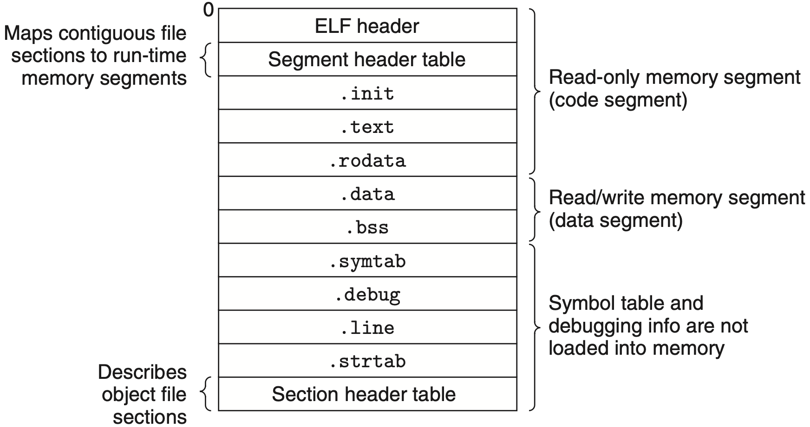

.. Michael Wu 版权所有

:Authors: Michael Wu
:Version: 1.0

Linux-user-ELF程序
=====================

Linux用户程序运行流程
---------------------

Linux ELF加载运行流程是一个多层次的过程，涉及多个组件和步骤。以下是一个简化的流程：

- 编写 ``main`` 函数，是C/C++语言规范定义的语言层面的入口点；
- 编译器和链接器 (gcc/ld): 编译代码并链接标准库，创建一个 ELF 格式可执行文件，并指定入口点 ``_start`` ;
- 入口点 ``_start`` 函数是链接器在最终的可执行文件中指定的入口点，它由标准库提供，位于 crt0.o 或 crt1.o 的目标文件中；
- 链接器的默认配置就是把 ``_start`` 作为入口点，链接生成的ELF文件的 ``e_entry`` 字段指向 ``_start`` 的地址;
- Linux内核的加载器解析ELF文件，创建内存空间，加载必要的代码段，通过ELF头的 ``e_entry`` 字段获取入口点地址跳转执行；
- 标准库 (libc)：当用户态程序需要OS服务（如文件读写）时，它会调用像 ``printf`` 这样的标准库函数;
- 系统调用 (Syscall)：标准库函数封装了 syscall 汇编实现，通过特殊指令陷入内核执行系统调用；

.. note::

    链接器 ``ld`` 如果没有指定链接脚本的话，默认会将 ``_start`` 作为入口点。这是一个默认的约定符号。如果用户自己编写了
    链接脚本，并且在脚本中指定了不同的入口点符号，那么链接器会使用用户指定的入口点符号。

    操作系统加载执行用户态程序，关注的只有：

    1. ELF文件格式, 会解析出入口点地址 ``e_entry``，代码段和数据段等信息，加载到内存;
    2. ``Syscall`` 调用接口，对应芯片架构的调用号、参数传递约定等；

对于标准库里的 ``_start`` 函数，通常会执行以下操作：

- 内核在加载程序时，会将命令行参数 (argc, argv) 和环境变量 (envp) 压入进程的虚拟地址空间的栈顶。 ``_start`` 的代码会从栈上正确地解析这些信息。
- 初始化C库: 调用libc内部的初始化函数（例如 ``__libc_start_main`` ）。这个函数会做很多重要的事，比如：

    - 设置 stdin, stdout, stderr。
    - 初始化线程相关的数据结构（即使是单线程程序）。
    - 注册 atexit 退出处理函数。
    - 执行全局对象的构造函数 (C++)。

- 调用 ``main`` : 将 argc 和 argv 作为参数传递给 main 函数，正式开始执行用户的代码。
- 处理 ``main`` 的返回: ``main`` 函数结束后，控制权会返回到 ``__libc_start_main``
- 调用 ``exit()`` : ``__libc_start_main`` 会将 ``main`` 的返回值作为参数传递给 ``exit()`` 系统调用。
- 最后 ``exit()`` 会进行最后的清理工作（如刷新I/O缓冲区），然后通过 ``exit_group`` 系统调用真正地终止进程。

不带标准库的ELF程序
---------------------

不带标准库的ELF程序是指libc库和其他运行时库的程序。这需要手动处理所有系统调用和相关资源管理(如基于系统调用实现一个malloc来
管理内存等), 还有需要自己指定入口点等等。下面是一个实例，针对 x86_64 架构的简单ELF程序：

.. code-block:: asm

    # AT&T x86-64 assembly syntax
    # 作用：调用 exit 系统调用退出程序，退出码 1

    .text
    .global entry

    entry:
        mov $60, %rax  # syscall number 60 = exit
        mov $1, %rdi   # 传递给exit的参数 1
        syscall

上面的程序会直接调用系统调用 `exit`，退出程序。使用下面的链接脚本 linker.ld 来指定入口点和段信息： ::

    ENTRY(entry)

    ENTRY(entry)  /* 指定入口点为 entry */

    SECTIONS {
        . = 0x400000;  /* 可执行文件加载地址（可选） */
        .text : { *(.text) }
        /DISCARD/ : { *(*) }  /* 丢弃其他未使用的段 */
    }

.. tip::

    ``ld --verbose`` 可以查看链接器的默认脚本信息，里面就指定了 ``ENTRY(_start)`` 等，默认的链接脚本还定义了
    各个 section（如 .text, .data, .rodata, .bss）在最终的可执行文件和加载到内存后的虚拟地址空间中的顺序和对齐方式。

使用下面的 Makefile 来编译和链接程序：

.. code-block:: makefile

    LDFLAGS = -T linker.ld

    .PHONY: all run clean
    all: run a.out

    run: a.out
        ./a.out; echo "exit code: $$?"

    a.out: foo.o
        ld $(LDFLAGS) $< -o $@

    foo.o: foo.S
        as $< -o $@

    clean:
        rm -f *.o *.out

ELF文件的加载
-----------------

通过shell命令行执行程序，会触发一系列的操作系统调用和内核行为：

内核的ELF loader
^^^^^^^^^^^^^^^^^

ELF格式参考： https://en.wikipedia.org/wiki/Executable_and_Linkable_Format

ELF文件的结构：

- ELF Header: 描述了文件的整体结构和类型，包括魔数字、架构类型、入口点地址等。
- Program Header Table: 也叫(Segment header table)，描述了如何将文件中的段（Segment）映射到内存中。包括了：

    - Segment Type: 描述该段的用途，比如是可执行代码、数据，还是动态链接信息。
    - 文件偏移 (Offset)： 该段内容在 ELF 文件中的起始位置。
    - 文件大小 (File Size)： 该段在文件中的大小。
    - 虚拟地址 (Virtual Address)： 该段被加载到内存中的目标虚拟地址。
    - 内存大小 (Memory Size)： 该段在内存中应占用的总大小（例如，``.bss`` 段在文件中大小为0，但在内存中需要分配空间）。
    - 权限 (Flags)： 描述该段在内存中的读、写、执行权限。

- Section Header Table: 描述了文件中的各个节（Section），如代码段、数据段、符号表等。每个节都有名称、类型、地址、大小等信息。

.. note::

    Program Header Table再ELF中是可选的。因为只有需要加载到内存中执行的文件才需要程序头表 (Program Header Table)。包括了
    可执行文件和共享库等。对于静态链接的库文件 (.a)，通常没有程序头表，而是使用节头表 (Section Header Table) 来描述各个节。

    - Program Header Table 描述的是描述文件的物理布局，供加载器使用，可加载段 (Segment) 由一个或多个节组成的内存加载单元。通常在 ELF 头之后，文件开头。
    - Section Header Table 描述文件的逻辑结构，供链接器使用，节 (Section)是最小的逻辑单元，如 .text、.data、.symtab。通常在文件末尾。

    ELF 文件格式的设计非常巧妙，它同时满足了两个不同阶段的需求：

    - **链接阶段**：链接器需要了解文件中所有独立的、细粒度的数据，比如符号表、重定位信息等。这些信息以节的形式存在，而段头表就是所
      有这些节的目录。链接器利用这个表将多个 .o 文件的节合并成一个完整的、可执行的程序。
    - **加载阶段**：操作系统加载器不需要关心文件的所有细节。它只关心哪些部分需要被加载到内存中，以及它们应该被加载到哪里。一个
      可加载段（Segment）可能包含了多个节（比如 .text 和 .rodata），因为它们都具有相同的加载权限（可读、可执行）。程序头表正
      是为此而生，它告诉加载器 “请把文件中偏移量 X 到 Y 的数据，映射到虚拟地址 Z，并赋予它读写执行等相关的权限” 。

ELF loader加载程序并执行的步骤：

- shell进程会调用 execve("./a.out", argv, envp) 这个系统调用，请求内核加载并执行一个新程序。
- 内核首先读取ELF文件的头部，检查它的魔数字和架构信息，确认这是一个合法的、可以在当前架构系统上可运行。
- 解析程序头表 (Program Header Table): 这是最关键的一步。程序头表描述了如何将文件中的段（Segment）映射到内存中。内核会遍
  历这个表，找到所有类型为 PT_LOAD 的段。这些段通常包括：

    - 代码段 (.text): 包含程序的指令。内核会把它映射到一块内存，并赋予 可读、可执行 (r-x) 的权限。
    - 数据段 (.data, .rodata): 包含已初始化的全局变量和常量。内核会把它映射到内存，并赋予 可读、可写 (rw-) 或 只读 (r--) 的权限。

- 创建 .bss 段: 对于未初始化的全局变量（在 .bss 段中），ELF文件中并不存储它们，只记录了需要多大空间。内核会分配一块匿名内存页，并将其清零，作为 .bss 段。
- 创建堆和栈: 内核为进程分配堆和栈的虚拟内存区域。并将前面提到的 argv 和 envp 复制到栈顶。

.. note::

    Linux生态系统提供了几个非常标准且功能强大的用户态库函数来解析和操作ELF文件。对于C/C++开发者来说，最主要和最常用的有
    两个： libelf 和 libbfd

动态链接的处理
^^^^^^^^^^^^^^^^^

如果程序是动态链接的（大多数现代程序都是），内核还会进行以下操作：

- 内核会检查程序头表中是否存在一个类型为 ``PT_INTERP`` 的段。如果存在，这个段会指向一个字符串，即 动态链接器 的路径。
- 此时，内核并不直接跳转到程序的 ``_start`` 。相反，它会先加载这个 动态链接器 (ld.so)到内存中，然后将控制权交给 ld.so 的入口点。
- ld.so 接管后，在用户态下工作。它会读取主程序的动态段（.dynamic section），找出所有依赖的共享库（如 libc.so.6），加载它们到内存，并进行符号重定位（relocation）。
- 所有准备工作完成后，ld.so 才会跳转到主程序真正的入口点 ``_start`` 。
- 如果程序是静态链接的，则没有 ``PT_INTERP`` 段，内核加载完程序后会直接跳转到其 ``_start`` 地址。

系统调用的流程
^^^^^^^^^^^^^^^^^^^^

系统调用的工作流程：

- 库函数封装: 程序员通常不直接写汇编来进行系统调用。而是调用C库中的函数，如: ``open()``, ``read()``, ``malloc()`` (内部会调用 ``brk`` 或 ``mmap``), ``exit()`` 等；
- 准备参数: libc 的封装函数会根据特定的ABI（应用程序二进制接口）约定，将系统调用号和所需的参数放入指定的CPU寄存器中（例如，在x86-64上，系统调用号放入 RAX，参数依次放入 RDI, RSI, RDX 等）。
- 陷入内核 (Trap): 执行一条特殊的CPU指令，如 syscall (x86-64) 或 int 0x80 (x86-32)。这条指令会引发一个“陷阱”（trap），导致CPU立即暂停当前的用户态代码执行，将特权级别切换到内核态，并跳转到内核中一个预先设定的地址——系统调用处理程序的入口。
- 内核执行: 内核的系统调用处理程序根据 RAX 寄存器中的系统调用号，在一个系统调用表（sys_call_table）中查找到对应的内核函数（如 sys_read, sys_open），并执行它。
- 返回用户态: 内核函数执行完毕后，将返回值放入 RAX 寄存器。然后内核执行 sysret 或 iret 指令，将CPU的特权级别切回用户态，并返回到用户程序中 syscall 指令的下一条指令继续执行。libc 的封装函数会检查 RAX 的返回值，并相应地设置 errno。

对于开发者来说，我们只需要关心 main 函数的逻辑，而编译器、链接器、C库和操作系统则在幕后处理了所有复杂的初始化、加载和权限管理工作。
