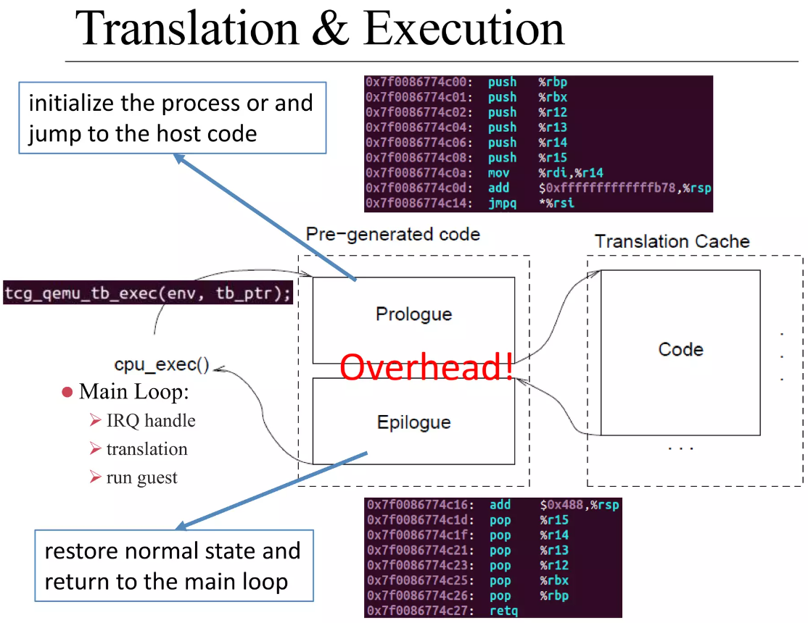
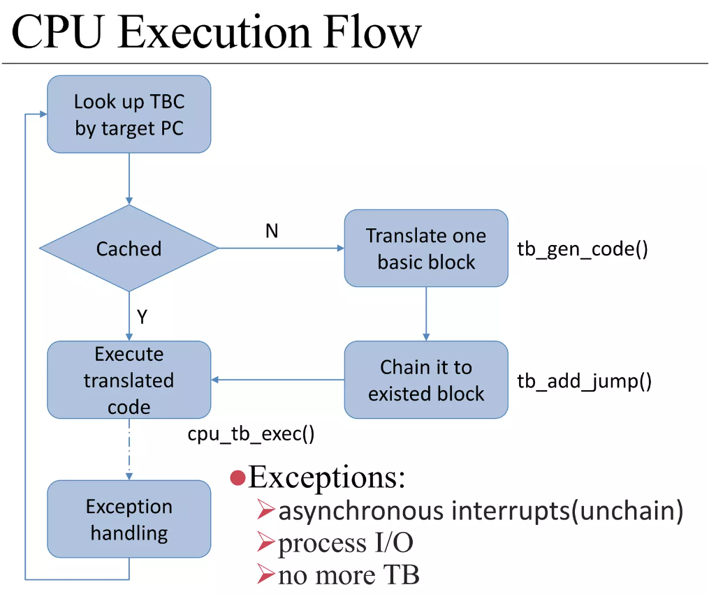

.. Michael Wu 版权所有

:Authors: Michael Wu
:Version: 1.0

QEMU-TCG
===========

TCG的基本原理
----------------

QEMU TCG(Tiny Code Generator)是一个轻量级的代码生成器，主要用于将Guest的指令翻译为Host的指令。TCG的设计目标是提供一个高效的指
令翻译机制，以支持多种架构之间的仿真。TCG的工作原理是将Guest的指令翻译为Host的指令，并在Host上执行这些指令。TCG使用了一种
称为“动态二进制翻译”的技术，这种技术可以在运行时将Guest的指令转换为Host的指令，从而实现跨架构的仿真。 TCG的工作流程如下：
`QEMU - Binary Translation <https://www.slideshare.net/RampantJeff/qemu-binary-translation>`_

把Guest的汇编指令翻译为Host的汇编指令，有个论文做的统计是大概是原来指令数的10多倍。那么为什么会多执行了这么多？很简单，比如
下面的情况：

- 访问内存的指令(访存指令)，肯定需要调用到对应内存的回调；
- 访问IO的指令(IO指令)，也会调用到对应IO的仿真回调函数；
- 特定系统寄存器的访问(系统寄存器读写指令)，也会调用到对应的helper函数中；
- 指令执行出现异常后的处理，这个也需要额外的处理；

`QEMU tcg源码分析与unicorn原理 <https://bbs.kanxue.com/thread-277163.htm>`_ ，这篇技术博客中总结了下面的几个方面：

.. note::

    1. 普通算术逻辑运算指令如何更新Host体系结构相关寄存器
    2. 内存读写如何处理
    3. 分支指令(条件跳转、非条件跳转、返回指令）
    4. 目标机器没有的指令、特权指令、敏感指令
    5. 非普通内存读写如设备寄存器访问MMIO
    6. 指令执行出现了同步异常如何处理(如系统调用)
    7. 硬件中断如何处理

QEMU会 ``mmap`` 一段空间，放到 ``code_gen_buffer`` 这个指针指向的位置，加入执行权限，然后来存放TCG对Guest指令进行翻译后的指令,
可以看 ``/qemu/tcg/region.c`` 相关的实现。

这些情况必须正确处理了，才能够做到一个真正的仿真。TCG是按照TB(Translate Block)进行一块一块的翻译。遇到函数调用类似 ``callq`` 等
就会有跳转，这时就会执行另一个TB。每个TB处理都会有 prologue, epilogue 的预处理和后处理，方便做特殊处理，比如遇到异常等，如下：

TCG会把翻译过得指令给缓存起来，下次遇到同样的TB，就可以直接执行这些翻译过的指令了，这样就提高了效率，大概执行的流程如下：

| 上面执行过程也可以看出，当遇到 Exception 时，会去执行异常处理，如中断、IO访问等。

还可以使用 ``-d help`` 看支持的选项，把tcg翻译前后的指令打印出来，先安装 ``apt install libcapstone-dev`` 支持反汇编。
还是用前面的环境配置，用下面一行命令拉起  ::

    qemu-system-aarch64 -nographic -cpu cortex-a57 -readconfig virt.cfg -d in_asm,out_asm -D a.log

    运行后的日志就被打印到 a.log 里了，大概如下，可以明显看出，一条guest会有很多host指令 ：
    IN:
    0xffff8000083ca030:  910163e0  add      x0, sp, #0x58
    0xffff8000083ca034:  f9002fe3  str      x3, [sp, #0x58]
    0xffff8000083ca038:  b90063e4  str      w4, [sp, #0x60]
    0xffff8000083ca03c:  940345d5  bl       #0xffff80000849b790

    OUT: [size=296]
      -- guest addr 0x0000000000000030 + tb prologue
    0x7f985d36c280:  8b 5d f0                 movl     -0x10(%rbp), %ebx
    0x7f985d36c283:  85 db                    testl    %ebx, %ebx
    0x7f985d36c285:  0f 8c b3 00 00 00        jl       0x7f985d36c33e
    0x7f985d36c28b:  c6 45 f4 00              movb     $0, -0xc(%rbp)
    0x7f985d36c28f:  48 8b 9d 38 01 00 00     movq     0x138(%rbp), %rbx
    0x7f985d36c296:  4c 8d 63 58              leaq     0x58(%rbx), %r12
    0x7f985d36c29a:  4c 89 65 40              movq     %r12, 0x40(%rbp)
      -- guest addr 0x0000000000000034
    0x7f985d36c29e:  4c 8d 63 58              leaq     0x58(%rbx), %r12
    0x7f985d36c2a2:  4c 8b 6d 58              movq     0x58(%rbp), %r13
    0x7f985d36c2a6:  49 8b fc                 movq     %r12, %rdi
    0x7f985d36c2a9:  48 c1 ef 07              shrq     $7, %rdi
    0x7f985d36c2ad:  48 23 bd 10 ff ff ff     andq     -0xf0(%rbp), %rdi
    0x7f985d36c2b4:  48 03 bd 18 ff ff ff     addq     -0xe8(%rbp), %rdi
    0x7f985d36c2bb:  49 8d 74 24 07           leaq     7(%r12), %rsi
    0x7f985d36c2c0:  48 81 e6 00 f0 ff ff     andq     $0xfffffffffffff000, %rsi
    0x7f985d36c2c7:  48 3b 77 08              cmpq     8(%rdi), %rsi
    0x7f985d36c2cb:  0f 85 79 00 00 00        jne      0x7f985d36c34a
    0x7f985d36c2d1:  48 8b 7f 18              movq     0x18(%rdi), %rdi
    0x7f985d36c2d5:  4d 89 2c 3c              movq     %r13, 0(%r12, %rdi)

Decodetree机制
-------------------

Decodetree语法规则
^^^^^^^^^^^^^^^^^^^^

TCG翻译前端, aarch64 是手写的翻译。arm32则是使用了decodetree机制。decodetree的语法规则如下：

https://www.qemu.org/docs/master/devel/decodetree.html

如上面连接, decodetree的语法规则是：::

  field_def     := '%' identifier ( field )* ( !function=identifier )?
  field         := unnamed_field | named_field
  unnamed_field := number ':' ( 's' ) number
  named_field   := identifier ':' ( 's' ) number

解释，使用了 vscode copilot的gpt-4o模型解释了下。

**符号解释**

- ``:=``：定义符号，表示左边的非终结符由右边的表达式定义。
- ``|``：选择符号，表示可以选择多个选项中的一个。
- ``*``：零或多个，表示前面的元素可以出现零次或多次。
- ``?``：零或一次，表示前面的元素可以出现零次或一次。
- ``()``：分组符号，用于将多个元素组合在一起，作为一个整体进行操作。
- ``!``：在 decodetree 语法中， ``!``  用于指定一个函数，将字段的值传递给该函数进行处理。
- ``''``：单引号用于表示字面量，即必须精确匹配的字符串。

有的会有点类似正则表达式中的一些通配符。

**符号应用**

- field_def := '%' identifier ( field )* ( !function=identifier )?：

    - ``%``：表示字段定义的开始。
    - ``identifier``：字段的名称。
    - ``( field )*``：零个或多个字段。
    - ``( !function=identifier )?``：可选的函数调用，指定一个函数来处理字段的值。

- field := unnamed_field | named_field：

    - ``unnamed_field`` 或 ``named_field``：字段可以是匿名字段或命名字段。

- unnamed_field := number ':' ( 's' ) number：

    - ``number``：字段的起始位置。
    - ``':'``：分隔符。
    - ``( 's' )``：可选的符号，表示字段是有符号的。
    - ``number``：字段的长度。

- named_field := identifier ':' ( 's' ) number：

    - ``identifier``：字段的名称。
    - ``':'``：分隔符。
    - ``( 's' )``：可选的符号，表示字段是有符号的。
    - ``number``：字段的长度。

举例：

- ``%disp 0:s16``  字段从第 0 位开始，有 16 位长，并且是有符号, ``disp`` 通常是 ``displacement`` 的缩写,
  表示一个位移量，用于计算内存地址或跳转地址
- ``%imm9 16:6 10:3`` 字段由两个部分组成：第一个部分从第 16 位开始，有 6 位长；第二个部分从第 10 位开始，有 3 位长。
- ``%shimm8 5:s8 13:1 !function=expand_shimm8`` 字段由两个部分组成：第一个部分从第 5 位开始，有 8 位
  长，并且是有符号的；第二个部分从第 13 位开始，有 1 位长。字段的值将传递给 ``expand_shimm8`` 函数进行处理。

注意：

- 命名字段可以引用其他字段，但不能形成循环引用。
- 格式和模式可以互相引用对方的字段，但不能同时这样做，以避免循环引用。

field举例 ::

    +---------------------------+---------------------------------------------+
    | Input                     | Generated code                              |
    +===========================+=============================================+
    | %disp   0:s16             | sextract(i, 0, 16)                          |
    +---------------------------+---------------------------------------------+
    | %imm9   16:6 10:3         | extract(i, 16, 6) << 3 | extract(i, 10, 3)  |
    +---------------------------+---------------------------------------------+
    | %disp12 0:s1 1:1 2:10     | sextract(i, 0, 1) << 11 |                   |
    |                           |    extract(i, 1, 1) << 10 |                 |
    |                           |    extract(i, 2, 10)                        |
    +---------------------------+---------------------------------------------+
    | %shimm8 5:s8 13:1         | expand_shimm8(sextract(i, 5, 8) << 1 |      |
    |   !function=expand_shimm8 |               extract(i, 13, 1))            |
    +---------------------------+---------------------------------------------+
    | %sz_imm 10:2 sz:3         | expand_sz_imm(extract(i, 10, 2) << 3 |      |
    |   !function=expand_sz_imm |               extract(a->sz, 0, 3))         |
    +---------------------------+---------------------------------------------+

**参数集**

Syntax::

  args_def    := '&' identifier ( args_elt )+ ( !extern )?
  args_elt    := identifier (':' identifier)?

- args_def：

    - ``&``：表示参数集定义的开始。
    - ``identifier``：参数集的名称。
    - ``( args_elt )+``：一个或多个参数元素 ``（args_elt）`` 。
    - ``( !extern )?``：可选的 ``!extern`` 标记，表示参数集的结构体已经在其他地方声明过。

- args_elt：

    - ``identifier ('``:' identifier)?：参数元素的定义。
    - 第一个 ``identifier`` 是参数的名称。
    - 可选的 ``':'`` identifier 是参数的类型。如果没有指定类型，默认类型是 int。

举例：

- ``&reg3 ra rb rc``: 一个名为 reg3 的参数集, 包含三个参数，名称分别为 ra、rb 和 rc，默认类型是 int
- ``&loadstore reg base offset``: 名为 loadstore 的参数集, 三个参数，名称分别为 reg、base 和 offset，默认类型是 int

``!extern`` 如果参数集定义中包含 !extern 标记，表示该参数集的结构体已经在其他地方声明过，通常用于多个解码
器协作的情况。 比如 ::

    &shared_args reg base offset !extern

**格式**

Syntax::

  fmt_def      := '@' identifier ( fmt_elt )+
  fmt_elt      := fixedbit_elt | field_elt | field_ref | args_ref
  fixedbit_elt := [01.-]+
  field_elt    := identifier ':' 's'? number
  field_ref    := '%' identifier | identifier '=' '%' identifier
  args_ref     := '&' identifier

- fmt_def：

    - ``@``：表示格式定义的开始。
    - ``identifier``：格式的名称。
    - ``( fmt_elt )+``：一个或多个格式元素 ``（fmt_elt）`` 。

- fmt_elt:

    - ``fixedbit_elt``：固定位元素。表示一段连续的比特，可以是 1、0、. 或 -。
    - ``field_elt``：字段元素。表示一个简单字段，指定了名称和位宽。
    - ``field_ref``：字段引用。引用一个已定义的字段，可以重命名。
    - ``args_ref``：参数引用。参数引用，引用一个参数集。

- fixedbit_elt

    - ``[01.-]+``：表示一段连续的比特，可以是 1、0、. 或 -。

      - ``1`` 和 ``0`` 表示固定的比特值。
      - . 表示该比特将任意，0或者1。
      - - 表示该比特将被忽略。

- field_elt

    - ``identifier ':' 's'? number``：字段元素，指定了名称和位宽。
    - ``identifier``：字段的名称。
    - ``':'``：分隔符。
    - ``'s'?``：可选的符号，表示字段是有符号的。
    - ``number``：字段的长度。

- field_ref

    - ``% identifier``：字段引用，引用一个已定义的字段。
    - ``identifier '=' '%' identifier``：字段引用，引用一个已定义的字段，并重命名。

- args_ref

    - ``& identifier``：参数引用，引用一个参数集。

举例: ::

    @opr    ...... ra:5 rb:5 ... 0 ....... rc:5

    @opr：定义一个名为 opr 的格式。
    ......：表示 6 个不关心的比特位。
    ra:5：表示一个名为 ra 的字段，位宽为 5 位。
    rb:5：表示一个名为 rb 的字段，位宽为 5 位。
    ... 0：表示 3 个不关心的比特位，接着是一个固定的 0。
    .......：表示 7 个不关心的比特位。
    rc:5：表示一个名为 rc 的字段，位宽为 5 位。

添加1个求平方的指令
^^^^^^^^^^^^^^^^^^^^^^^^

代码实现链接：

https://github.com/thisinnocence/qemu/commit/624ba758cbbb67484aa9fcb7036f6010dcb2acc5

后面详细补充依稀 riscv 指令知识，以及QEMU TCG的详细实现。
