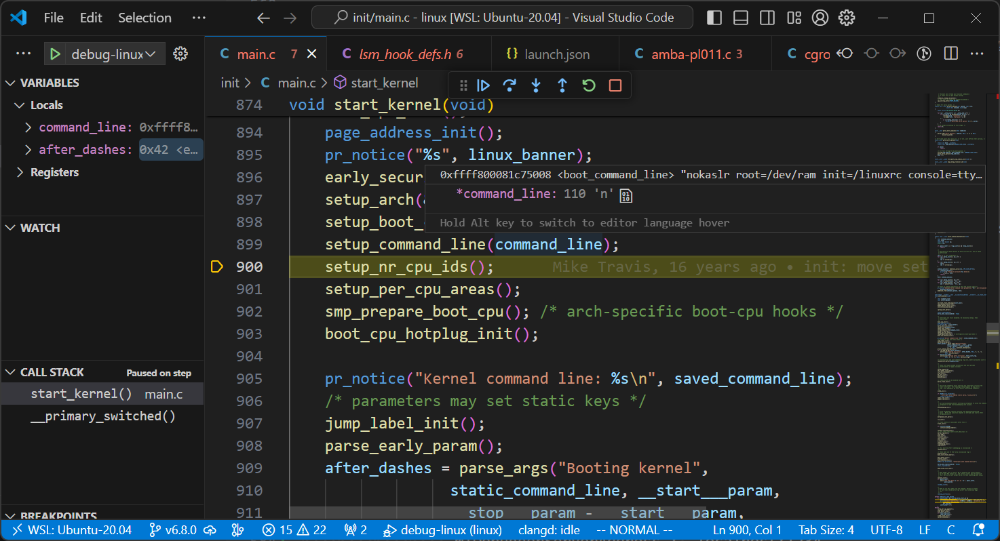

.. Michael Wu 版权所有

:Authors: Michael Wu
:Version: 1.0

编译调试Linux内核
==================

本文主要针对ARM64架构的相关代码进行介绍。

编译ARM64 Linux kernel
-------------------------

下载Linux源码后，使用menuconfig勾选RAM disks为 ``build-in`` 支持，并调整大小为: 65536 kb， 方便后面用QEMU拉起。
编译ARM64内核镜像(v6.8.0)方法：

.. code-block:: bash

    make CROSS_COMPILE=aarch64-linux-gnu- ARCH=arm64 O=build menuconfig -j32
      Device Drivers > Block devices
        <*>   RAM block device support
          (16)    Default number of RAM disks (NEW)
          (65536) Default RAM disk size (kbytes)

    make CROSS_COMPILE=aarch64-linux-gnu- ARCH=arm64 O=build -j32
    file build/arch/arm64/boot/Image

ARM Linux常见的内核镜像格式：

- Image: the generic Linux kernel binary image file.
- zImage: a compressed version of the Linux kernel image that is **self-extracting** .
- uImage: an image file that has a **U-Boot** wrapper (installed by the mkimage utility) that includes the OS type and
  loader information.

.. note::
    Since a zImage file is self-extracting (i.e. needs no external decompressors), the wrapper would indicate that
    this kernel is "not compressed" even though it actually is.

    uImage维护者认为：

    Actually it's pretty stupid to use a zImage inside an uImage. It is much better to use normal (uncompressed)
    kernel image, compress it using just gzip, and use this as poayload for mkimage.
    This way U-Boot does the uncompresiong instead of including yet another uncompressor with each kernel image.

    https://docs.yoctoproject.org/pipermail/yocto/2013-October/016778.html

制作 uImage 的方法 ::

    sudo apt install u-boot-tools
    mkimage -A <arch> -O linux -T kernel -C none -a <load-address> -e <entry-point> -n "Linux kernel" -d arch/arm/boot/zImage uImage

制作根文件系统initrd
-----------------------

从 https://busybox.net 下载源码，然后交叉编译。可以参考下面命令编译ARM64架构的busybox :

.. code-block:: bash

    make CROSS_COMPILE=aarch64-linux-gnu- ARCH=arm64 menuconfig -j32
        Settings
        [*] Build static binary (no shared libs)

    make CROSS_COMPILE=aarch64-linux-gnu- ARCH=arm64 install -j32
    file _install/bin/busybox

然后制作ARM64 initrd

.. code-block:: bash

    #!/bin/bash

    MOUNT_DIR=mnt
    CURR_DIR=`pwd`

    rm initrd.ext4
    dd if=/dev/zero of=initrd.ext4 bs=1M count=32
    mkfs.ext4 initrd.ext4

    mkdir -p $MOUNT_DIR
    mount initrd.ext4 $MOUNT_DIR
    cp -arf busybox/_install/* $MOUNT_DIR

    cd $MOUNT_DIR
    mkdir -p etc dev mnt proc sys tmp mnt etc/init.d/

    echo "proc /proc proc defaults 0 0" > etc/fstab
    echo "tmpfs /tmp tmpfs defaults 0 0" >> etc/fstab
    echo "sysfs /sys sysfs defaults 0 0" >> etc/fstab

    echo "#!/bin/sh" > etc/init.d/rcS
    echo "mount -a" >> etc/init.d/rcS
    echo "mount -o remount,rw /" >> etc/init.d/rcS
    echo "echo -e \"Welcome to ARM64 Linux\"" >> etc/init.d/rcS
    chmod 755 etc/init.d/rcS

    echo "::sysinit:/etc/init.d/rcS" > etc/inittab
    echo "::respawn:-/bin/sh" >> etc/inittab
    echo "::askfirst:-/bin/sh" >> etc/inittab
    chmod 755 etc/inittab

    cd dev
    mknod console c 5 1
    mknod null c 1 3
    mknod tty1 c 4 1

    cd $CURR_DIR
    umount $MOUNT_DIR
    echo "make initrd ok!"

然后就可以使用QEMU来拉起了。

制作ARM DTS设备树
------------------------

DTS基础知识
^^^^^^^^^^^^^^^

| 官方地址: https://www.devicetree.org
| 文档地址: https://devicetree-specification.readthedocs.io
| 文档工程: https://github.com/devicetree-org/devicetree-specification ，也是一个sphinx工程。

关于ARM Linux的DTS，历史渊源是Linus非常不满意ARM硬件细节硬编码到代码里，把代码弄的一团乱，然后社区才引入了DTS这个机制。这个
机制用来描述一个硬件平台的硬件资源，起源于 OpenFirmware (OF)。社区当时讨论的方案是：

.. note::

    - ARM的核心代码仍然保存在arch/arm目录下
    - ARM SoC core architecture code保存在arch/arm目录下
    - ARM SoC的周边外设模块的驱动保存在drivers目录下
    - ARM SoC的特定代码在arch/arm/mach-xxx目录下
    - ARM SoC board specific的代码被移除，由DeviceTree机制来负责传递硬件拓扑和硬件资源信息。

本质上，Device Tree改变了原来用hardcode方式将HW 配置信息嵌入到内核代码的方法，改用bootloader传递一个DB的形式。对于操作系统，一个
系统要能够运行到多种硬件平台，还有对一个平台多种特定的单板期间，那么为了内核的通用性，内核启动就要感知：

1. 识别platform的信息
2. runtime的配置参数
3. 设备的拓扑结构以及特性

在系统启动阶段，bootloader会加载内核并将控制权转交给内核，此外， 还需要把上述的三个参数信息传递给kernel，以便kernel可以有较大的灵活性。

可以看这篇文章： https://e-mailky.github.io/2019-01-14-dts-1

Device Tree由一系列被命名的结点（node）和属性（property）组成，而结点本身可包含 **子结点** 。所谓属性， 其实就是成对出现的name和value。
在Device Tree中，可描述的信息包括（原先这些信息大多被hard code到kernel中）：

- CPU的数量和类别
- 内存基地址和大小
- 总线和桥
- 外设连接
- 中断控制器和中断使用情况
- GPIO控制器和GPIO使用情况
- Clock控制器和Clock使用情况

基本上就是画一棵电路板上CPU、总线、设备组成的树，Bootloader会将这棵树传递给内核，然后内核可以识别这棵树， 并根据它展开
出Linux内核中的platform_device、i2c_client、spi_device等设备，而这些设备用到的内存、IRQ等资源， 也被传递给了内核，
内核会将这些资源绑定给展开的相应的设备。

.. note::
    是否Device Tree要描述系统中的所有硬件信息？答案是否定的。基本上，那些可以动态探测到的设备是不需要描述的， 例如USB device。
    不过对于SOC上的usb hostcontroller，它是无法动态识别的，需要在device tree中描述。

    同样的道理， 在computersystem中，PCI device可以被动态探测到，不需要在device tree中描述，但是PCI bridge如果不能被探测，
    那么就需要描述之。

基本上，在ARM Linux在，一个 ``.dts`` 文件对应一个ARM的machine，一般放置在内核的 ``arch/arm/boot/dts/`` 目录。一个SoC可能对应多个machine，
Linux内核为了简化，把SoC公用的部分或者多个machine共同的部分一般提炼为 ``.dtsi`` ，类似于C语言的头文件。 其他的machine对应的.dts就
include这个.dtsi。

正常情况下所有的dts文件以及dtsi文件都含有一个根节点 ``/`` , include文件也不会造成多个根节点，Device Tree Compiler会对DTS的node进行合并。
device tree的基本单元是node。这些node被组织成树状结构，除了root node，每个node都只有一个parent。一个device tree文件中只能有
一个root node。每个node中包含了若干的 ``property/value`` 来描述该node的一些特性。

每个node用节点名字（node name）标识，节点名字的格式是 ``node-name@unit-address`` 。

.. note::
    如果该node没有reg属性（后面会描述这个property）， 那么该节点名字中必须不能包括@和unit-address。
    unit-address的具体格式是和设备挂在那个bus上相关。例如对于cpu，其unit-address就是从0开始编址，以此加一。

在一个树状结构的device tree中，如何引用一个node呢？要想唯一指定一个node必须使用full path，
例如 ``/node-name-1/node-name-2/node-name-N`` 。

下面的资料也很不错：
    - https://community.arm.com/oss-platforms/w/docs/525/device-tree
    - https://elinux.org/images/f/f9/Petazzoni-device-tree-dummies_0.pdf

.. _virt_dts:

QEMU导出dts
^^^^^^^^^^^^^

QEMU有个功能，可以导出来machine的dts. 参考 :doc:`/arch/QEMU仿真虚拟化` 的例子，用下面方法导出virt machine的dts ::

    // 方法一, 推荐这种方法
    启动QEMU后，ctrl a,c 进入 console
    然后敲命令: dumpdtb virt.dtb

    // 方法二
    在 virt.cfg 中，machine项加入下面配置即可
    [machine]
        dumpdtb = "virt.dtb"

然后在执行拉起命令，就可以导出来virt.dtb文件。然后可以反编译出来看下具体配置

.. code-block:: bash

    dtc -I dtb -O dts virt.dtb > virt.dts

导出的内容如下，通过QEMU virt machine可以看一个完整的DTS主要包括什么, 下面摘录部分：

.. code-block:: dts

    /dts-v1/;

    / {
        interrupt-parent = <0x8003>;
        model = "linux,dummy-virt";
        #size-cells = <0x02>;
        #address-cells = <0x02>;
        compatible = "linux,dummy-virt";

        memory@40000000 {
            reg = <0x00 0x40000000 0x01 0x00>;
            device_type = "memory";
        };

        pl011@9000000 {
            clock-names = "uartclk\0apb_pclk";
            clocks = <0x8000 0x8000>;
            interrupts = <0x00 0x01 0x04>;
            reg = <0x00 0x9000000 0x00 0x1000>;
            compatible = "arm,pl011\0arm,primecell";
        };

        intc@8000000 {
            phandle = <0x8003>;
            reg = <0x00 0x8000000 0x00 0x10000 0x00 0x8010000 0x00 0x10000>;
            compatible = "arm,cortex-a15-gic";  // gicv2
            ranges;
            #size-cells = <0x02>;
            #address-cells = <0x02>;
            interrupt-controller;
            #interrupt-cells = <0x03>;
        };

        cpus {
            #size-cells = <0x00>;
            #address-cells = <0x01>;

            cpu@0 {
                phandle = <0x8002>;
                reg = <0x00>;
                enable-method = "psci";
                compatible = "arm,cortex-a57";
                device_type = "cpu";
            };
        };

        timer {
            interrupts = <0x01 0x0d 0x304 0x01 0x0e 0x304 0x01 0x0b 0x304 0x01 0x0a 0x304>;
            always-on;
            compatible = "arm,armv8-timer\0arm,armv7-timer";
        };

        apb-pclk {
            phandle = <0x8000>;
            clock-output-names = "clk24mhz";
            clock-frequency = <0x16e3600>;
            #clock-cells = <0x00>;
            compatible = "fixed-clock";
        };

        chosen {
            linux,initrd-end = <0x00 0x4a000000>;
            linux,initrd-start = <0x00 0x48000000>;
            bootargs = "nokaslr root=/dev/ram init=/linuxrc console=ttyAMA0 console=ttyS0";
            stdout-path = "/pl011@9000000";
            rng-seed = <0xa6ca99d8 0x114f19f2 0x9ab0b35a 0x4dd25395 0x57bd4bc2 0x380a39c3 0x6301f6d1 0xea19cd2>;
            kaslr-seed = <0x53566464 0x74519bb2>;
        };
    };

然后结合文档就可以理解各个关键属性，以及对应的硬件IP是什么了。在QEMU拉起的virt machine中，看下部分地址 ::

    // QEMU console 命令 info mtree 可以查看：
    0000000008000000-0000000008000fff (prio 0, i/o): gic_dist
    0000000008010000-0000000008011fff (prio 0, i/o): gic_cpu
    0000000008020000-0000000008020fff (prio 0, i/o): gicv2m
    0000000009000000-0000000009000fff (prio 0, i/o): pl011

QEMU-virt-dts
^^^^^^^^^^^^^^^^

从 UART pl011 的dts配置看起：

.. code-block:: dts

    / {
        #size-cells = <0x02>;
        #address-cells = <0x02>;
        pl011@9000000 {
            clock-names = "uartclk\0apb_pclk";
            clocks = <0x8000 0x8000>;
            interrupts = <0x00 0x01 0x04>;
            reg = <0x00 0x9000000 0x00 0x1000>;
            compatible = "arm,pl011\0arm,primecell";
        };
    }

最主要的 reg_base_addr, reg_len, irq_num，对比理解DTS里这几个字段或者一组每个值什么含义。

先看下 reg 属性。注意，根据 ARM DTS的官方specification：

| Property name: reg
| Property value: <prop-encoded-array> encoded as an arbitrary number of (address, length) pairs.

需要注意的是，address/length可以是1个或这个2个u32(dts规范称之位cell)的值，根据下面两个属性确定:

.. note::

    | #address-cells 和 #size-cells 属性可在层次结构中具有子节点的任何设备节点中使用，用于描述如何寻址子设备节点。
    | #address-cells 和 #size-cells 属性不会从设备树的祖先节点继承。它们应该被明确地定义, 即先看当前，再看父节点。

    - #address-cells 属性定义了用于编码子节点的 reg 属性中地址字段的 <u32> 个数。
    - #size-cells 属性定义了用于编码子节点的 reg 属性中大小字段的 <u32> 个数。

所以上面 pl011 中的reg的 (addr, size) 每个value是两个u32的值，一个高32bit，一个低32bit，共同组成。这样就可以的出pl011的
地址基地址和范围了。

然后看 interrupt 属性。

| Property: interrupts
| Value type: <prop-encoded-array> encoded as arbitrary number of interrupt specifiers

interrupt属性的value是一个数组, 格式说明要看绑定的interrupt domain root. Interrupts可以被
interrupts-extended property 覆盖，通常只有1个被使用。

对于 pl011, 有3个字段(cells), 有下面资料：

| https://stackoverflow.com/questions/48188392/in-an-arm-device-tree-file-what-do-the-three-interrupt-values-mean
| https://xillybus.com/tutorials/device-tree-zynq-4

为什么是3个字段，这个还需要看 intc (interrupt controller) 里的这个定义 ::

    intc@8000000 {
        phandle = <0x8003>;
        reg = <0x00 0x8000000 0x00 0x10000 0x00 0x8010000 0x00 0x10000>;
        #interrupt-cells = <0x03>;
        #size-cells = <0x02>;
        #address-cells = <0x02>;
    }
    // 然后 pl011 属性的父节点里： interrupt-parent = <0x8003>;  关联起来，所以 interrupts 就是3个字段

    // 顺便解释一下 intc 的 reg 都是什么mmio地址段, 8个cell, 2个cell是一个值, 4个值，2个(addr, size) pairs.
    // base_addr,  size
    // 0x8000000,  0x10000 (hex(0x8000000+0x10000-1) == 0x800ffff)
    // 0x8010000,  0x10000 (hex(0x8010000+0x10000-1) == 0x801ffff)

    // info mtree 里关于intc的显示如下, qemu virt machine实际的大小没有dts分配的多
    0000000008000000-0000000008000fff (prio 0, i/o): gic_dist
    0000000008010000-0000000008011fff (prio 0, i/o): gic_cpu

这些结合Linux kernel内核的实现代码结合起来看。Linux 内核文档的说明

https://github.com/torvalds/linux/blob/master/Documentation/devicetree/bindings/interrupt-controller/arm%2Cgic.yaml

.. note::

  | #interrupt-cells:
  | const: 3
  | description:

  The 1st cell is the interrupt type;

    - 0 for SPI interrupts
    - 1 for PPI

  The 2nd cell contains the interrupt number for the interrupt type.

    - | SPI interrupts are in the range [0-987].  (显然对于硬件手册里的中断号，我们配置DTS减去32)
      | 硬件定义的中断编号可参考 :ref:`int_id_type`
    - PPI interrupts are in the range [0-15].

  The 3rd cell is the flags, encoded as follows:
  bits[3:0] trigger type and level flags.

    - 1 = low-to-high edge triggered
    - 2 = high-to-low edge triggered (invalid for SPIs)
    - 4 = active high level-sensitive
    - 8 = active low level-sensitive (invalid for SPIs).

  bits[15:8] PPI interrupt cpu mask.  Each bit corresponds to each of
  the 8 possible cpus attached to the GIC.  A bit set to '1' indicated
  the interrupt is wired to that CPU.  Only valid for PPI interrupts.
  Also note that the configurability of PPI interrupts is IMPLEMENTATION
  DEFINED and as such not guaranteed to be present (most SoC available
  in 2014 seem to ignore the setting of this flag and use the hardware
  default value).

这个解释就和内核实现对一个起来了，可以完全理解这个字段的意思。

然后是 ram 的配置, 这里比较好理解 ::

    // dts 里配置
    memory@40000000 {
        reg = <0x00 0x40000000 0x01 0x00>;
        device_type = "memory";
    };

    和前面一样，都是 2 cell u32的值，base: 0x40000000, size 0x100000000
    >>> hex(0x40000000+0x100000000-1)
    '0x13fffffff'

    // info mtree (qemu console)
    0000000040000000-000000013fffffff (prio 0, ram): mach-virt.ram

.. _cut_dts:

裁剪virt的dts
^^^^^^^^^^^^^^^^^

跑起来一个支持shell的OS，最少需要的硬件有：CPU, RAM, GIC、timer、外设时钟、串口。

裁剪上面dts，然后重新编译dtb文件，通过命令行或者配置文件传给qemu的virt machine，仍然可以拉起来：

https://github.com/thisinnocence/qemu/blob/my/v8.2.0/my_tests/mini_virt/mini-virt.dts

在这个裁剪的DTS中，我们使用的GIC-V2，也可以使用GIC-V3，我们启动virt machine的时候，可以指定，修改 virt.cfg 加入::

    [machine]
        gic-version = "3"

如果不适用LPI消息中断，那么ITS也不是必须的。然后我们拉起内核时，使用命令行把上面的dtb传给qemu即可。在 virt.cfg 中加入,
记得指定好gic的版本 ::

    [machine]
        dtb = "virt.dtb"

然后, 就可以拉起我们裁剪dts后的内核了。上面dts编译还有个warnning，搜了下没解决，不过没有影响。 ::

    virt.dts:48.3-21: Warning (clocks_property): /pl011@9000000:clocks: cell 0 is not a phandle reference

有点奇怪，暂不影响，后面再解决。

.. _linux_lsp:

使用VScode+clangd看内核代码
----------------------------

| LSP技术发展到现在，我猜Linux内核社区已经支持了，随便搜了下文件发现了就有 gen_compile_commands.py :
| https://github.com/torvalds/linux/commits/master/scripts/clang-tools/gen_compile_commands.py
| 可看出，从2020年，这个生成 compile_commands.json 的工具都已经合入了内核代码主线。

| 中间遇到了clangd解析错误的，然后这个链接解决了问题： https://github.com/clangd/clangd/issues/734,
| 在Linux源码根目录下新建 ``.clangd`` 文件添加下面内容：

::

  CompileFlags:
    Remove: -mabi=lp64

然后在build目录执行  ::

    cd build
    ../scripts/clang-tools/gen_compile_commands.py

打开vscode的工程，clangd会尝试建立索引，如果没有可以手工重启一下clangd server: ``ctrl+shift+p`` , 然后输入 ``clangd`` 找到重启
命令回车。 clangd插件会索引大概5min，然后就可以基本精确跳转了。不得不说，有了clangd-lsp支持，比传统的tags/cscope精确
多了，基于语义的分析给代码浏览跳转体验带来质的飞跃。

.. tip::
  Linux的内核git log写的非常详细，可以当做代码功能注释补充，配合 vscode GitLens 插件，我们很容易看到某一行的提交以及当时的注释，
  这个对于我们理解Linux代码很有帮助。看代码还是下载带着git提交记录的版本好一点。

有了这个LSP支持，看内核和修改内核代码效率大增。

使用QEMU调试Linux
------------------------

| QEMU内置的gdb server可以单步调试内核，这个非常方便。可以看内核官方文档的链接:
| https://docs.kernel.org/dev-tools/gdb-kernel-debugging.html

使用QEMU ``-S -s`` 拉起linux，这个会使用QEMU内置的gdb server， 我们用 ``gdb-multiarch`` 连接这个server调试 ::

    cd build
    gdb-multiarch vmlinux
    (gdb) target remote :1234
    (gdb) b start_kernel
    (gdb) c

前面为了方便看代码，我们配置了VScode工程，在这个工程里我们配置下 ``launch.json`` 文件可以更方便图形调试：

.. code-block:: json

    {
        "version": "0.2.0",
        "configurations": [
            {
                "name": "debug-linux",
                "type": "cppdbg",
                "request": "launch",
                "program": "${workspaceFolder}/build/vmlinux",
                "cwd": "/root/arm",
                "miDebuggerServerAddress": "localhost:1234",
                "miDebuggerPath": "gdb-multiarch",
                "stopAtEntry": false,
                "externalConsole": true,
                "MIMode": "gdb",
                "setupCommands": [
                    {
                        "description": "Enable pretty-printing for gdb",
                        "text": "-enable-pretty-printing",
                        "ignoreFailures": true
                    }
                ],
            }
        ]
    }

用VScode调试内核的大概得效果如下：

一些内核程序的调试手段，可以看内核文档： https://www.kernel.org/doc/html/latest/dev-tools

| 用户态我们常用ASAN来定位内存类问题, 内核态用类似的KASAN:
| https://docs.kernel.org/dev-tools/kasan.html

.. note::

  Kernel Address Sanitizer (KASAN) is a **dynamic memory safety error detector** designed to find out-of-bounds and
  use-after-free bugs.

还有很多的定位手段，可以看上面文档链接，或者内核源码目录的 Documentation/dev-tools 下的文档。

ARM64 Linux的启动入口
------------------------

针对 arm64 linux kernel， 入口在

.. code-block:: asm

    // @file: arch/arm64/kernel/head.S
    /*
     * Kernel startup entry point.
     * ---------------------------
     *
     * The requirements are:
     *   MMU = off, D-cache = off, I-cache = on or off,
     *   x0 = physical address to the FDT blob.
     *
     * Note that the callee-saved registers are used for storing variables
     * that are useful before the MMU is enabled. The allocations are described
     * in the entry routines.
     */
        __HEAD
            /*
                * DO NOT MODIFY. Image header expected by Linux boot-loaders.
                */
            efi_signature_nop			// special NOP to identity as PE/COFF executable
            b	primary_entry			// branch to kernel start, magic

    // 这部无法断点，只能单步ni跟踪执行流，或者以来qemu plugin的tcg execlog打印了。
