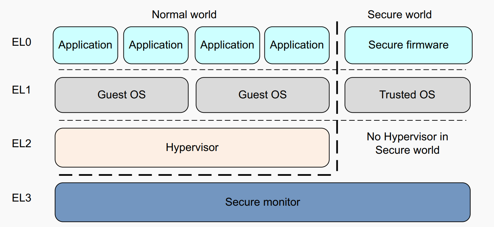
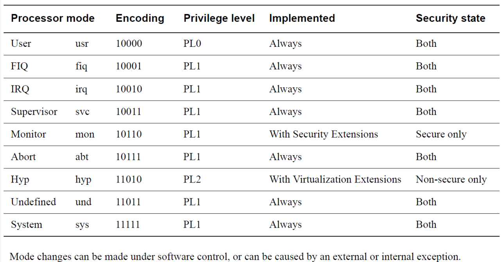
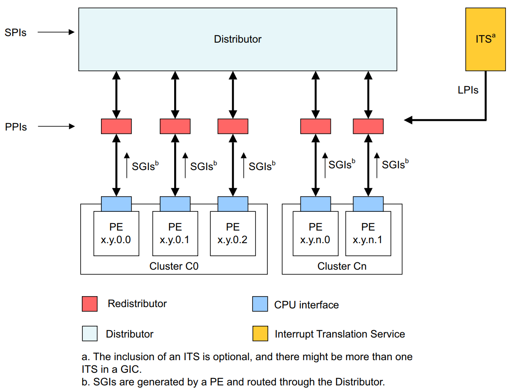
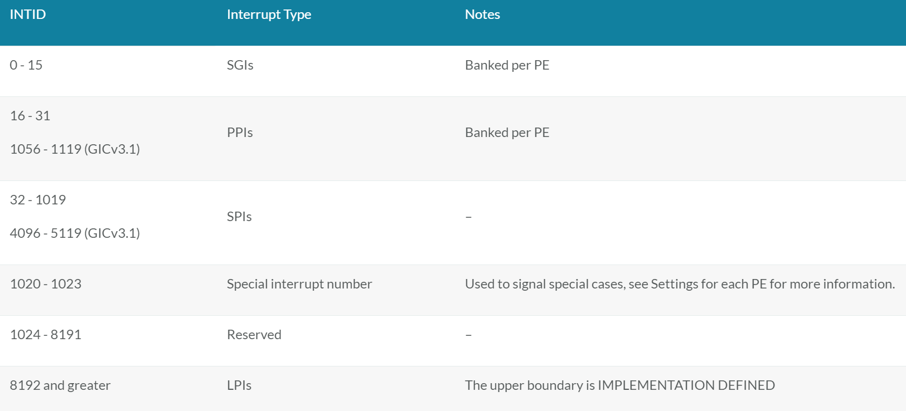
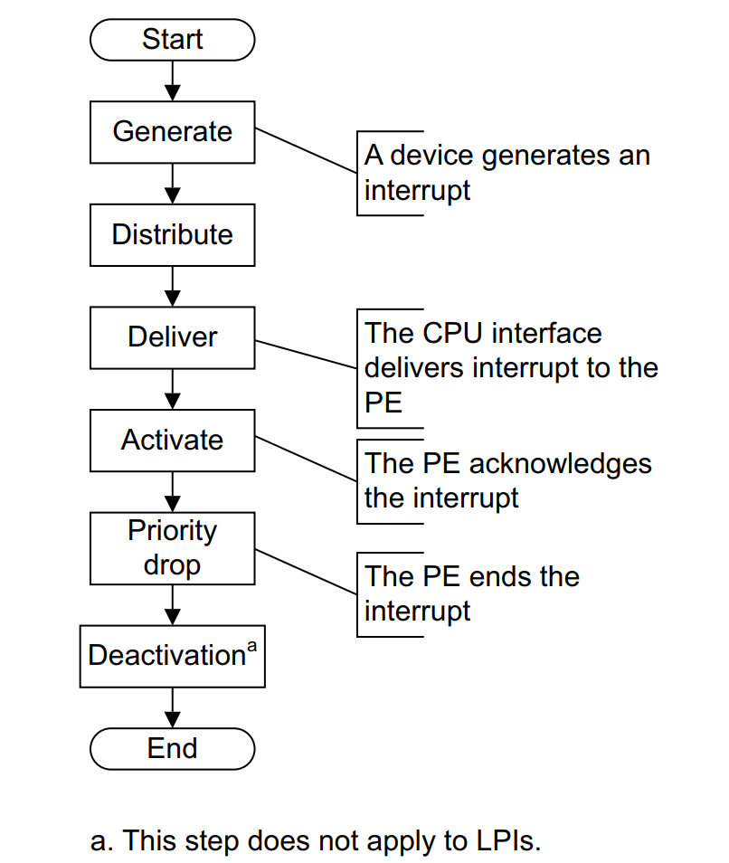
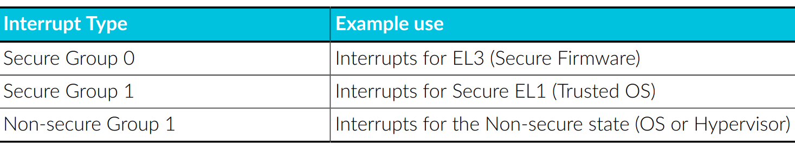

.. Michael Wu 版权所有

:Authors: Michael Wu
:Version: 1.0

ARM体系结构
===========

ARMv8异常等级和安全态
------------------------

ARMv8-A 有两种 security states, Secure and Non-secure. The Non-secure state 也叫做 Normal World. 

AArch64 Exception Handling
^^^^^^^^^^^^^^^^^^^^^^^^^^^

异常会中断正常执行流程，并且需要特权程序进行异常处理，从而确保系统正常运行。Exception包括：

- Interrupts.
- Memory system aborts.
- Exceptions generated by attempting to execute an instruction that is UNDEFINED.
- System calls.
- Secure monitor or Hypervisor traps.
- Debug exceptions

| ARM CPU的执行mode改变受到特权程序控制或者异常自动触发。可以参考：
| https://developer.arm.com/documentation/den0024/a/Fundamentals-of-ARMv8/Changing-Exception-levels

执行这些指令可能会引发异常。以请求运行在更高特权级别的软件提供的服务：

.. note:: 

  - The Supervisor Call (SVC) instruction enables User mode programs to request an OS service.
  - The Hypervisor Call (HVC) instruction enables the guest OS to request hypervisor services.
  - The Secure monitor Call (SMC) instruction enables the Normal world to request Secure world services.

Reset异常比较特殊，异常向量表地址可以从 ``Reset Vector Base Address`` 寄存器 ``RVBAR_ELn`` 中读取。
所有核都有一个 ``reset input`` ，reset是最高优先级的异常，无法被mask屏蔽，用于核上电初始化。

Exception and Interrupt
^^^^^^^^^^^^^^^^^^^^^^^^^

| 每种exception都有一个关联的异常handler。当异常被处理后，特权软件恢复到异常前的执行状态。
| https://developer.arm.com/documentation/100933/latest/AArch64-Exception-and-Interrupt-Handling

.. note:: 

  异常和中断的区别:

  - An exception is an event (other than branch or jump instructions) that causes the normal sequential execution
    of instructions to be modified.
  - An interrupt is an exception that is not caused directly by program execution. Usually, hardware external to the 
    processor core signals an interrupt, such as a button being pressed.

  ARM把exception分为同步和异步两组:

  - The synchronous exception types can have many causes but they are handled in a similar way. 
  - The asynchronous exception type is subdivided into three interrupt types, IRQ, FIQ, and SError (System Error).

GIC中断控制器
----------------

主要参考ARM官方文档:  https://developer.arm.com/documentation/ihi0069/h/?lang=en

GIC的组成和中断的分类：

| 按照中断号分：
| https://developer.arm.com/documentation/198123/0302/Arm-GIC-fundamentals

然后中断的上报流程可以看，不包括LPI（都是消息中断)：

按照安全非安全进行分组如下，以及对应的使用场景：

| 下面从软件使能GIC视角讲了一些原理和用法:
| https://developer.arm.com/documentation/den0024/a/AArch64-Exception-Handling/The-Generic-Interrupt-Controller

.. note:: 

    The GIC is accessed as a memory-mapped peripheral. All cores can access the common
    Distributor, but the CPU interface is banked, that is, each core uses the same address to access
    its own private CPU interface. It is not possible for a core to access the CPU interface of another
    core。

    In the Distributor, software must configure the priority, target, security and enable individual
    interrupts. The Distributor must subsequently be enabled through its control register
    (GICD_CTLR). For each CPU interface, software must program the priority mask and
    preemption settings.

    Each CPU interface block itself must be enabled through its control register (GICD_CTLR).
    This prepares the GIC to deliver interrupts to the core.

    When the core takes an interrupt, it jumps to the top-level interrupt vector obtained from the
    vector table and begins execution.

    The top-level interrupt handler reads the Interrupt Acknowledge Register from the CPU
    Interface block to obtain the interrupt ID.

    As well as returning the interrupt ID, the read causes the interrupt to be marked as active in the
    Distributor. Once the interrupt ID is known (identifying the interrupt source), the top-level
    handler can now dispatch a device-specific handler to service the interrupt.

    When the device-specific handler finishes execution, the top-level handler writes the same
    interrupt ID to the End of Interrupt (EoI) register in the CPU Interface block, indicating the end
    of interrupt processing.

结合QEMU和Linux的源码实现，可以更好的理解其实现细节。