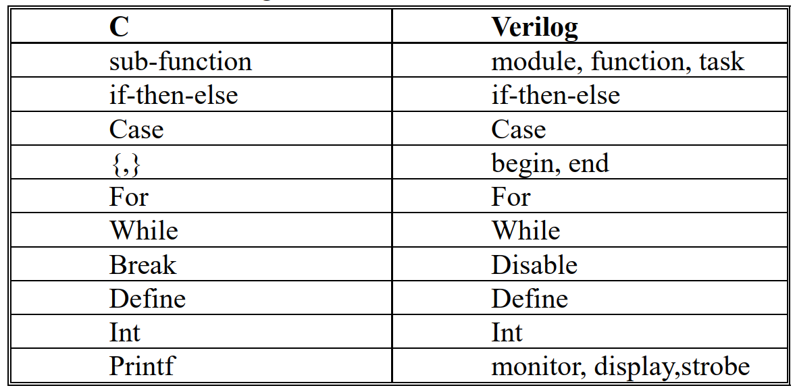

.. Michael Wu 版权所有

:Authors: Michael Wu
:Version: 1.0

IC芯片设计
============

verilog入门
------------

verilog入门资料
^^^^^^^^^^^^^^^

Verilog HDL（简称 Verilog ）是一种硬件描述语言，用于数字电路的系统设计。搜了一些资料：

- https://www.runoob.com/w3cnote/verilog-tutorial.html
- `夏宇闻-Verilog经典教程pdf <https://github.com/wtcat/DeveloperDoc/blob/master/%E5%A4%8F%E5%AE%87%E9%97%BB-Verilog%E7%BB%8F%E5%85%B8%E6%95%99%E7%A8%8B.pdf>`_ 
- `Verilog HDL教程（共172页pdf电子书下载） <https://bbs.elecfans.com/jishu_1610362_1_1.html>`_ 
- https://www.asic-world.com/verilog/intro1.html
- https://www.chipverify.com/tutorials/verilog

verilog与c语言对比关键字和控制结构:

而 C 与 Verilog 相对应的运算符几乎一样。所以有C基础，学起来Verilog会更快。

Verilog HDL是专门为复杂数字逻辑电路和系统的设计仿真而开发的，本身就非常适合复杂数字逻辑电路和系统的仿真和综合。
由于Verilog HDL在其门级描述的底层，也就是在晶体管开关的描述方面比VHDL有强得多得功能，所以即使是VHDL的设计环境，
在底层实质上也是由Verilog HDL描述的器件库所支持的。

说一下逻辑综合，有点类似C语言的编译。综合（synthesize），就是在标准单元库和特定的设计约束的基础上，将设计的高层次
描述（Verilog 建模）转换为门级网表的过程。逻辑综合的目的是产生物理电路门级结构，并在逻辑、时序上进行一定程度的优化，
寻求逻辑、面积、功耗的平衡，增强电路的可测试性。但不是所有的 Verilog 语句都是可以综合成逻辑单元的，例如时延语句。

.. _chisel_comp:

对比chisel
^^^^^^^^^^^^

- `问chisel语言未来是否会影响传统Verilog数字设计工程师? <https://www.zhihu.com/question/468593551/answer/1975018258>`_ 
- `快速学习-chisel为入门例子 <https://mysummary.readthedocs.io/zh/latest/%E8%8A%B1%E6%9C%B5%E7%9A%84%E6%B8%A9%E5%AE%A4/%E5%BF%AB%E9%80%9F%E5%AD%A6%E4%B9%A0.html#id1>`_ 
- `RISC-V开源项目为什么选用chisel这种新的高层次建模语言，而不是SystemVerilog? <https://www.zhihu.com/question/58584770>`_ 
- `数字IC工程师必须关注的开发潮流 <https://xueqiu.com/4927163759/130286419>`_ 

摘录上面链接一个经典例子：

.. note::

    芯片开发周期过长已经是阻碍半导体数字设计快速发展的重要瓶颈。

    Verilog HDL能实现完整的数字电路开发，但是其代码密度低，许多团队为了加速开发还必须配合团队约定的coding style自行开发
    的Python/Perl等脚本来自动生成代码，然而这种方式的可移植性存在问题。

    之前EDA业界也在尝试把C代码直接编译成Verilog的高级语言综合（High-Level Synthesis），但该尝试目前仅获得了有限的成功。
    U.C. Berkeley在设计和开发RISC-V标准和Core的过程中，引入了Chisel这样的开发工具，并且很大程度上反哺和改进了Chisel。

    举一个非常不恰当的栗子，我们以设计一个CPU为例：

    你本科熬了几年图书馆，挤破了头进入国内某微电子学院做了研究生，老师进来和你说我有个很好的想法，能够有效的改进指令效率或者多核性能
    或者功耗。老师说你做个5级流水线CPU把，还要把cache、总线、外设之类也做了（没缓存搞什么多核？）。好吧，我承认你很聪明，
    不出几个月你把CPU写的差不多了，然后cache、总线、外设这些大头还远着呢。又过了几个月你天天啃《量化研究方法》，然后终于把cache实现了。
    然后你写了个GPIO，又挂了个SRAM，好吧，你终于实现了一个小的CPU了。为了降低难度，你用了学术界最爱的MIPS体系结构，
    用了最土的wishbone总线。然后你开始了撸软件了，因为用了MIPS，你的难度已然降低了很多，而且你不用考虑编译器的问题了，
    你又吭哧了好几个月，写了个巨土的bootloader，终于把程序加载了。尽管后面可能还要在FPGA上跑起来，要发顶作的同学还要去申请经费流个片，
    这估计又要好久好久。但到目前为止你终于可以开始评估下你的设计的好坏了。

    你跑了一堆benchmark，得出了一些结果，然后你才开始把导师的idea应用到你的设计中。然后，然后，你就硕士毕业了，
    放心吧，你的这个摊子，你的学弟们会接锅的。

    这里尽管很多东西不那么真实，但是不得不说大学教授的很多项目，都是好几届学生慢慢做才做下来的，而且做归做，评估归评估。
    做完了哪里不好还得继续改进，因为有了架构，离实现到最后变成芯片还远着呢。更何况，评估一个设计好坏这件事本身或许难度更大。
    以上的故事暴露了一个问题，对于改进硬件架构这件事，反馈环实在太长了。

    所以扯了半天，我其实就想说一句话，硬件设计太耗时，Verilog写的蛋疼，需求要是变一点，那些个接口就得跟着变。要是速度上不去了，
    我要是想换个架构，又要花好久。或许SystemVerilog好一点，但你真的爱她吗？ // 难道SystemVerilog有什么坑？

    chisel的代码密度更高，面向对象和高级语言特性支持的更好。和SystemVerilog提供的一步到位相比，Chisel首先生成通用的Verilog，
    然后交由后端处理的方式，降低了对EDA工具的要求。还有更重要的一点，它是开源和免费的。

    Chisel的封装和抽象对 **通用的电路** 描述很有帮助，但是对某些 **定制化的电路，它的优势其实没有这么明显** 。
    这也是为什么目前能看到名气比较大的项目都是一些CPU、NPU等。里面有很多模块都是相同的单元在重复，所以很适合用Chisel封装。
    并且，Chisel在验证阶段（特别是最花时间的集成验证）中能做到东西基本为0。这一点就导致它很难对整个项目的进度有质的影响。

.. _sys_verlog:

对比 System Verilog
^^^^^^^^^^^^^^^^^^^^^

在 :ref:`chisel_comp` 章节，作者提到了 SystemVerilog(后面简称SV)，“或许比 Verilog 好一点，但是你真的爱她吗？”
突然就对 System Verilog 有点好奇，据我知道，很多testbench都是SV语言开发的，然后硬件IP模块还是Verilog。

| https://en.wikipedia.org/wiki/SystemVerilog
| SystemVerilog is based on Verilog and some extensions, and since 2008, Verilog is now part of the same IEEE standard. 

`什么场合下会用到systemverilog？ <https://www.zhihu.com/question/35418837>`_ 

芯片验证中通常要搭建一个完整的测试平台来写所需要测试用例。而 **verilog是出于可综合成电路的目的设计出来的**  ，所以它在书写测试
平台和测试用例是不够方便的（测试平台和用例不需要综合成电路）。

而 **SV正是由于它不需要满足可综合性** ，所以它变得非常灵活，它引入了面向对象语言的概念。在验证方面，
如果说verilog是C语言的话，那SV就是C++，SV不光有verilog的所有特性，还有自身面向对象的特性。

Verilog之父Phil Moorby（也参与到SV标准制定当中）评价SV：

1. Verilog产生于20世纪80年代中期，典型的设计大小为5000~10000门，典型的设计方法则是使用图形化原理图输入工具进行设计，仿真开始成为必不可少的门级验证工具。
2. SystemVerilog在Verilog的基础上进行了重大改进，包括在抽象设计、测试平台，形式和基于C语言的应用程序接口（API）等方面的主要扩展。 
3. SystemVerilog还定义了Verilog仿真的新层次。与原先的Verilog相比，采用基于SystemVerilog的工具的团队将更高效， 并能够在更短的时间内生成更高质量的设计。
4. SystemVerilog是Verilog的扩展，并且随着新工具的推出，我相信所有Verilog用户以及其他HDL的许多用户都会自然地采用它。实际上Verilog与SV是一脉相承的。

在Verilog-2005标准之后就几乎不再更新，而SV则获得接力棒，继续更新标准，最新的SV标准基于IEEE 1800-2017。
SV是分为设计部分和验证部分的，这也是SV当时基于Verilog扩展的目的，是为了在RTL和更高抽象级模型建立过程当中，
使用SV来同时解决设计和验证的问题。SystemVerilog可综合的部份其实和Verilog差异不是很大，
SV面向对象的不可综合部份对设计用的偏少，对验证用的较多。UVM就是基于SystemVerilog搭建的。

开发demo CPU
-------------

IC设计领域比较经典的项目就是设计一个CPU了，在 :ref:`chisel_comp` 章节引用的一个知乎回答提到了 **学术界最爱的MIPS体系结构** ，
然后刚好前阵子看 ``xv6 OS for armv8`` 时，在作者的github主页看到了使用 ``System Verilog`` 实现一个MIPS的CPU的项目：

| https://github.com/hakula139/MIPS-CPU
| https://sunfloweraries.github.io/ICS-Spring20-Fudan
| https://github.com/jasha64/MIPS-Pipeline-with-Cache/blob/master/benchtest/cpu_tb.sv

整个代码量不是很多，通过这个项目理解下CPU基本原理，了解下SV工程还是比较方便的。

verilog开发环境
------------------

从 https://zhuanlan.zhihu.com/p/436976157 得出一个信息：
知名的Verilog仿真工具主要为三大EDA厂商的产品：mentor的modelsim/questasim，candence的NC-verilog，synopsys的VCS。
但这三个玩意难安装，要收费，启动也慢，有时候我们就是想简单的看一下设计功能对不对，结果新建一个工程都费了牛劲了。
不够灵活方便。

前面 https://www.runoob.com/w3cnote/verilog-install.html 也提到了环境相关：记忆中，Quartus II + Modelsim 的联合仿真
功能既强大，又安装方便。几年后重新进行此过程，发现步骤也有些许繁琐，花费了我一晚上的时间来搞定。很多细节也在上面提出，多多注意就好。
不过，大家以后有机会进行大型的数字模块仿真时，就会发现此方法的有效性。

然后免费环境有如下的方案，参考： `ubuntu安装vim,iverilog和gtkwave并进行测试与仿真 <https://blog.csdn.net/ZikY_0827/article/details/127939852>`_ 
安装方法： ::

  apt install iverilog
  apt install gtkwave

然后就可以命令行写verilog代码，运行并看波形了，适合入门verilog写小练习。

online verilog练习网站： https://hdlbits.01xz.net/wiki/Step_one

  - `HDLBits: 在线学习 Verilog （〇） <https://zhuanlan.zhihu.com/p/56646479>`_ 
  - `Verilog HDL刷题网站推荐——HDLBits <https://zhuanlan.zhihu.com/p/184031850>`_

该网站很适合Verilog初学者快速上手，也适用于日常练手，其自带基于 **mentor modelsim** 的在线仿真功能，能够在编写完代码后快速得到反馈，
极大地方便了调试。HDLbits中共有178道题目，大部分题目比较基础，但在组合逻辑、时序逻辑两个模块中也有一些具有挑战性的题。

一些博主分享的答案：

  - `HDLBits 中文导学 <https://zhuanlan.zhihu.com/c_1131528588117385216>`_ 
  - https://github.com/jerrylioon/Solutions-to-HDLbits-Verilog-sets
  - https://github.com/xiaop1/Verilog-Practice

如果是纯粹学习维护，不防用这个online的网站。

verilator介绍
-------------

see: https://verilator.org/guide/latest/overview.html

The Verilator package converts Verilog 1 and SystemVerilog 2 hardware description language (HDL) designs 
into a C++ or SystemC model that, after compiling, can be executed.

| 还支持：SystemVerilog Direct Programming Interface(DPI)
| https://verilator.org/guide/latest/connecting.html#direct-programming-interface-dpi

芯片验证UVM
------------

在前面 :ref:`sys_verlog` 章节，提到了 SystemVerilog 开发的 UVM (Universal Verification Methodology), 而且提到这是
芯片验证必须掌握的技能，查了一些资料如下：

- https://en.wikipedia.org/wiki/Universal_Verification_Methodology
- `zhihu: UVM入门学习笔记（一） <https://zhuanlan.zhihu.com/p/266391581>`_ 
- `《UVM实战 卷Ⅰ》 <https://github.com/sin-x/FPGA/blob/master/src/docs/UVM%E5%AE%9E%E6%88%98%20%E5%8D%B7%E2%85%A0.pdf>`_ 
- `《SystemVerilog for Verification(最新版)》 <https://github.com/chunzhimu/Verilog-HDL/blob/master/SystemVerilog%20for%20Verification(%E6%9C%80%E6%96%B0%E7%89%88).pdf>`_
- https://www.chipverify.com/tutorials/uvm

在上面的知乎笔记里：

.. note::

  我使用的材料是经典的两本书《SystemVerilog for Verification》和《UVM实战》，其中前者主要介绍SV的语法，
  以及一些代码机制（如面向对象，线程通信等等），而后者着重介绍UVM框架的具体细节，以及如何搭建通用的验证环境。
  由于UVM是用SV写的，所以我推荐先学习前者，重点记住语法和数据结构，mailbox，semophore之类的线程相关机制，
  至于书中的验证框架是VMM，可以不去关注。

  数字IC验证，与设计一样，是属于前端的一部分，也是不可或缺的一部分。通常在公司中，一个设计工程师需要配两个验证工程师，
  因为芯片作为硬件产品，其电路一旦生产出来就无法修改了，所以在验证阶段排除尽量多的bug就尤为关键。

然后是，《UVM实战》里的一些介绍：

当设计说明书完成后， 设计人员开始使用Verilog（ 或者VHDL， 这里以Verilog为例） 将特性列表转换成RTL代码， 而验证人员
则开始使用验证语言（ 这里以 SystemVerilog 为例） 搭建验证平台， 并且着手建造第一个测试用例（ test case） 。 当RTL代码完成
后， 验证人员开始验证这些代码（ 通常被称为DUT（ Design Under Test） ， 也可以称为DUV（ Design Under Verification） ， 本书统
一使用DUT） 的正确性。

有两种通用的设计语言： Verilog和VHDL。伴随着IC的发展， Verilog由于其易用性，在IC设计领域占据了主流地位， 使用VHDL的人越来越少。
基于Verilog的验证语言主要有如下三种：Verilog，SystemC，SystemVerilog.

.. note:: 

  Verilog：Verilog是针对设计的语言。验证起源于设计， 在最初的时候是没有专门的验证的， 验证与设计合二为一。 考虑到这种现状， 
  Verilog在其中还包含了一个用于验证的子集， 其中最典型的语句就是initial、 task和function。纯正的设计几乎是用不到这些语句的。
  通过这些语句的组合， 可以给设计施加激励， 并观测输出结果是否与期望的一致， 达到验证的目的。 Verilog在验证方面最大的问题是
  功能模块化、 随机化验证上的不足。

  SystemC： SystemC本质上是一个C++的库，适合更复杂的算法验证。通常来说。可以笼统地把IC分为两类，一类是算法需求比较少的， 
  如网络通信协议； 另一类是算法需求非常复杂的， 如图形图像处理等。在使用Verilog编写代码之前，会使用C或者C++建立一个算法参考模型， 
  在验证时需要把此参考模型的输出与DUT的输出相比， 因此需要在设计中把基于C++/C的模型集成到验证平台中。C++的强大使得SystemC在算法类
  的设计中如鱼得水，但是采用C++也有个缺点就是过于复杂。有很多公司专项了 SystemVerilog。

  SystemVerilog： 它是一个Verilog的扩展集， 可以完全兼容Verilog(有点类似C++之于C)。起源于2002年，2005年成为IEEE的标准。
  SystemVerilog刚一推出就受到了热烈欢迎， 它具有所有面向对象语言的特性： 封装、继承和多态。同时还为验证提供了一些独有的特性， 
  如约束（ constraint） 、 功能覆盖率（ functional coverage）。因为其与Verilog完全兼容， 很多使用Verilog的用户可以快速上手，
  且其学习曲线非常短，因此很多原先使用Verilog做验证的工程师们迅速转到SystemVerilog。在与SystemC的对比中， SystemVerilog也不落
  下风， 它提供了DPI接口， 可以把C/C++的函数导入SystemVerilog代码中， 就像这个函数是用SystemVerilog写成的一样。与C++相比， 
  SystemVerilog语言本身提供内存管理机制， 用户不用担心内存泄露的问题。 除此之外， 它还支持系统函数$system， 可以直接调用外部的
  可执行程序， 就像在Linux的shell下直接调用一样。用户可以把使用C++写成的参考模型编译成可执行文件， 使用$system函数调用。

在IC设计领域， 有一句很有名的话是“验证与设计不分家”。 甚至目前在一些IC公司里， 依然存在着同一个人兼任设计人员与验证人员的情况。
验证与设计只是从不同的角度来做同一件事情而已。 