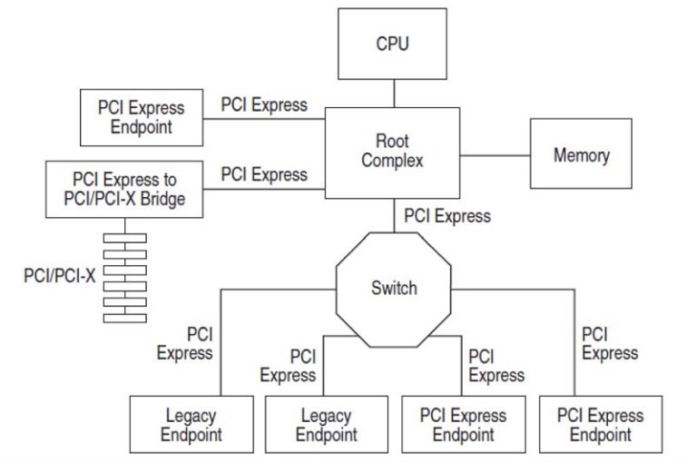

.. Michael Wu 版权所有

:Authors: Michael Wu
:Version: 1.0

PCIe总线
=========

介绍
-----

PCI总线，Peripheral Component Interconnect，是Intel早年推出的一种外设总线，用于连接外部高速设备。这种总线后来逐步成为高速外设
的一种标准。PCI是一种并行总线，速度有限。

PCIe总线是PCI的发展，它改用了串行DerDes的物理层。PCIe 在软件层面上兼容目前的 PCI 技术和设备。

.. note::
    Q: in a software perspective, can we use the same driver(Linux) for PCI and PCIe(+additional features)?
    Is the Bus access will be same?

    A: Yes. PCIe use the same old config registers as PCI (plus some extra config register space).
    From the Linux driver perspective, the CPU/OS access the same config registers in the PCI/PCIe end-point
    regardless of how the write/read access is carried out in the physical media i.e.,
    parallel bus (PCI) vs serial link (PCIe). The OS/driver sees the same address space. As long as the definition
    the address space looks the same, it is compatible.

    From a software standpoint, PCI and PCI Express devices are essentially the same. PCIe devices had the same
    configuration space, BARs, and (usually) support the same PCI INTx interrupts.

PCIe可以级联，构成多样的组合和物理布局。PCIe总线和系统设备通向MMIO空间，所以PCIe设备和总线上的设备非常接近，
其他总线设备可以直接访问PCIe设备的的MMIO空间，而PCIe设备也可以访问其他的总线空间，包括其他设备的MMIO空间或者总线控制器后面的内存。

.. csv-table:: pcie-term-definiton
    :align: left

    Term,definition
    EP,End point
    RC,Root Complex
    VC,Virtual channel
    PCIESS,PCI Express subsystem
    TLP,Transaction layer packet
    BARs,Base address registers

我们把和CPU发出地址的那个总线称为系统总线, PCIe像一个数结构，是一个子总线。如下图，RC是根节点，EP是叶节点。

从软件的角度来说，对某个设备寻址，就是往系统总线里面写一个地址。对系统总线来说，如果这个地址在RC的范围内，就把这个读写请求发到RC上，
RC怎么处理剩下的细节，那就是PCIe标准要解决的问题了。

PCIe总线的位置
---------------

在处理器体系结构中，PCI 总线属于局部总线(Local Bus)。局部总线作为系统总线的延伸，主要功能是为了连接外部设备。从软件层面上看，
PCI Express 总线与 PCI 总线基本兼容。

- PCI-to-PCI 桥简称为 PCI 桥
- PCIe-to-PCI 桥简称为 PCIe 桥
- Host-to-PCI 主桥简称为 HOST 主桥, 很多书也将 **HOST主桥** 称作 **PCI主桥** 或者 **PCI 总线控制器**

PCI 总线空间与 **处理器空间** 隔离。PCI 设备具有独立的地址空间，即 PCI 总线地址空间，该空间与存储器地址空间通过 HOST 主
桥（即 PCI 总线控制器）隔离。处理器需要通过 **HOST主桥** 才能访问 PCI 设备。而 PCI 设备需要通过 HOST 主桥才能访问
主存储器。

处理器访问 PCI 设备时，必须通过 HOST主桥进行地址转换；而 PCI设备访问主存储器时，也需要通过 HOST 主桥进行地址转换。
PCI 规范并没有对 HOST 主桥的设计进行约束。每一个处理器厂商使用的 HOST主桥，其设计都不尽相同。在 PCI 总线中，HOST主桥可以
直接推出一条 PCI 总线，这条总线也是该 HOST 主桥的所管理的第一条 PCI 总线，该总线还可以通过 PCI 桥扩展出一系列 PCI
总线，并以 HOST 主桥为根节点，形成 1 颗 PCI 总线树。在同一条 PCI 总线上的设备间可以直接通信。

PCI 设备使用的地址可以根据需要由系统软件动态分配。PCI 总线使用这种方式合理地解决了设备间的地址冲突，从而实现了“即插即用”功能。
每一个 PCI 设备都有独立的配置空间，在配置空间中含有该设备在 PCI 总线中使用的基地址，系统软件可以动态配置这个基地址，
从而保证每一个 PCI 设备使用的物理地址并不相同。PCI桥的配置空间中含有其下 PCI 子树所能使用的地址范围。

HOST 主桥是一个很特别的桥片，其主要功能是隔离处理器系统的存储器域与处理器系统的 PCI总线域，管理 PCI 总线域，
并完成处理器与 PCI 设备间的数据交换。处理器与 PCI 设备间的数据交换主要由: “处理器访问 PCI 设备的地址空间”和“PCI 设备
使用 DMA 机制访问主存储器”这两部分组成。

PCI 设备
-----------

在 PCI 总线中有三类设备，PCI 主设备、PCI 从设备和桥设备。其中 PCI 从设备只能被动地接
收来自 HOST 主桥，或者其他 PCI 设备的读写请求；而 PCI 主设备可以通过总线仲裁获得 PCI
总线的使用权，主动地向其他 PCI 设备或者主存储器发起存储器读写请求。而桥设备的主要作
用是管理下游的 PCI 总线，并转发上下游总线之间的总线事务。

一个 PCI 设备可以即是主设备也是从设备，但是在同一个时刻，只能是一种。
PCI 总线规范将 PCI 主从设备统称为 PCI Agent 设备。常见的 PCI
网卡、显卡、声卡等设备都属于 PCI Agent 设备。

在 PCI 总线中，HOST 主桥（PCI 总线控制器）是一个特殊的 PCI 设备，该设备可以获取 PCI 总线的控制权访问 PCI
设备，也可以被 PCI 设备访问。PCI 规范也没有规定如何设计 HOST 主桥。

桥设备包括 PCI 桥、PCI-to-(E)ISA 桥和PCI-to-Cardbus 桥，PCI 桥的存在使PCI 总线极具扩展性。

在 PCI 设备的配置空间中，共有 6 个 BAR 寄存器。每一个 BAR 寄存器都与 PCI 设备使用的一组 **PCI总线地址空间** 对应，
BAR 寄存器记录这组地址空间的基地址。值得注意的是，在 BAR 寄存器中存放的是 PCI 设备使用的“PCI 总线域”的物理地址，
而不是“存储器域”的物理地址。

HOST 处理器访问 PCI 设备 I/O 地址空间的过程，与访问存储器地址空间略有不同。有些处理
器，如 x86 处理器，具有独立的 I/O 地址空间。x86 处理器可以将 PCI 设备使用的 I/O 地址映射
到存储器域的 I/O 地址空间中，之后处理器可以使用 IN，OUT 等指令对存储器域的 I/O 地址进
行访问，然后通过 HOST 主桥将存储器域的 I/O 地址转换为 PCI 总线域的 I/O 地址，最后使用
PCI 总线的 I/O 总线事务对 PCI 设备的 I/O 地址进行读写访问。在 x86 处理器中，存储器域的 I/O
地址与 PCI 总线域的 I/O 地址相同。

对于有些没有独立 I/O 地址空间的处理器，如 PowerPC 处理器（ARM也是)，需要在 HOST主桥(PCI总线控制器)初始化时，
将 PCI 设备使用的 I/O 地址空间映射为处理器的存储器地址空间。PowerPC 处理器对这段“存
储器域”的存储器空间进行读写访问时，HOST 主桥将存储器域的这段存储器地址转换为 PCI
总线域的 I/O 地址，然后通过 PCI 总线的 I/O 总线事务对 PCI 设备的 I/O 地址进行读写操作。

PCI设备的DMA
--------------

PCI 设备与存储器直接进行数据交换的过程也被称为 DMA。与其他总线的 DMA 过程类似，PCI
设备进行 DMA 操作时，需要获得数据传送的目的地址和传送大小。支持 DMA 传递的 PCI 设
备可以在其 BAR 空间中设置两个寄存器，分别保存这个目标地址和传送大小。这两个寄存器也
是 PCI 设备 DMA 控制器的组成部件。

PCI 设备配置空间的访问机制

PCI 总线规定访问配置空间的总线事务，即配置读写总线事务，使用 ID 号进行寻址。PCI 设
备的 ID 号由总线号(Bus Number)、设备号(Device Number)和功能号(Function Number)组成。

PCI 总线可以使用 PCI 桥扩展 PCI 总线，并形成一颗 PCI 总线树。在一颗 PCI 总线树上，
有几个 PCI 桥(包括 HOST 主桥)，就有几条 PCI总线。在一颗 PCI 总线树中，总线号由系统软件决定。
常与 HOST 主桥直接相连的 PCI 总线编号为 0，系统软件使用 DFS(Depth-First Search)算法扫描 PCI 总线树上的所有 PCI 总线，
并依次进行编号。

一条 PCI 总线的设备号由 PCI 设备的 IDSEL 信号与 PCI 总线地址线的连接关系确定，而功能
号与 PCI 设备的具体设计相关。在一个 PCI 设备中最多有 8 个功能设备，而且每一个功能设备
都有各自的 PCI 配置空间，而在绝大多数 PCI 设备中只有一个功能设备。

QEMU中的PCIe仿真
-------------------

在 docs/system/ppc/powernv.rst 里给出了一个命令行使用PCIe网卡E1000E的方法。可以通过这个命令可以看device的属性，
看PCIe网卡： ``qemu -device e1000e,?`` ::

    $ qemu -device e1000e,?

    e1000e options:
    acpi-index=<uint32>    -  (default: 0)
    addr=<int32>           - Slot and optional function number, example: 06.0 or 06 (default: -1)
    bootindex=<int32>
    disable_vnet_hdr=<uint8> - Do not use virtio headers, perform SW offloads emulation instead (default: 0)
    failover_pair_id=<str>
    init-vet=<bool>        -  (default: true)
    mac=<str>              - Ethernet 6-byte MAC Address, example: 52:54:00:12:34:56
    migrate-timadj=<bool>  -  (default: true)
    multifunction=<bool>   - on/off (default: false)
    netdev=<str>           - ID of a netdev to use as a backend
    rombar=<uint32>        -  (default: 1)
    romfile=<str>
    romsize=<uint32>       -  (default: 4294967295)
    subsys=<uint16>        - PCI device Subsystem ID (default: 0)
    subsys_ven=<uint16>    - PCI device Subsystem Vendor ID (default: 32902)
    x-pcie-ari-nextfn-1=<bool> - on/off (default: false)
    x-pcie-err-unc-mask=<bool> - on/off (default: true)
    x-pcie-extcap-init=<bool> - on/off (default: true)
    x-pcie-lnksta-dllla=<bool> - on/off (default: true)

这种方式也可以比好方便的看QEMU里的device支持那些属性设置。

在QEMU的帮助文档里，搜索 pcie 也可以看到一些使能 pcie 的示例配置。比如  ::

    -device e1000e,netdev=net0,mac=C0:FF:EE:00:00:02,bus=pcie.0,addr=0x0

给一个 device 指定好bus属性的值pcie.0, 地址是0.

对于PCIe地址处理对于QEMU实现是相对比较关键的。PCIe总线体系把地址空间分成两个部分:

第一个部分叫ECAM空间，是PCIe的标准配置空间，提供标准的控制整个PCIe功能的基本语义，
它的地址组成是“RC基地址+16位BDF+偏移”（BDF是Bus，Device，Function的简称，在Linux上lspci就能看见）。
通过对这个空间寻址，就可以实现对PCIe总线系统的配置。

第二个部分可简称BAR空间，这个空间是RC和系统总线设计者讨论决定的，在对ECAM进行配置的时候，软件和硬件进行协商，最后在某个BDF的
ECAM空间的Base Address Register（BAR）中指向分配好的，给这个EP的一组IO空间。

CPU发出一个物理地址，落入分配给RC的空间，这个地址就进入PCIE的调度体系。就可以从RC开始，变成PCIe自己的
消息（TLP Transaction layer packet）。TLP主要依靠BDF（在TLP中称为RequesterID和CompleterID）来寻址，因为无论如何，
一个地址请求，终究目的是发给一个设备的某个Function，然后寻址这个Function里面的某个偏移。

如果CPU发出的地址落在ECAM的范围内，就变成配置消息，基于解码出来的BDF就可以发到对应的EP上了。调度系统也可以基于配置找到对应的BDF来发送。

如果是BAR空间，这个东西如何分配给每个BDF的，RC肯定也是清楚的，同样可以转化为BDF，发送给对应的EP，这个过程没有问题。

Address Translation

    PCI Express TLP transactions use PCIe addresses. There is a mapping requirement
    between a PCIe address and a local internal bus address and to accommodate this
    address mapping, built-in hardware address translation mechanisms exist.

    PCIe recognizes four address spaces, Memory, I/O, Configuration, and Message.

参考
-----

- `KeyStone Architecture Peripheral Component Interconnect Express (PCIe) <https://www.ti.com/lit/ug/sprugs6d/sprugs6d.pdf?ts=1714159982257>`_
- `QEMU docs pcie.txt <https://github.com/qemu/qemu/blob/master/docs/pcie.txt>`_
- `zhihu: qemu PCIe总线结构 <https://zhuanlan.zhihu.com/p/113467453>`_
- `readthedoc: qemu PCIe总线结构 <https://mysummary.readthedocs.io/zh/latest/%E8%BD%AF%E4%BB%B6%E6%9E%84%E6%9E%B6%E8%AE%BE%E8%AE%A1/qemu_PCIe%E6%80%BB%E7%BA%BF%E7%BB%93%E6%9E%84.html>`_
- `PCIe总线的地址问题 <https://mysummary.readthedocs.io/zh/latest/%E8%BD%AF%E4%BB%B6%E6%9E%84%E6%9E%B6%E8%AE%BE%E8%AE%A1/PCIe%E6%80%BB%E7%BA%BF%E7%9A%84%E5%9C%B0%E5%9D%80%E9%97%AE%E9%A2%98.html>`_
- `PCIe总线的保序模型 <https://mysummary.readthedocs.io/zh/latest/%E8%BD%AF%E4%BB%B6%E6%9E%84%E6%9E%B6%E8%AE%BE%E8%AE%A1/PCIe%E6%80%BB%E7%BA%BF%E7%9A%84%E4%BF%9D%E5%BA%8F%E6%A8%A1%E5%9E%8B.html>`_
- `认识鲲鹏920：一个服务器SoC/总线.rst#pcie总线 <https://gitee.com/Kenneth-Lee-2012/know_modern_server_from_kunpeng920_pub/blob/pub/source/%E8%AE%A4%E8%AF%86%E9%B2%B2%E9%B9%8F920%EF%BC%9A%E4%B8%80%E4%B8%AA%E6%9C%8D%E5%8A%A1%E5%99%A8SoC/%E6%80%BB%E7%BA%BF.rst#pcie%E6%80%BB%E7%BA%BF>`_
- `PCI+Express体系结构导读.pdf <https://github.com/vvvlan/misc/blob/master/PCI%2BExpress%E4%BD%93%E7%B3%BB%E7%BB%93%E6%9E%84%E5%AF%BC%E8%AF%BB.pdf>`_
- https://docs.kernel.org/PCI/pci.html
- https://stackoverflow.com/questions/45366918/difference-between-pci-and-pcie
- https://stackoverflow.com/questions/12159739/linux-driver-development-difference-between-pci-and-pcie-driver