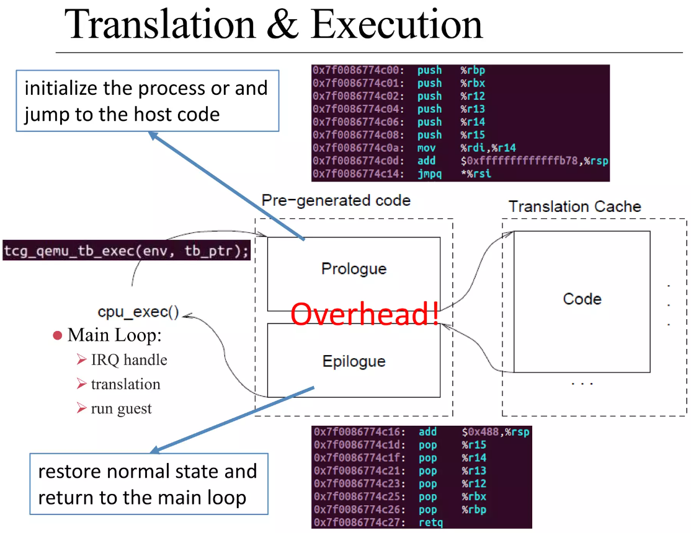
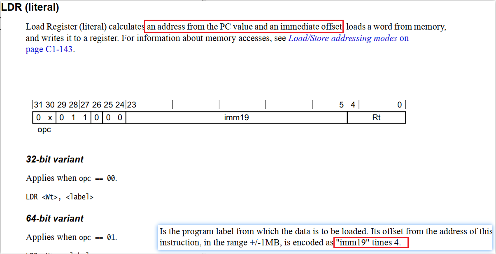
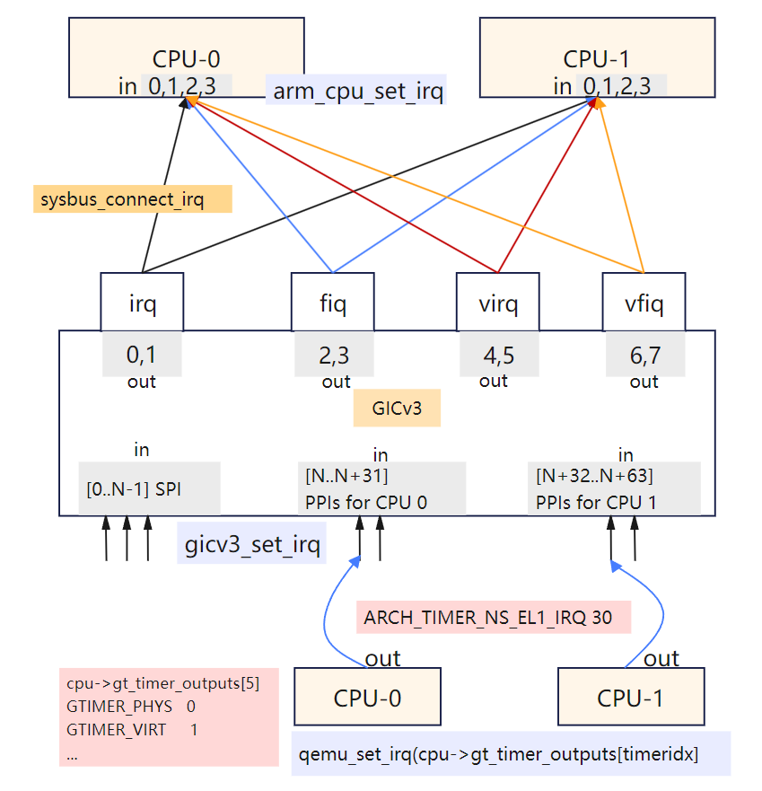
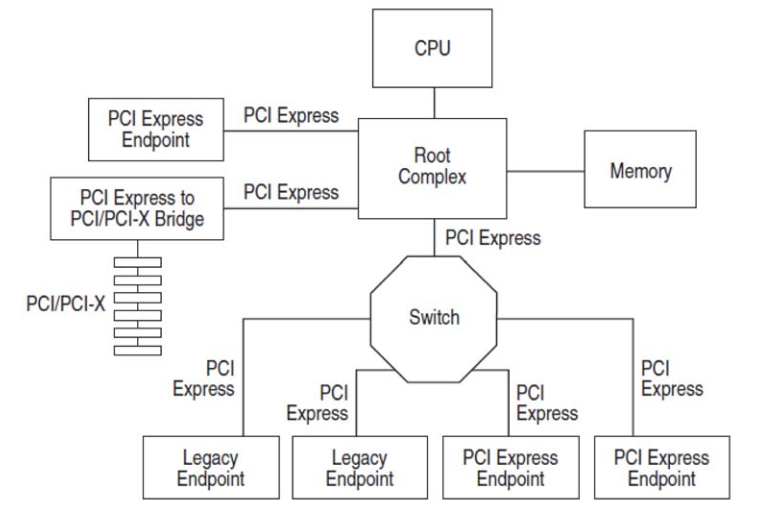

.. Michael Wu 版权所有

:Authors: Michael Wu
:Version: 1.0

QEMU仿真虚拟化
================

编译和运行
----------------

使用当前（2024.3）的最新版本即可:

.. csv-table::

    QEMU, https://www.qemu.org, https://github.com/qemu, v8.2.0
    Linux, https://www.kernel.org, https://github.com/torvalds/linux, v6.8.0
    BusyBox, https://busybox.net, https://github.com/mirror/busybox, 1.36.0

编译QEMU, 为了方便调试，加入了 ``--enable-debug`` 选项，这个方便单步调试，但是会影响性能，所以release版本不要带。

.. code-block:: bash

    mkdir build
    cd build
    ../configure --target-list=aarch64-softmmu --enable-debug
    make -j

编译Linux内核，请参考 :doc:`/blogs/Linux操作系统`

启动QEMU, ``start.sh``

.. code-block:: bash

    #!/bin/bash

    qemu/build/aarch64-softmmu/qemu-system-aarch64 \
        -nographic \
        -cpu cortex-a57 \
        -readconfig virt.cfg

配置文件 ``virt.cfg``

.. code-block:: ini

    [machine]
        type = "virt"
        kernel = "linux/build/arch/arm64/boot/Image"
        append = "nokaslr root=/dev/ram init=/linuxrc console=ttyAMA0 console=ttyS0"
        initrd = "initrd.ext4"

    [smp-opts]
        cpus = "2"

    [memory]
        size = "4G"

我们也可以在 vscode 中拉起，更加容易调试, ``launch.json``

.. code-block:: json

    {
        "version": "0.2.0",
        "configurations": [
            {
                "name": "QEMU",
                "MIMode": "gdb",
                "type": "cppdbg",
                "request": "launch",
                "program": "${workspaceFolder}/build/qemu-system-aarch64",
                "cwd": "/root/arm",
                "args": [
                    "-nographic",
                    "-cpu", "cortex-a57",
                    "-readconfig", "virt.cfg"
                ]
            }
        ]
    }

加载kernel, initrd, dtb
------------------------

这里直接使用QEMU命令行传递内核和initrd，用了QEMU内置的mini-Bootloader，关键的流程步骤:

1. load kernel
2. load initrd
3. load dtb

执行时的callstack如下 ::

    // 1. load kernel
    #0  load_uboot_image (filename=0x555557a469b0 "linux-6.0.9/build/arch/arm64/boot/Image", ep=0x7fffffffd748, loadaddr=0x7fffffffd750, is_linux=0x7fffffffd724, image_type=2 '\002', translate_fn=0x0, translate_opaque=0x0, as=0x555557bcc6c0) at ../hw/core/loader.c:646
    #1  0x00005555559a89bc in load_uimage_as (filename=0x555557a469b0 "linux-6.0.9/build/arch/arm64/boot/Image", ep=0x7fffffffd748, loadaddr=0x7fffffffd750, is_linux=0x7fffffffd724, translate_fn=0x0, translate_opaque=0x0, as=0x555557bcc6c0) at ../hw/core/loader.c:784
    #2  0x0000555555df23ab in arm_setup_direct_kernel_boot (cpu=0x555557b3ca90, info=0x5555579d19b8) at ../hw/arm/boot.c:976
    #3  0x0000555555df2cfe in arm_load_kernel (cpu=0x555557b3ca90, ms=0x5555579d1800, info=0x5555579d19b8) at ../hw/arm/boot.c:1239
    #4  0x0000555555dfa6b2 in machvirt_init (machine=0x5555579d1800) at ../hw/arm/virt.c:2336
    #5  0x00005555559b1215 in machine_run_board_init (machine=0x5555579d1800, mem_path=0x0, errp=0x7fffffffd980) at ../hw/core/machine.c:1509
    #6  0x0000555555d14a46 in qemu_init_board () at ../system/vl.c:2613
    #7  0x0000555555d14cb4 in qmp_x_exit_preconfig (errp=0x5555575a7f20 <error_fatal>) at ../system/vl.c:2704
    #8  0x0000555555d174ed in qemu_init (argc=6, argv=0x7fffffffdc88) at ../system/vl.c:3753
    #9  0x00005555561af787 in main (argc=6, argv=0x7fffffffdc88) at ../system/main.c:47

    // 2. load initrd
    #0  load_uboot_image (filename=0x555557a46e60 "initrd.ext4", ep=0x0, loadaddr=0x7fffffffd6f0, is_linux=0x0, image_type=3 '\003', translate_fn=0x0, translate_opaque=0x0, as=0x555557bcc6c0) at ../hw/core/loader.c:636
    #1  0x00005555559a8a3c in load_ramdisk_as (filename=0x555557a46e60 "initrd.ext4", addr=1207959552, max_sz=2013265920, as=0x555557bcc6c0) at ../hw/core/loader.c:797
    #2  0x0000555555df2731 in arm_setup_direct_kernel_boot (cpu=0x555557b3ca90, info=0x5555579d19b8) at ../hw/arm/boot.c:1048
    #3  0x0000555555df2cfe in arm_load_kernel (cpu=0x555557b3ca90, ms=0x5555579d1800, info=0x5555579d19b8) at ../hw/arm/boot.c:1239

    // 3. load dtb
    #0  arm_load_dtb (addr=1241513984, binfo=0x5555579d19b8, addr_limit=0, as=0x555557bcc6c0, ms=0x5555579d1800) at ../hw/arm/boot.c:518
    #1  0x0000555555df9176 in virt_machine_done (notifier=0x5555579d1958, data=0x0) at ../hw/arm/virt.c:1681
    #2  0x00005555563c7f0c in notifier_list_notify (list=0x555557579390 <machine_init_done_notifiers>, data=0x0) at ../util/notify.c:39
    #3  0x00005555559b1352 in qdev_machine_creation_done () at ../hw/core/machine.c:1557
    #4  0x0000555555d14bbe in qemu_machine_creation_done () at ../system/vl.c:2677
    #5  0x0000555555d14cbe in qmp_x_exit_preconfig (errp=0x5555575a7f20 <error_fatal>) at ../system/vl.c:2706
    #6  0x0000555555d174ed in qemu_init (argc=6, argv=0x7fffffffdc88) at ../system/vl.c:3753

内核启动是需要Bootloader的，硬件初始化，把内核/DTB从文件加载到内存，PC设置到入口等等。

选项解析与初始化
-----------------

首先说一下怎么看qemu所支持的参数 ::

    ./qemu-system-aarch64 -help   // 可以看所有参数
    ./qemu-system-aarch64 -d help // 可以看调试所支持项
    在编译的build目录下有个 qemu-options.def，也有所有的标砖的参数

展开看下QEMU启动一个machine的选项与配置 ::

    qemu_init
        // 1. qemu_add各种opts数据结构
        // 2. pass of option parsing, qemu-options.def 里有各种定义
        // QEMU_OPTION_readconfig
        |   qemu_read_config_file
        |   |   qemu_config_foreach  // 解析配置文件
        |   |       qemu_config_foreach // 跳过空行和注释解析到字典中
        |   qemu_validate_options // 从解析的字典结构判断选项合法性
        |       // 指定了 -kernel 选项，才能指定 -initrd 和 -append
        qemu_validate_options
        qemu_process_sugar_options // 有些 cpu 选项 Deprecated ，可以看文档具体
        qemu_init_main_loop
        qemu_create_machine
        |   select_machine
        |       machine_type = machine类型名字字符串
        |       machine_class = find_machine(machine_type, machines);
        |       current_machine = MACHINE(object_new_with_class(OBJECT_CLASS(machine_class))); // 全局变量machine
        machine_class = MACHINE_GET_CLASS(current_machine);
        current_machine->cpu_type = xx // 解析CPU类型
        qmp_x_exit_preconfig
            qemu_init_board
            |   machine_run_board_init
            |       machine_class = MACHINE_GET_CLASS(machine);
            |       machine_class->init(machine); // 函数指针是 machvirt_init
            |           cpuobj = object_new(possible_cpus->cpus[n].type); // 初始化cpu对象
            |           object_property_set_bool(cpuobj, "has_el3", false, NULL); // 如果secure模式
            |           create_gic
            |           create_uart
            |           ... // 各种设备create
            |           vms->bootinfo = .. // 赋值 bootinfo
            |               arm_load_kernel
            |                   arm_setup_direct_kernel_boot
            qemu_machine_creation_done
                arm_load_dtb

上面就是使用QEMU解析命令行参数和配置文件启动virt(arm machine)跑Linux的流程。

编译QEMU的rst文档
------------------

可以直接看docs下面的QEMU文档，也可以本地编译，这样看文档没有相比online更加快不会有时延体验更好，也方便自己修改文档
是否引入sphinx的编译问题。  ::

    mkdir build
    cd build
    ../configure --target-list=aarch64-softmmu --enable-docs
    make html
    cd dosc/manual

然后再build目录的 docs/manual 目录下面就有编译好的文档了，直接双击 index.html 浏览器打开即可, 速度非常快。

在QEMU仓库的 docs 目录，还有一些txt的文档，这些不是rst格式，不会sphinx编译发布，这种直接vim打开就好，比如 pcie.txt 文档。

QEMU对ARM系统仿真的支持
-----------------------

https://www.qemu.org/docs/master/system/target-arm.html

ARM由于是开放授权的，有很多种硬件。上面链接就说明了当前QEMU所支持的仿真硬件。如果不是跟真实硬件所对应，只是为了跑linux，建议
使用 vrit machine.  virt supports PCI, virtio, recent CPUs and large amounts of RAM.

有时候，看源码 rst 反而更方便，这种在vim里快速浏览查找所支持的device，IP，总线等。
每个ARM machine可以快速看 ``Supported devices`` 列表。比如：

在 qemu/docs/system/arm 目录：

    - I2C/SPI/PCI/PICe/GPIO/USB
    - RTC/UART/NOR Flash/91C111 Ethernet Controller
    - GIC/DDR/Timer/Watchdog timer/
    - E1000E ethernet card on PCIe bus

一个查所有device的命令： ``qemu -device help``

TCG的原理
-----------

| QEMU仿真的核心机制是DBT(Dynamic Binary Translate), 在TCG模块不停的翻译Guest的指令为Host的指令。
| see: `QEMU - Binary Translation <https://www.slideshare.net/RampantJeff/qemu-binary-translation>`_ 

把Guest的汇编指令翻译为Host的汇编指令，有个论文做的统计是大概是原来指令数的10多倍。那么为什么会多执行了这么多？很简单，比如
下面的情况：

- 访问内存的指令(访存指令)，肯定需要调用到对应内存的回调；
- 访问IO的指令(IO指令)，也会调用到对应IO的仿真回调函数；
- 特定系统寄存器的访问(系统寄存器读写指令)，也会调用到对应的helper函数中；
- 指令执行出现异常后的处理，这个也需要额外的处理；

这片文章讲的很不错: `QEMU tcg源码分析与unicorn原理 <https://bbs.kanxue.com/thread-277163.htm>`_ ，讲了下面几个点：

.. note:: 

    1. 普通算术逻辑运算指令如何更新Host体系结构相关寄存器
    2. 内存读写如何处理
    3. 分支指令(条件跳转、非条件跳转、返回指令）
    4. 目标机器没有的指令、特权指令、敏感指令
    5. 非普通内存读写如设备寄存器访问MMIO
    6. 指令执行出现了同步异常如何处理(如系统调用)
    7. 硬件中断如何处理

QEMU会 ``mmap`` 一段空间，放到 ``code_gen_buffer`` 这个指针指向的位置，加入执行权限，然后来存放TCG对Guest指令进行翻译后的指令, 
可以看 ``/qemu/tcg/region.c`` 相关的实现。

这些情况必须正确处理了，才能够做到一个真正的仿真。TCG是按照TB(Translate Block)进行一块一块的翻译。遇到函数调用类似 ``callq`` 等
就会有跳转，这时就会执行另一个TB。每个TB处理都会有 prologue, epilogue 的预处理和后处理，方便做特殊处理，比如遇到异常等，如下：

TCG会把翻译过得指令给缓存起来，下次遇到同样的TB，就可以直接执行这些翻译过的指令了，这样就提高了效率，大概执行的流程如下：

.. image:: pic/qemu-tcg-flow.png
    :scale: 60%

| 上面执行过程也可以看出，当遇到 Exception 时，会去执行异常处理，如中断、IO访问等。

还可以使用 ``-d help`` 看支持的选项，把tcg翻译前后的指令打印出来，先安装 ``apt install libcapstone-dev`` 支持反汇编。
还是用前面的环境配置，用下面一行命令拉起  ::
    
    qemu-system-aarch64 -nographic -cpu cortex-a57 -readconfig virt.cfg -d in_asm,out_asm -D a.log

    运行后的日志就被打印到 a.log 里了，大概如下，可以明显看出，一条guest会有很多host指令 ：
    IN: 
    0xffff8000083ca030:  910163e0  add      x0, sp, #0x58
    0xffff8000083ca034:  f9002fe3  str      x3, [sp, #0x58]
    0xffff8000083ca038:  b90063e4  str      w4, [sp, #0x60]
    0xffff8000083ca03c:  940345d5  bl       #0xffff80000849b790

    OUT: [size=296]
      -- guest addr 0x0000000000000030 + tb prologue
    0x7f985d36c280:  8b 5d f0                 movl     -0x10(%rbp), %ebx
    0x7f985d36c283:  85 db                    testl    %ebx, %ebx
    0x7f985d36c285:  0f 8c b3 00 00 00        jl       0x7f985d36c33e
    0x7f985d36c28b:  c6 45 f4 00              movb     $0, -0xc(%rbp)
    0x7f985d36c28f:  48 8b 9d 38 01 00 00     movq     0x138(%rbp), %rbx
    0x7f985d36c296:  4c 8d 63 58              leaq     0x58(%rbx), %r12
    0x7f985d36c29a:  4c 89 65 40              movq     %r12, 0x40(%rbp)
      -- guest addr 0x0000000000000034
    0x7f985d36c29e:  4c 8d 63 58              leaq     0x58(%rbx), %r12
    0x7f985d36c2a2:  4c 8b 6d 58              movq     0x58(%rbp), %r13
    0x7f985d36c2a6:  49 8b fc                 movq     %r12, %rdi
    0x7f985d36c2a9:  48 c1 ef 07              shrq     $7, %rdi
    0x7f985d36c2ad:  48 23 bd 10 ff ff ff     andq     -0xf0(%rbp), %rdi
    0x7f985d36c2b4:  48 03 bd 18 ff ff ff     addq     -0xe8(%rbp), %rdi
    0x7f985d36c2bb:  49 8d 74 24 07           leaq     7(%r12), %rsi
    0x7f985d36c2c0:  48 81 e6 00 f0 ff ff     andq     $0xfffffffffffff000, %rsi
    0x7f985d36c2c7:  48 3b 77 08              cmpq     8(%rdi), %rsi
    0x7f985d36c2cb:  0f 85 79 00 00 00        jne      0x7f985d36c34a
    0x7f985d36c2d1:  48 8b 7f 18              movq     0x18(%rdi), %rdi
    0x7f985d36c2d5:  4d 89 2c 3c              movq     %r13, 0(%r12, %rdi)

串口pl011的仿真
----------------

| 官方手册： https://developer.arm.com/documentation/ddi0183/latest/
| 寄存器:  https://developer.arm.com/documentation/ddi0183/g/programmers-model/summary-of-registers

Data Register, UARTDR 的偏移是0，屏幕打印就是这个寄存器的值。点开细节描述就是： ``7:0`` 就是 data. 看QEMU pl011.c实现：

.. code-block:: c

    pl011_write()
        case 0: ch = value; // 这个就是要打印的value
        qemu_chr_fe_write_all(&s->chr, &ch, 1); // 这个换成printf仍然可以打出来值
            qemu_chr_write // char设备的backend实现

一个执行的流程 ::

    (gdb) b writev
    (gdb) bt
    #0  __GI___writev (fd=1, iov=0x7ffe5b9fa450, iovcnt=1) at ../sysdeps/unix/sysv/linux/writev.c:25
    <||>
    #1  0x00005555561ca6c9 in qio_channel_file_writev (ioc=0x555557a26390, iov=0x7ffe5b9fa450, niov=1, fds=0x0, nfds=0, flags=0, errp=0x0) at ../io/channel-file.c:126
    #2  0x00005555561d353e in qio_channel_writev_full (ioc=0x555557a26390, iov=0x7ffe5b9fa450, niov=1, fds=0x0, nfds=0, flags=0, errp=0x0) at ../io/channel.c:109
    #3  0x00005555562e8090 in io_channel_send_full (ioc=0x555557a26390, buf=0x7ffe5b9fa75c, len=1, fds=0x0, nfds=0) at ../chardev/char-io.c:123
    #4  0x00005555562e813e in io_channel_send (ioc=0x555557a26390, buf=0x7ffe5b9fa75c, len=1) at ../chardev/char-io.c:146
    #5  0x00005555562f2a7a in fd_chr_write (chr=0x5555576e7740, buf=0x7ffe5b9fa75c "[\177", len=1) at ../chardev/char-fd.c:45
    #6  0x00005555562efe2f in qemu_chr_write_buffer (s=0x5555576e7740, buf=0x7ffe5b9fa75c "[\177", len=1, offset=0x7ffe5b9fa560, write_all=false) at ../chardev/char.c:122
    #7  0x00005555562effdb in qemu_chr_write (s=0x5555576e7740, buf=0x7ffe5b9fa75c "[\177", len=1, write_all=false) at ../chardev/char.c:174
    #8  0x00005555562e6ea0 in qemu_chr_fe_write (be=0x55555794ccc0, buf=0x7ffe5b9fa75c "[\177", len=1) at ../chardev/char-fe.c:42
    #9  0x00005555562e82cb in mux_chr_write (chr=0x55555794cc00, buf=0x7ffe5b9fa75c "[\177", len=1) at ../chardev/char-mux.c:49
    #10 0x00005555562efe2f in qemu_chr_write_buffer (s=0x55555794cc00, buf=0x7ffe5b9fa75c "[\177", len=1, offset=0x7ffe5b9fa6d0, write_all=true) at ../chardev/char.c:122
    #11 0x00005555562effdb in qemu_chr_write (s=0x55555794cc00, buf=0x7ffe5b9fa75c "[\177", len=1, write_all=true) at ../chardev/char.c:174
    #12 0x00005555562e6eea in qemu_chr_fe_write_all (be=0x555557d01cb0, buf=0x7ffe5b9fa75c "[\177", len=1) at ../chardev/char-fe.c:53
    <||>
    #13 0x000055555599535b in pl011_write (opaque=0x555557d017f0, offset=0, value=91, size=4) at ../hw/char/pl011.c:268
    #14 0x00005555561413a2 in memory_region_write_accessor (mr=0x555557d01b20, addr=0, value=0x7ffe5b9fa878, size=4, shift=0, mask=4294967295, attrs=...) at ../system/memory.c:497
    #15 0x00005555561416b9 in access_with_adjusted_size (addr=0, value=0x7ffe5b9fa878, size=2, access_size_min=4, access_size_max=4, access_fn=0x5555561412a8 <memory_region_write_accessor>, mr=0x555557d01b20, attrs=...) at ../system/memory.c:573
    #16 0x00005555561447e7 in memory_region_dispatch_write (mr=0x555557d01b20, addr=0, data=91, op=MO_16, attrs=...) at ../system/memory.c:1521
    #17 0x000055555619c498 in int_st_mmio_leN (cpu=0x555557b3e370, full=0x7ffe54141f50, val_le=91, addr=18446603336393150464, size=2, mmu_idx=2, ra=140734882528523, mr=0x555557d01b20, mr_offset=0) at ../accel/tcg/cputlb.c:2545
    #18 0x000055555619c5f6 in do_st_mmio_leN (cpu=0x555557b3e370, full=0x7ffe54141f50, val_le=91, addr=18446603336393150464, size=2, mmu_idx=2, ra=140734882528523) at ../accel/tcg/cputlb.c:2581
    #19 0x000055555619cd2d in do_st_2 (cpu=0x555557b3e370, p=0x7ffe5b9faa10, val=91, mmu_idx=2, memop=MO_16, ra=140734882528523) at ../accel/tcg/cputlb.c:2739
    #20 0x000055555619d06f in do_st2_mmu (cpu=0x555557b3e370, addr=18446603336393150464, val=91, oi=18, ra=140734882528523) at ../accel/tcg/cputlb.c:2812
    #21 0x000055555619db37 in helper_stw_mmu (env=0x555557b40b30, addr=18446603336393150464, val=91, oi=18, retaddr=140734882528523) at ../accel/tcg/ldst_common.c.inc:93
    #22 0x00007fff64ae3d56 in code_gen_buffer ()
    <...tcg thread...>

上面断了 POSIX 标准库中的 writev 函数，主要用途在于提高写入操作的效率，特别是当需要将多个不连续的数据缓冲区写入时。

然后就是捕获键盘的输入，这个肯定涉及了interrupt，等OS启动到串口可以命令是，给 pl011 中报中断的地方打断点 ::

    // gic interrupt
    #0  cpu_interrupt (cpu=0x555557b3e370, mask=2) at ../system/cpus.c:255
    #1  0x0000555555e83bfc in arm_cpu_set_irq (opaque=0x555557b3e370, irq=0, level=1) at ../target/arm/cpu.c:954
    #2  0x00005555561b8040 in qemu_set_irq (irq=0x555557b26420, level=1) at ../hw/core/irq.c:44
    #3  0x0000555555a73d0a in gic_update_internal (s=0x555557c869f0, virt=false) at ../hw/intc/arm_gic.c:222
    #4  0x0000555555a73d7f in gic_update (s=0x555557c869f0) at ../hw/intc/arm_gic.c:229
    #5  0x0000555555a74639 in gic_set_irq (opaque=0x555557c869f0, irq=33, level=1) at ../hw/intc/arm_gic.c:419
    #6  0x00005555561b8040 in qemu_set_irq (irq=0x555557bee5c0, level=1) at ../hw/core/irq.c:44
    <||> // pl011
    #7  0x0000555555994de4 in pl011_update (s=0x555557d017f0) at ../hw/char/pl011.c:120
    #8  0x00005555559956f7 in pl011_put_fifo (opaque=0x555557d017f0, value=97) at ../hw/char/pl011.c:358
    #9  0x0000555555995729 in pl011_receive (opaque=0x555557d017f0, buf=0x7fffffffc9c0 "a\317\377\377\377\177", size=1) at ../hw/char/pl011.c:364
    <||> // char backend, 这里键盘输入的是a, buf里value就是a
    #10 0x00005555562e8c4b in mux_chr_read (opaque=0x55555794cc00, buf=0x7fffffffc9c0 "a\317\377\377\377\177", size=1) at ../chardev/char-mux.c:235
    #11 0x00005555562f00d7 in qemu_chr_be_write_impl (s=0x5555576e7740, buf=0x7fffffffc9c0 "a\317\377\377\377\177", len=1) at ../chardev/char.c:202
    #12 0x00005555562f013f in qemu_chr_be_write (s=0x5555576e7740, buf=0x7fffffffc9c0 "a\317\377\377\377\177", len=1) at ../chardev/char.c:214
    #13 0x00005555562f2bb3 in fd_chr_read (chan=0x5555576ed090, cond=G_IO_IN, opaque=0x5555576e7740) at ../chardev/char-fd.c:72
    #14 0x00005555561cf5b1 in qio_channel_fd_source_dispatch (source=0x5555586664a0, callback=0x5555562f2a7c <fd_chr_read>, user_data=0x5555576e7740) at ../io/channel-watch.c:84
    <||> // event loop
    #15 0x00007ffff736b04e in g_main_context_dispatch () at /lib/x86_64-linux-gnu/libglib-2.0.so.0
    #16 0x00005555563dae7d in glib_pollfds_poll () at ../util/main-loop.c:290
    #17 0x00005555563daefb in os_host_main_loop_wait (timeout=510442109) at ../util/main-loop.c:313
    #18 0x00005555563db00c in main_loop_wait (nonblocking=0) at ../util/main-loop.c:592
    #19 0x0000555555d0f0b5 in qemu_main_loop () at ../system/runstate.c:782
    #20 0x00005555561b04e4 in qemu_default_main () at ../system/main.c:37
    #21 0x00005555561b0523 in main (argc=6, argv=0x7fffffffdc88) at ../system/main.c:48

在上面的第5层栈帧，可以看到 irq=33, 而前面前面一层调用还是irq=1， 跟virt的DTS一致，参考： :ref:`virt_dts`

.. code-block:: dts

    pl011@9000000 {
        clock-names = "uartclk\0apb_pclk";
        clocks = <0x8000 0x8000>;
        interrupts = <0x00 0x01 0x04>;
        reg = <0x00 0x9000000 0x00 0x1000>;
        compatible = "arm,pl011\0arm,primecell";
    }; 

这里面QEMU做了一个特殊的处理，看第5层函数栈帧实现:

.. code-block:: c

    /* Process a change in an external IRQ input.  */
    static void gic_set_irq(void *opaque, int irq, int level)
    {
        /* Meaning of the 'irq' parameter:
        *  [0..N-1] : external interrupts
        *  [N..N+31] : PPI (internal) interrupts for CPU 0
        *  [N+32..N+63] : PPI (internal interrupts for CPU 1
        *  ...
        */
        if (irq < (s->num_irq - GIC_INTERNAL))
            /* The first external input line is internal interrupt 32.  */
            irq += GIC_INTERNAL; // GIC_INTERNAL 32
    }

这里就对中断号做了特殊处理，external interrupts 是所有核共享的，放到到 ``[0, N-1]``， 而前32个中断号是每个核私有的，
可以看那 :doc:`/blogs/ARM体系结构` 里GIC章节。每个核私有中断包括了SGI/PPI，这样好处就是让CPU核和中断编号就对应了起来了，
就又了注释中所说明的， ``[N..N+31]`` 就是CPU0, 然后就是CPU1。巧妙在数据结构关系中建立了这个逻辑。

后面可以看下 Linux 内核里相关的实现再。

最小系统mini-virt
-----------------

前面的virt实现还是比较复杂，很多硬件设备没用上。针对 :ref:`cut_dts` , 也可以对 QEMU virt 的实现做裁剪，
实现一个 mini-virt 最小 machine, 这里使用 **gic-v3** 注意前面链接裁剪的dts，改为gicv3的node. 而且也不需要启动参数
传递gic版本了，默认就是gic-v3实现了，代码链接：

| mini-virt.c:   https://github.com/thisinnocence/qemu/blob/my/v8.2.0/hw/arm/mini-virt.c
| mini-virt.dts: https://github.com/thisinnocence/qemu/blob/my/v8.2.0/my_tests/mini_virt/mini-virt.dts

QEMU源码里实现一个machine，不能像内核一样改改dts配置就行，还需要改动一些源码。裁剪的时候，刚开始遇到了一些问题，
单步内核看，发现是dtb没有load到正确的问题，然后对比了一些 virt 的实现，发现如果用qemu的load dtb机制，需要在
machine init done后，通过notify来，然后改完后就好了。看内核这块代码，printk早起没有打出来，单步还是很方便的，
一下子就看到问题所在了，知道明确的失败点就好反推了。

并且由于指定了默认的CPU type，也不用传 ``-cpu`` 这个参数了。

这个拉起来后，可以在看么 meminfo，对比一下qemu console的和内核的，如下 ::

    Please press Enter to activate this console.
    / #
    / # cat /proc/iomem
    08000000-0800ffff : GICD
    080a0000-08ffffff : GICR
    09000000-09000fff : pl011@9000000
    09000000-09000fff : 9000000.pl011 pl011@9000000
    40000000-13fffffff : System RAM
    40210000-41d6ffff : Kernel code
    41d70000-4270ffff : reserved
    42710000-42c3ffff : Kernel data
    // ... reserved
    / #
    / # QEMU 8.2.0 monitor - type 'help' for more information
    (qemu) info mtree
    address-space: I/O
    0000000000000000-000000000000ffff (prio 0, i/o): io

    address-space: cpu-memory-0
    address-space: cpu-secure-memory-0
    address-space: memory
    0000000000000000-ffffffffffffffff (prio 0, i/o): system
        0000000008000000-000000000800ffff (prio 0, i/o): gicv3_dist
        00000000080a0000-00000000080bffff (prio 0, i/o): gicv3_redist_region[0]
        0000000009000000-0000000009000fff (prio 0, i/o): pl011
        0000000040000000-000000013fffffff (prio 0, ram): ram
    (qemu)
    // 看roms，可以看内置的loader所占用的地址，也方便定位是否发生了内存覆盖的问题
    (qemu) info roms
    addr=0000000040000000 size=0x000028 mem=ram name="bootloader"
    addr=0000000040200000 size=0x29a1a00 mem=ram name="/root/github/linux/build/arch/arm64/boot/Image"
    addr=0000000048000000 size=0x2000000 mem=ram name="initrd.ext4"
    addr=000000004a000000 size=0x005622 mem=ram name="dtb"

可以看出，如果不算Bootloader（用QEMU内置的），那么拉起一个最小的ARM64 Linux, 只需要上面几个设备就行了，非常少。
比DTS里面描述的还少，DTS里描述串口的时候，还需要指定一个外设时钟 ``apb_pclk``, QEMU仿真中在创建没看到，估计在其他地方或者
就不需要模拟了，后面再研究下。

QEMU内置的Bootloader
^^^^^^^^^^^^^^^^^^^^^^^

那么用qemu -bios参数指定的dtb，是如何确定加载的位置呢，追一下代码流程 ::

    // @file: mini-virt.c
    vms->bootinfo.loader_start = vms->memmap[VIRT_MEM].base; // 0x40000000 (1 GiB)

    // load 内核image和initrd
    arm_load_kernel  // @file: boot.c
        arm_setup_direct_kernel_boot
            primary_loader = bootloader_aarch64;
            |   ARMInsnFixup bootloader_aarch64[] = {
            |       { 0x580000c0 }, /* ldr x0, arg ; Load the lower 32-bits of DTB */
            |       //...
            |       { 0xd61f0080 }, /* br x4      ; Jump to the kernel entry point */
            arm_load_elf(info, &elf_entry...)
            |   load_elf_hdr(info->kernel_filename, &elf_header, &elf_is64, &err); // @file: loader.c;
            loadaddr = info->loader_start + KERNEL_NOLOAD_ADDR; // + 0x2000000(32 KiB) = 0x42000000
            load_uimage_as(info->kernel_filename, &entry, &loadaddr,
            load_aarch64_image(filename, hwaddr mem_base, hwaddr *entry, AddressSpace *as)
            |   load_image_gzipped_buffer // aarch64, it's the bootloader's job to uncompress kernel
            |   g_file_get_contents(filename, (char **)&buffer, &len, NULL) // 没有压缩的内核
            |   unpack_efi_zboot_image
            |   *entry = mem_base + kernel_load_offset; // 0x40000000 + 0x200000
            |       rom_add_blob_fixed_as(filename, buffer, size, *entry, as); // blob加载到address-space
            |           rom_add_blob
            |               rom = g_malloc0(sizeof(*rom));
            |               memcpy(rom->data, blob, len);
            | // put the initrd far enough into RAM...
            info->initrd_start = info->loader_start + MIN(info->ram_size / 2, 128 * MiB);
            info->initrd_start = MAX(info->initrd_start, image_high_addr);
            info->initrd_start = TARGET_PAGE_ALIGN(info->initrd_start);
            load_ramdisk_as
            |   load_uboot_image // <-- initrd filename
            |   load_image_targphys_as  // @file: loader.c
            |       rom_add_file_fixed_as
            |           rom_add_file
            | // has dtb
            align = 2 * MiB;
            // Place the DTB after the initrd in memory with alignment
            info->dtb_start = QEMU_ALIGN_UP(info->initrd_start + initrd_size, align);
            |   // info->initrd_start = 0x48000000
            |   // then result = 0x4a000000
            arm_write_bootloader("bootloader", as, info->loader_start, primary_loader, fixupcontext);
            |   rom_add_blob_fixed_as
            ARM_CPU(cs)->env.boot_info = info;

    // 最后load dtb
    virt_machine_done
        as = arm_boot_address_space(cpu, info);
        arm_load_dtb(info->dtb_start, info, info->dtb_limit, as, ms); // info->dtb_start = 0x4a000000
            load_device_tree
            |   load_image_size(const char *filename, void *addr, size_t size)
            rom_add_blob_fixed_as  // Put the DTB into the memory map as a ROM image
                rom_add_blob

针对这个 boot 和 load 流程，执行内置的bootloader代码时，执行到linux OS代码时，理应有个地方时把 dtb addr 设置到
对应 cpu x0 reg里，然后才是tcg才运行启动guest指令的翻译执行。

可见，如果没有bios，使用qemu内置的bootloader直接启动内核，那么 ``-kernel, -dtb, -initrd`` 都是qemu自己计算的位置，内置
的bootloader可以使用 boot_info 的 loader_start 指定，其他两个都是根据一定逻辑自己判断的。 ``-initrd`` 可以用  ``-device loader`` 
来制定加载对应地址，其他两个不行，可能需要改一下代码， TODO: 需要进一步确认。 

.. code-block:: c

    // 每个CPU核的定义，有通用寄存器，关键系统寄存器，PC等
    // file: target/arm/cpu.h
    typedef struct CPUArchState {
        /* Regs for current mode.  */
        uint32_t regs[16];

        /* 32/64 switch only happens when taking and returning from
        * exceptions so the overlap semantics are taken care of then
        * instead of having a complicated union.
        */
        /* Regs for A64 mode.  */
        uint64_t xregs[32];
        uint64_t pc;
        // -----557 lines:---------------- 被vim自由折叠
    } CPUARMState;

    // qemu自带的aarch64 boot代码，硬编码的几个核心指令
    // file: boot.c
    static const ARMInsnFixup bootloader_aarch64[] = {
        { 0x580000c0 }, /* ldr x0, arg ; Load the lower 32-bits of DTB */
        { 0xaa1f03e1 }, /* mov x1, xzr */
        { 0xaa1f03e2 }, /* mov x2, xzr */
        { 0xaa1f03e3 }, /* mov x3, xzr */
        { 0x58000084 }, /* ldr x4, entry ; Load the lower 32-bits of kernel entry */
        { 0xd61f0080 }, /* br x4      ; Jump to the kernel entry point */
        { 0, FIXUP_ARGPTR_LO }, /* arg: .word @DTB Lower 32-bits */ // <------ 这个就是DTB地址
        { 0, FIXUP_ARGPTR_HI}, /* .word @DTB Higher 32-bits */
        { 0, FIXUP_ENTRYPOINT_LO }, /* entry: .word @Kernel Entry Lower 32-bits */
        { 0, FIXUP_ENTRYPOINT_HI }, /* .word @Kernel Entry Higher 32-bits */
    };

    // @file: boot.c
    arm_setup_direct_kernel_boot
        arm_load_elf(info, &elf_entry...)
        entry = elf_entry;
        fixupcontext[FIXUP_ENTRYPOINT_LO] = entry; // <-- 传递给这个Guest的地址，需要前面配合设置x0

    // 《kernel的代码》
    // @arch/arm64/kernel/head.S
    // Kernel startup entry point
    //    MMU = off, D-cache = off, I-cache = on or off
    //    x0 = physical address to the FDT blob.  <--- i

然后，用 tcg 内置的 gdbserver看下启动的首地址 ::

    (gdb) target remote :1234
    Remote debugging using :1234
    0x0000000040000000 in ?? ()
    (gdb) p $pc
    $1 = (void (*)()) 0x40000000
    (gdb) x/10i $pc
    => 0x40000000:  ldr     x0, 0x40000018    //同上面硬编码的boot code (gpt解析不准： ldr x0, [pc, #0x18])
       0x40000004:  mov     x1, xzr
       0x40000008:  mov     x2, xzr
       0x4000000c:  mov     x3, xzr
       0x40000010:  ldr     x4, 0x40000020
       0x40000014:  br      x4
       0x40000018:  eor     w0, w0, w0 // 这个是DTB的参数地址，可以看QEMU对应代码的注释也 -- value是0x4a000000
       0x4000001c:  .inst   0x00000000 ; undefined
       0x40000020:  .inst   0x40200000 ; undefined
    (gdb) ni
    0x0000000040000004 in ?? ()
    (gdb) p/x $x0
    $2 = 0x4a000000 // 就是 info roms里的dtb加载地址
    (gdb) x/wx 0x40000018
    0x40000018:     0x4a000000

对于 ``0x580000c0`` 这个汇编指令解码，可以参考 ARMv8-Reference-Manual.pdf 的 C6.2.102 LDR (literal)

根据 opc 解析出 ldr 类型，lable is: ((0x580000c0 & 0xfff) >> 5) * 4 = 0x18

这样看下来，qemu内置的Bootloader实现加载DTB，并传递地址给内核入口，这段实现还是很巧妙的，需要对汇编指令然后bootload机制
有系统的了解，代码还是比较清晰的。

核启动的执行第一条Guest指令是怎么个流程呢? 首先是设置PC(Program Counter)寄存器位置，可以通过CPUState的PC成员看调用点 ::

    @file: target/arm/cpu.h
    struct CPUArchState {
        uint64_t xregs[32];  /* Regs for A64 mode.  */
        uint64_t pc;
        // ...
    }

    @file: include/hw/core/cpu.h
    arm_cpu_set_pc(CPUState *cs, vaddr value)
    arm_cpu_class_init
        cc->set_pc = arm_cpu_set_pc;
    ||
    cpu_set_pc(CPUState *cpu, vaddr addr)
        cc->set_pc(cpu, addr);

    @file: boot.c  // 使用qemu内置的boot，boot阶段就置位了PC
    default_reset_secondary
        cpu_set_pc(cs, info->smp_loader_start);
    ||
    do_cpu_reset(void *opaque)
        if (cs == first_cpu)
            cpu_set_pc(cs, info->loader_start);

    <<---create machine完毕---->>
    do_cpu_reset(void * opaque) (\root\github\qemu\hw\arm\boot.c:757)
    qemu_devices_reset(ShutdownCause reason) (\root\github\qemu\hw\core\reset.c:84)
    qemu_system_reset(ShutdownCause reason) (\root\github\qemu\system\runstate.c:494)
    qdev_machine_creation_done() (\root\github\qemu\hw\core\machine.c:1569)
    qemu_machine_creation_done() (\root\github\qemu\system\vl.c:2677)
    qmp_x_exit_preconfig(Error ** errp) (\root\github\qemu\system\vl.c:2706)
    qemu_init(int argc, char ** argv) (\root\github\qemu\system\vl.c:3753)
    main(int argc, char ** argv) (\root\github\qemu\system\main.c:47)

    // 也是reset阶段，把所有roms的data写入对应系统的地址空间里面去的
    #0  address_space_write_rom_internal (as=0x555557acc1c0, addr=1073741824, attrs=..., ptr=0x555557dac7d0, len=40, type=WRITE_DATA) at ../system/physmem.c:2936
    #1  0x000055555615408f in address_space_write_rom (as=0x555557acc1c0, addr=1073741824, attrs=..., buf=0x555557dac7d0, len=40) at ../system/physmem.c:2956
    #2  0x00005555559aa9bb in rom_reset (unused=0x0) at ../hw/core/loader.c:1282
    #3  0x00005555561b6ded in qemu_devices_reset (reason=SHUTDOWN_CAUSE_NONE) at ../hw/core/reset.c:84
    #4  0x0000555555d0e8ea in qemu_system_reset (reason=SHUTDOWN_CAUSE_NONE) at ../system/runstate.c:494
    #5  0x00005555559b2107 in qdev_machine_creation_done () at ../hw/core/machine.c:1569
    #6  0x0000555555d15947 in qemu_machine_creation_done () at ../system/vl.c:2677
    #7  0x0000555555d15a47 in qmp_x_exit_preconfig (errp=0x5555575a9f60 <error_fatal>) at ../system/vl.c:2706
    #8  0x0000555555d18276 in qemu_init (argc=8, argv=0x7fffffffdc48) at ../system/vl.c:3753
    #9  0x00005555558ede00 in main (argc=8, argv=0x7fffffffdc48) at ../system/main.c:47

然后是TCG大循环开始执行翻译的第一条Guest OS指令 ::

    b mttcg_cpu_thread_fn 这个，首次断住，只有1个，secondary core还没启动。
    看调用点事 mttcg_start_vcpu_thread， 断这个看调用栈
    
    // 至少看这个时机，bootloader/kernel 还没load，tcg thread 已经OK
    #0  mttcg_start_vcpu_thread (cpu=0x555557a4a030) at ../accel/tcg/tcg-accel-ops-mttcg.c:137
    #1  0x0000555555d01633 in qemu_init_vcpu (cpu=0x555557a4a030) at ../system/cpus.c:649
    #2  0x0000555555e89093 in arm_cpu_realizefn (dev=0x555557a4a030, errp=0x7fffffffd650) at ../target/arm/cpu.c:2387
    #3  0x00005555561b5f29 in device_set_realized (obj=0x555557a4a030, value=true, errp=0x7fffffffd760) at ../hw/core/qdev.c:510
    #4  0x00005555561c0071 in property_set_bool (obj=0x555557a4a030, v=0x555557a62390, name=0x5555566afdf1 "realized", opaque=0x5555576eb4a0, errp=0x7fffffffd760) at ../qom/object.c:2305
    #5  0x00005555561bdf98 in object_property_set (obj=0x555557a4a030, name=0x5555566afdf1 "realized", v=0x555557a62390, errp=0x7fffffffd760) at ../qom/object.c:1435
    #6  0x00005555561c2542 in object_property_set_qobject (obj=0x555557a4a030, name=0x5555566afdf1 "realized", value=0x555557a62370, errp=0x5555575a9f60 <error_fatal>) at ../qom/qom-qobject.c:28
    #7  0x00005555561be312 in object_property_set_bool (obj=0x555557a4a030, name=0x5555566afdf1 "realized", value=true, errp=0x5555575a9f60 <error_fatal>) at ../qom/object.c:1504
    #8  0x00005555561b56e9 in qdev_realize (dev=0x555557a4a030, bus=0x0, errp=0x5555575a9f60 <error_fatal>) at ../hw/core/qdev.c:292
    #9  0x0000555555dfee79 in create_cpu (machine=0x555557918000) at ../hw/arm/mini-virt.c:88
    #10 0x0000555555dff27c in mach_virt_init (machine=0x555557918000) at ../hw/arm/mini-virt.c:146
    #11 0x00005555559b1f9e in machine_run_board_init (machine=0x555557918000, mem_path=0x0, errp=0x7fffffffd960) at ../hw/core/machine.c:1509
    #12 0x0000555555d157cf in qemu_init_board () at ../system/vl.c:2613
    #13 0x0000555555d15a3d in qmp_x_exit_preconfig (errp=0x5555575a9f60 <error_fatal>) at ../system/vl.c:2704
    #14 0x0000555555d18276 in qemu_init (argc=6, argv=0x7fffffffdc68) at ../system/vl.c:3753
    #15 0x00005555558ede00 in main (argc=6, argv=0x7fffffffdc68) at ../system/main.c:47

至于执行到第一条Guest指令，用qemu的boot的话，应该是那个boot的地址。CPU执行第一调Guest指令时，一定已经是翻译成Host了，这个涉及了
访存（第一条boot指令时加载内存里的值到，那么会触发helper的访存操作，最终会访问到对应的地址 ::

    gdb --args qemu-system-aarch64 -nographic -readconfig mini-virt.cfg -plugin ~/github/qemu/build/contrib/plugins/libexeclog.so -d plugin

    (gdb) b cpu_tb_exec
    (gdb) r
    Thread 3 "qemu-system-aar" hit Breakpoint 1, cpu_tb_exec (cpu=0x555557a4a730, itb=0x7fffa3e7e040, tb_exit=0x7fff63e79050) at ../accel/tcg/cpu-exec.c:448
    448         CPUArchState *env = cpu_env(cpu);
    (gdb) n
    451         const void *tb_ptr = itb->tc.ptr;
    (gdb)
    453         if (qemu_loglevel_mask(CPU_LOG_TB_CPU | CPU_LOG_EXEC)) {
    (gdb)
    457         qemu_thread_jit_execute();
    (gdb)
    458         ret = tcg_qemu_tb_exec(env, tb_ptr); // 后面就是执行boot这个第一段TB的所涉及的指令，以及对应访存
    (gdb)
    0, 0x40000000, 0x580000c0, "ldr x0, #0x40000018", load, 0x40000018, RAM
    0, 0x40000004, 0xaa1f03e1, "mov x1, xzr"
    0, 0x40000008, 0xaa1f03e2, "mov x2, xzr"
    0, 0x4000000c, 0xaa1f03e3, "mov x3, xzr"
    0, 0x40000010, 0x58000084, "ldr x4, #0x40000020", load, 0x40000020, RAM
    459         cpu->neg.can_do_io = true;
    (gdb) bt
    #0  cpu_tb_exec (cpu=0x555557a4a730, itb=0x7fffa3e7e040, tb_exit=0x7fff63e79050) at ../accel/tcg/cpu-exec.c:459
    #1  0x0000555556184ee4 in cpu_loop_exec_tb (cpu=0x555557a4a730, tb=0x7fffa3e7e040, pc=1073741824, last_tb=0x7fff63e79060, tb_exit=0x7fff63e79050) at ../accel/tcg/cpu-exec.c:920
    #2  0x000055555618522a in cpu_exec_loop (cpu=0x555557a4a730, sc=0x7fff63e790e0) at ../accel/tcg/cpu-exec.c:1041
    #3  0x00005555561852f0 in cpu_exec_setjmp (cpu=0x555557a4a730, sc=0x7fff63e790e0) at ../accel/tcg/cpu-exec.c:1058
    #4  0x0000555556185386 in cpu_exec (cpu=0x555557a4a730) at ../accel/tcg/cpu-exec.c:1084
    #5  0x00005555561ab526 in tcg_cpus_exec (cpu=0x555557a4a730) at ../accel/tcg/tcg-accel-ops.c:76
    #6  0x00005555561abc28 in mttcg_cpu_thread_fn (arg=0x555557a4a730) at ../accel/tcg/tcg-accel-ops-mttcg.c:95

| 上面插件的使用方法在QEMU的官方文档的说明  https://www.qemu.org/docs/master/devel/tcg-plugins.html#example-plugins
| 结合着gdb qemu，就很容易找到最开始哪里执行Guest的第一条指令的，执行的是什么指令，这就可以很好的回答起那么的问题。

.. note::

    code_gen_buffer 中是TB翻译后的指令数据，不能够用gdb单步执行，好的办法是借助 -d in_asm,out_asm 或者 tcg plugin来分析。

再看下起来后的中断，比如用到的timer，只用到1个arch timer中断，其他的其实没有用到，至少在启动这个最小
的内核Guest的时候。而且，代码精简后，也更加方便清楚每一行的功能是干嘛的，方便系统性的了解。启动OS后，
可以通过下面的命令来看哪些中断增长了。  ::

    # cat proc/interrupts
               CPU0       CPU1
      10:       791       2186     GICv3  30 Level     arch_timer
      11:         0          0     GICv3  27 Level     kvm guest vtimer
      13:        34          0     GICv3  33 Level     uart-pl011
    IPI0:        16         25       Rescheduling interrupts
    IPI1:       457        266       Function call interrupts
    IPI2:         0          0       CPU stop interrupts
    IPI3:         0          0       CPU stop (for crash dump) interrupts
    IPI4:         0          0       Timer broadcast interrupts
    IPI5:         0          0       IRQ work interrupts

    连续敲击两次，可以看那些中断在增长，CPU0这个第二列就是中断个数统计。
    关于中断号：
    arch_timer  30    //  #define ARCH_TIMER_NS_EL1_IRQ  30   @hw/arm/bsa.h
    uart-pl011  33    //  SPI interrupt:   [VIRT_UART] =  1   @hw/arm/mini-virt.c

中断的仿真
^^^^^^^^^^

QEMU在tcg大循环不停的翻译执行Guest的指令，然后遇到了IO/Exception后，就去执行对应处理，比如下面中断的一个callstack ::

    (gdb) bt
    #0  cpu_exit (cpu=0x5555563bf3fb <qemu_cond_broadcast+71>) at ../hw/core/cpu-common.c:85
    #1  0x00005555561aa4fe in mttcg_kick_vcpu_thread (cpu=0x555557b3d370) at ../accel/tcg/tcg-accel-ops-mttcg.c:130
    #2  0x0000555555d00121 in qemu_cpu_kick (cpu=0x555557b3d370) at ../system/cpus.c:462
    #3  0x00005555561a9d9c in tcg_handle_interrupt (cpu=0x555557b3d370, mask=2) at ../accel/tcg/tcg-accel-ops.c:100
    <||>
    #4  0x0000555555cffb21 in cpu_interrupt (cpu=0x555557b3d370, mask=2) at ../system/cpus.c:256
    #5  0x0000555555e82e75 in arm_cpu_set_irq (opaque=0x555557b3d370, irq=0, level=1) at ../target/arm/cpu.c:954
    #6  0x00005555561b72ad in qemu_set_irq (irq=0x555557b25420, level=1) at ../hw/core/irq.c:44

中断报上来后，在tcg里面设置一个标记，大循环中检测到后，pc指针设置到中断向量表的位置去执行中断。

看下这个 mini-virt machine 实现中，gic相关的创建使用：

create_gic 中，通过property指定gic版本，cpu核数，中断个数。然后 GICR 部分，这部分在ARM手册里是每个核一个GICR，这里实现的逻辑是
根据地址规划，看一下可以支持的GICR的个数，也通过property设置给gic的redist-region-count 

.. note:: 

    https://patchew.org/QEMU/20210930150842.3810-1-peter.maydell@linaro.org/20210930150842.3810-4-peter.maydell@linaro.org/

    Our GICv3 QOM interface includes an array property
    redist-region-count which allows board models to specify that the
    registributor registers are not in a single contiguous range, but
    split into multiple pieces.  We implemented this for KVM, but
    currently the TCG GICv3 model insists that there is only one region.

::

    /*
    * The redistributor in GICv3 has two 64KB frames per CPU; in
    * GICv4 it has four 64KB frames per CPU.
    */
    #define GICV3_REDIST_SIZE 0x20000  // == 2*64KB
    #define GICV4_REDIST_SIZE 0x40000  // == 4*64KB

    这个通过property数组机制设置redist-region-count的比较精妙。首先是一个链表，然后链表在设置给array的时候，会重新申请一个
    array的数组，因为后面已经知道了大小了，赋值给array后，再把这个临时的链表给释放掉，watch了这个属性的值，callstack如下：

    #0  set_prop_array (obj=0x555557d298d0, v=0x555557d2e750, name=0x55555663b431 "redist-region-count", opaque=0x5555573c9210 <arm_gicv3_common_properties+528>, errp=0x5555575aaf58 <error_abort>) at ../hw/core/qdev-properties.c:675
    #1  0x00005555561b21f1 in field_prop_set (obj=0x555557d298d0, v=0x555557d2e750, name=0x55555663b431 "redist-region-count", opaque=0x5555573c9210 <arm_gicv3_common_properties+528>, errp=0x5555575aaf58 <error_abort>) at ../hw/core/qdev-properties.c:88
    #2  0x00005555561bdfe4 in object_property_set (obj=0x555557d298d0, name=0x55555663b431 "redist-region-count", v=0x555557d2e750, errp=0x5555575aaf58 <error_abort>) at ../qom/object.c:1435
    #3  0x00005555561c258e in object_property_set_qobject (obj=0x555557d298d0, name=0x55555663b431 "redist-region-count", value=0x555557d176a0, errp=0x5555575aaf58 <error_abort>) at ../qom/qom-qobject.c:28
    #4  0x00005555561b3f01 in qdev_prop_set_array (dev=0x555557d298d0, name=0x55555663b431 "redist-region-count", values=0x555557d176a0) at ../hw/core/qdev-properties.c:854
    #5  0x0000555555dfeca5 in create_gic (vms=0x555557919000, mem=0x555557748ee0) at ../hw/arm/mini-virt.c:62
    #6  0x0000555555dff2ee in mach_virt_init (machine=0x555557919000) at ../hw/arm/mini-virt.c:148

    可以看 set_prop_array 的实现，有这个拷贝的总做，这个最终的目的都是为了支持多GICR的region.

    @type: struct GICv3State
        MemoryRegion iomem_dist; /* Distributor */
        GICv3RedistRegion *redist_regions; /* Redistributor Regions */
        uint32_t *redist_region_count; /* redistributor count within each region */
        uint32_t nb_redist_regions; /* number of redist regions */
    @type: struct GICv3RedistRegion
        // The redistributor pages might be split into more than one region
        // on some machine types if there are many CPUs.

然后看一下GIC和CPU的连接 ：

.. code-block:: c

    #define NUM_IRQS 256  // Number of external interrupt lines to configure the GIC with
    SysBusDevice *gicbusdev = SYS_BUS_DEVICE(vms->gic);
    // 中断的总数，针对1个core，32是每个core私有独占，其他的是所有core共享
    qdev_prop_set_uint32(vms->gic, "num-irq", NUM_IRQS + 32); // 0~31 is SGI/PPI
    for (int i = 0; i < smp_cpus; i++) {
        DeviceState *cpudev = DEVICE(qemu_get_cpu(i));
        int intidbase = NUM_IRQS + i * GIC_INTERNAL; // GIC_INTERNAL == 32
        // ARCH_TIMER_NS_EL1_IRQ 30 (Non-Secure EL1 arch-timer)
        // 连接到一个device的output GPIO line，当assert这个line，对应的qemu_irq callback会被调用
        //      第二个参数：Number of the anonymous output GPIO line，必须在范围内
        //      第三个参数：pin: qemu_irq to connect the output line to(一个结构体，内部有回调函数)
        qdev_connect_gpio_out(cpudev, 0, qdev_get_gpio_in(vms->gic, intidbase + ARCH_TIMER_NS_EL1_IRQ));
            qdev_connect_gpio_out_named(dev, NULL, n, input_pin);
                object_property_set_link(OBJECT(dev), propname, OBJECT(input_pin), &error_abort);
                // @propname: "unnamed-gpio-out[0]"
                // @input_pin->handler: <gicv3_set_irq>
        <||>
        // #define ARM_CPU_IRQ 0, ARMCPU object's four inbound GPIO lines
        //      有4个：ARM_CPU_FIQ 1, ARM_CPU_VIRQ 2, ARM_CPU_VFIQ 3
        // sysbus_connect_irq: 
        sysbus_connect_irq(gicbusdev, i, qdev_get_gpio_in(cpudev, ARM_CPU_IRQ));
            // 这里gic转成了父类 sysbusdev, 这里比较隐秘的用父类初始化了 gpio out, 看后面callstack
            SysBusDeviceClass *sbd = SYS_BUS_DEVICE_GET_CLASS(dev);
            //  Connect one of a device's named output GPIO lines
            //  arg2: Name of the output GPIO array;  这里 #define SYSBUS_DEVICE_GPIO_IRQ "sysbus-irq"
            //  arg3: Number of the anonymous output GPIO line
            //  arg4: qemu_irq to connect the output line to
            qdev_connect_gpio_out_named(DEVICE(dev), SYSBUS_DEVICE_GPIO_IRQ, n, irq); // dev <-- gicbusdev
                    object_property_set_link(OBJECT(dev), propname, OBJECT(input_pin), &error_abort);
                        // @propname: "sysbus-irq[0]"
                        // @input->hander: <arm_cpu_set_irq>
    }

大概得连接如下图：

ARM手册里规定 0~31 是SGI/PPI, 后面在连线gic和cpu时，看看各自设备对中断的实现。

对于CPU的连接线 :: 

    // @cpu.c
    arm_cpu_initfn
        // create an array of anonymous input GPIO lines
        //    arg2：Function to call when GPIO line value is set
        //    arg3: Number of GPIO lines to create
        qdev_init_gpio_in(DEVICE(cpu), arm_cpu_set_irq, 4);
        |
        arm_cpu_set_irq
        |   [ARM_CPU_IRQ] = CPU_INTERRUPT_HARD // mask[] , #define CPU_INTERRUPT_HARD  0x0002
        |   cpu_interrupt(cs, mask[irq]);
        |       // then tcg loop will proc interrupt
        |
        // generic timer
        // create an array of anonymous output GPIO lines
        //  The device implementation can then raise and lower the GPIO line by calling qemu_set_irq()
        //      If anything is connected to the other end of the GPIO this will cause the handler function 
        //      for that input GPIO to be called.
        // GTIMER_PHYS 0; GTIMER_VIRT 1; GTIMER_HYP 2; GTIMER_SEC 3; GTIMER_HYPVIRT 4;
        qdev_init_gpio_out(DEVICE(cpu), cpu->gt_timer_outputs, ARRAY_SIZE(cpu->gt_timer_outputs));
            qdev_init_gpio_out_named(dev, pins, NULL, n);
                memset(pins, 0, sizeof(*pins) * n); // gpio_out pins在外部内存申请好了，这里设置0
                // 关联一个命名属性，从而方便后续 connect irq时，通过属性的名字，赋值 qemu_irq 的值
                object_property_add_link(OBJECT(dev), propname, TYPE_IRQ, (Object **)&pins[i]
                gpio_list->num_out += n; // 这里有个总计数，方便connect的时候连接上去

对于 gic 初始化连接线 ::

    // // gic 初始化gpio_in
    #0  qdev_init_gpio_in_named (dev=0x555557d28670, handler=0x555555a7caee <gicv3_set_irq>, name=0x0, n=320) at /root/github/qemu/include/hw/qdev-core.h:836
    #1  0x00005555559a4158 in qdev_init_gpio_in (dev=0x555557d28670, handler=0x555555a7caee <gicv3_set_irq>, n=320) at ../hw/core/gpio.c:71
    #2  0x0000555555a7ab29 in gicv3_init_irqs_and_mmio (s=0x555557d28670, handler=0x555555a7caee <gicv3_set_irq>, ops=0x55555738dea0 <gic_ops>) at ../hw/intc/arm_gicv3_common.c:288
    #3  0x0000555555a7cd01 in arm_gic_realize (dev=0x555557d28670, errp=0x7fffffffd5d0) at ../hw/intc/arm_gicv3.c:401
    || property proc
    #11 0x00005555559b8965 in sysbus_realize_and_unref (dev=0x555557d28670, errp=0x5555575a9f60 <error_fatal>) at ../hw/core/sysbus.c:261
    #12 0x0000555555dfec83 in create_gic (vms=0x555557918000, mem=0x555557747ee0) at ../hw/arm/mini-virt.c:65
    #13 0x0000555555dff2a2 in mach_virt_init (machine=0x555557918000) at ../hw/arm/mini-virt.c:148

    // gic 初始化gpio_out
    #0  qdev_init_gpio_out_named (dev=0x555557d28650, pins=0x555557d2d6c0, name=0x5555564e8301 "sysbus-irq", n=1) at ../hw/core/gpio.c:94
    #1  0x00005555559b854f in sysbus_init_irq (dev=0x555557d28650, p=0x555557d2d6c0) at ../hw/core/sysbus.c:181
    #2  0x0000555555a7ab5f in gicv3_init_irqs_and_mmio (s=0x555557d28650, handler=0x555555a7caee <gicv3_set_irq>, ops=0x55555738dea0 <gic_ops>) at ../hw/intc/arm_gicv3_common.c:291
    #3  0x0000555555a7cd01 in arm_gic_realize (dev=0x555557d28650, errp=0x7fffffffd5d0) at ../hw/intc/arm_gicv3.c:401
    || // property process
    #10 0x00005555561b571a in qdev_realize_and_unref (dev=0x555557d28650, bus=0x555557a371c0, errp=0x5555575a9f60 <error_fatal>) at ../hw/core/qdev.c:299
    #11 0x00005555559b8965 in sysbus_realize_and_unref (dev=0x555557d28650, errp=0x5555575a9f60 <error_fatal>) at ../hw/core/sysbus.c:261
    #12 0x0000555555dfec83 in create_gic (vms=0x555557918000, mem=0x555557747ee0) at ../hw/arm/mini-virt.c:65
    #13 0x0000555555dff2a2 in mach_virt_init (machine=0x555557918000) at ../hw/arm/mini-virt.c:148

    arm_gic_realize //  @file: arm_gicv3.c
        gicv3_init_irqs_and_mmio (s=0x555557d28670, handler= <gicv3_set_irq>, ops= <gic_ops>) // arm_gicv3_common.c
            // For the GIC, also expose incoming GPIO lines for PPIs for each CPU.
            // GPIO array layout is thus: [0..N-1] spi; [N..N+31] PPIs for CPU 0; [N+32..N+63] PPIs for CPU 1; ...
            i = s->num_irq - GIC_INTERNAL + GIC_INTERNAL * s->num_cpu; // 总数
            qdev_init_gpio_in(DEVICE(s), handler, i);
            |   // create an array of input GPIO lines
            |   qdev_init_gpio_in_named(dev, handler, NULL, n)
            |       qdev_init_gpio_in_named_with_opaque
            |           // type就是 qemu_irq， 就是中断pin，里面有hander回调
            |           gpio_list->in = qemu_extend_irqs(gpio_list->in, gpio_list->num_in, handler, opaque, n);
            |           if (!name) name = "unnamed-gpio-in";
            |           object_property_add_child
            for (i = 0; i < s->num_cpu; i++)
            |-->sysbus_init_irq(sbd, &s->cpu[i].parent_irq);
                    qdev_init_gpio_out_named(DEVICE(dev), p, SYSBUS_DEVICE_GPIO_IRQ, 1);

所以, qdev_init_gpio_in 核心就是把回调函数和gpio关联起来：

    - 对于gic，qemu给每个中断包括ppi都会分配一个gpio，这machine就是 gicv3_set_irq;
    - 对于cpu，这里值arm的，qemu分配了4个(IRQ/FIQ/VIRQ/VFIQ)，这里machine就是 arm_cpu_set_irq;

而，qdev_connect_gpio_out_named 核心就是连接到某设备的GPIO lines。 当设备asserts that output GPIO line, 
the qemu_irq's callback is invoked. 针对这个arch-timer中断流程 ::

    // qemu_irq 是一个结构体指针类型, 初始 cpu->gt_timer_outputs[0] 的值是 0, 赋值是在下面流程, 可以用 gdb watch 来验证：
    #0  object_set_link_property (obj=0x555557a4b030, v=0x555557d91dd0, name=0x555557d2e830 "unnamed-gpio-out[0]", opaque=0x5555576edd50, errp=0x5555575aaf58 <error_abort>) at ../qom/object.c:1920
    #1  0x00005555561bdfb7 in object_property_set (obj=0x555557a4b030, name=0x555557d2e830 "unnamed-gpio-out[0]", v=0x555557d91dd0, errp=0x5555575aaf58 <error_abort>) at ../qom/object.c:1435
    #2  0x00005555561c2561 in object_property_set_qobject (obj=0x555557a4b030, name=0x555557d2e830 "unnamed-gpio-out[0]", value=0x555557d56860, errp=0x5555575aaf58 <error_abort>) at ../qom/qom-qobject.c:28
    #3  0x00005555561be051 in object_property_set_str (obj=0x555557a4b030, name=0x555557d2e830 "unnamed-gpio-out[0]", value=0x555557d30400 "/machine/unattached/device[2]/unnamed-gpio-in[286]", errp=0x5555575aaf58 <error_abort>) at ../qom/object.c:1443
    #4  0x00005555561be1ea in object_property_set_link (obj=0x555557a4b030, name=0x555557d2e830 "unnamed-gpio-out[0]", value=0x555557d43990, errp=0x5555575aaf58 <error_abort>) at ../qom/object.c:1479
    #5  0x00005555559a4407 in qdev_connect_gpio_out_named (dev=0x555557a4b030, name=0x0, n=0, input_pin=0x555557d43990) at ../hw/core/gpio.c:128
    #6  0x00005555559a45cc in qdev_connect_gpio_out (dev=0x555557a4b030, n=0, input_pin=0x555557d43990) at ../hw/core/gpio.c:171
    #7  0x0000555555dfed23 in create_gic (vms=0x555557919000, mem=0x555557748ee0) at ../hw/arm/mini-virt.c:72
    // 在 arm_cpu_initfn 中找到地址进行watch
    (gdb) p cpu->gt_timer_outputs[0] // == 0
    (gdb) p &cpu->gt_timer_outputs[0] // 找到地址watch
    $5 = (qemu_irq *) 0x555557a60ba8
    (gdb) watch *0x555557a60ba8
    (gdb) c
    hit Hardware watchpoint 2: *0x555557a60ba8 // 此时的调用栈就是上面的callstack
    (gdb) x/xg 0x555557a60ba8
    0x555557a60ba8: 0x555557d43990 // <-- 就是第5层栈的 input_pin
    (gdb) p input_pin->handler
    $13 = (qemu_irq_handler) 0x555555a7caee <gicv3_set_irq>

    (gdb) bt // 抓了一次callstack，从tcg thread调过来的, 但是最终没有调到 cpu_interrupt
    #0  gicv3_set_irq (opaque=0x555557a4d7f0, irq=2, level=1676118400) at ../hw/intc/arm_gicv3.c:325
    #1  0x00005555561b8abb in qemu_set_irq (irq=0x555557d441e0, level=0) at ../hw/core/irq.c:44
    #2  0x0000555555e957ec in gt_update_irq (cpu=0x555557a4b030, timeridx=0) at ../target/arm/helper.c:2615
    ||
    #3  0x0000555555e95dfc in gt_ctl_write (env=0x555557a4d7f0, ri=0x555557adce20, timeridx=0, value=7) at ../target/arm/helper.c:2795
    #4  0x0000555555e9611a in gt_phys_redir_ctl_write (env=0x555557a4d7f0, ri=0x555557adce20, value=7) at ../target/arm/helper.c:2890
    #5  0x0000555555f889ed in helper_set_cp_reg64 (env=0x555557a4d7f0, rip=0x555557adce20, value=7) at ../target/arm/tcg/op_helper.c:836
    #6  0x00007fff6434f6ba in code_gen_buffer ()

总结一下中断的核心API作用, 都在 include/hw/qdev-core.h 文件里，有详细的注释，不过看懂这个最好对硬件GIC/GPIO等有基本了解：

    - qdev_init_gpio_in_named, 初始化 gpio_in, 会赋值 hander 回调函数；
    - qdev_init_gpio_out_named, 初始化 gpio_out, 会把 qemu_irq pin 赋值为空指针，并且关联一个命名属性；
    - qdev_connect_gpio_out_named，中断连接, 把 gpio_in 的 qemu_irq pin 赋给 gpio_out 里的 qemu_irq pin；

这样针对一个 gpio_out, 在业务需要的时候调用通用的中断触发函数 qemu_set_irq, 就调到了这个 gpio_out connect 的
gpio_in 里的 qemu_irq pin里的handler回调函数。这个接口设计的很巧妙，接口定义在语义上很好的模拟了硬件中断管脚的连接。

很多其他的API基本都是对上面的封装，比如：
    
    - qdev_init_gpio_in、qdev_init_gpio_out 相当于name改成了NULL；
    - sysbus_connect_irq 则是把特定的device转换为父类sysbusdev后，然后接着调用的 qdev_init_gpio_out_named；

.. note:: 

    那么最终什么时候，ARCH_TIMER_NS_EL1_IRQ 30 这个中断触发到了 cpu_interrupt 呢？通过gdb发现，还是在main_loop定时器抓到了，
    之前的tcg线程可能是一个检查吧？maybe

测试的方法，采用gdb条件断点配合commands控制命令 ::

    (gdb) i b
    Num     Type           Disp Enb Address            What
    2       breakpoint     keep y   0x0000555555d00868 in cpu_interrupt at ../system/cpus.c:254
            breakpoint already hit 1 time
    3       breakpoint     keep y   0x0000555555e957c9 in gt_update_irq at ../target/arm/helper.c:2615
            stop only if timeridx==0
    (gdb) commands 3
    Type commands for breakpoint(s) 3, one per line.
    End with a line saying just "end".
    >en 2
    >c
    >end
    (gdb) dis 2
    (gdb) c
    Continuing.
    
    Thread 3 "qemu-system-aar" hit Breakpoint 3, gt_update_irq (cpu=0x555557a4b030, timeridx=0) at ../target/arm/helper.c:2615
    2615        qemu_set_irq(cpu->gt_timer_outputs[timeridx], irqstate);
    
    Thread 3 "qemu-system-aar" hit Breakpoint 3, gt_update_irq (cpu=0x555557a4b030, timeridx=0) at ../target/arm/helper.c:2615
    2615        qemu_set_irq(cpu->gt_timer_outputs[timeridx], irqstate);
    
    Thread 3 "qemu-system-aar" hit Breakpoint 3, gt_update_irq (cpu=0x555557a4b030, timeridx=0) at ../target/arm/helper.c:2615
    2615        qemu_set_irq(cpu->gt_timer_outputs[timeridx], irqstate);
    [Switching to Thread 0x7fffe89bf3c0 (LWP 12151)]
    
    Thread 1 "qemu-system-aar" hit Breakpoint 3, gt_update_irq (cpu=0x555557a4b030, timeridx=0) at ../target/arm/helper.c:2615
    2615        qemu_set_irq(cpu->gt_timer_outputs[timeridx], irqstate);
    
    Thread 1 "qemu-system-aar" hit Breakpoint 2, cpu_interrupt (cpu=0x555557a4d7f0, mask=30) at ../system/cpus.c:254
    254     {
    (gdb) bt
    #0  cpu_interrupt (cpu=0x555557a4d7f0, mask=30) at ../system/cpus.c:254
    #1  0x0000555555e846aa in arm_cpu_set_irq (opaque=0x555557a4b030, irq=0, level=1) at ../target/arm/cpu.c:954
    #2  0x00005555561b8abb in qemu_set_irq (irq=0x555557a42bb0, level=1) at ../hw/core/irq.c:44
    #3  0x00005555560c6b69 in gicv3_cpuif_update (cs=0x555557c8c8c0) at ../hw/intc/arm_gicv3_cpuif.c:980
    #4  0x0000555555a7c714 in gicv3_redist_update (cs=0x555557c8c8c0) at ../hw/intc/arm_gicv3.c:204
    #5  0x0000555555a8abb3 in gicv3_redist_set_irq (cs=0x555557c8c8c0, irq=30, level=1) at ../hw/intc/arm_gicv3_redist.c:1131
    #6  0x0000555555a7cbf5 in gicv3_set_irq (opaque=0x555557c878a0, irq=30, level=1) at ../hw/intc/arm_gicv3.c:349
    #7  0x00005555561b8abb in qemu_set_irq (irq=0x555557ca11c0, level=1) at ../hw/core/irq.c:44
    #8  0x0000555555e957ec in gt_update_irq (cpu=0x555557a4b030, timeridx=0) at ../target/arm/helper.c:2615
    #9  0x0000555555e95a2a in gt_recalc_timer (cpu=0x555557a4b030, timeridx=0) at ../target/arm/helper.c:2690
    #10 0x0000555555e967bf in arm_gt_ptimer_cb (opaque=0x555557a4b030) at ../target/arm/helper.c:3076
    #11 0x00005555563e07d2 in timerlist_run_timers (timer_list=0x5555576ecf90) at ../util/qemu-timer.c:576
    #12 0x00005555563e087e in qemu_clock_run_timers (type=QEMU_CLOCK_VIRTUAL) at ../util/qemu-timer.c:590
    #13 0x00005555563e0b64 in qemu_clock_run_all_timers () at ../util/qemu-timer.c:672
    #14 0x00005555563dbac6 in main_loop_wait (nonblocking=0) at ../util/main-loop.c:603
    #15 0x0000555555d0f107 in qemu_main_loop () at ../system/runstate.c:782
    #16 0x00005555558eddca in qemu_default_main () at ../system/main.c:37
    #17 0x00005555558ede09 in main (argc=4, argv=0x7fffffffdf18) at ../system/main.c:48

    可以看出，这次中断触发到CPU，是定时器机制触发的。

在最小系统 mini-virt 中，我们用到这个 arch-timer 的中断，还有 uart 就可以。

QEMU仿真的总线
---------------

QEMU在功能层面实现了很多总线的仿真，比如 SPI/I2C/PCIe 等。

PCIe总线
^^^^^^^^^^^

一些参考资料：

- `KeyStone Architecture Peripheral Component Interconnect Express (PCIe) <https://www.ti.com/lit/ug/sprugs6d/sprugs6d.pdf?ts=1714159982257>`_ 
- `QEMU docs pcie.txt <https://github.com/qemu/qemu/blob/master/docs/pcie.txt>`_ 
- `zhihu: qemu PCIe总线结构 <https://zhuanlan.zhihu.com/p/113467453>`_ 
- `readthedoc: qemu PCIe总线结构 <https://mysummary.readthedocs.io/zh/latest/%E8%BD%AF%E4%BB%B6%E6%9E%84%E6%9E%B6%E8%AE%BE%E8%AE%A1/qemu_PCIe%E6%80%BB%E7%BA%BF%E7%BB%93%E6%9E%84.html>`_ 
- `PCIe总线的地址问题 <https://mysummary.readthedocs.io/zh/latest/%E8%BD%AF%E4%BB%B6%E6%9E%84%E6%9E%B6%E8%AE%BE%E8%AE%A1/PCIe%E6%80%BB%E7%BA%BF%E7%9A%84%E5%9C%B0%E5%9D%80%E9%97%AE%E9%A2%98.html>`_ 
- `PCIe总线的保序模型 <https://mysummary.readthedocs.io/zh/latest/%E8%BD%AF%E4%BB%B6%E6%9E%84%E6%9E%B6%E8%AE%BE%E8%AE%A1/PCIe%E6%80%BB%E7%BA%BF%E7%9A%84%E4%BF%9D%E5%BA%8F%E6%A8%A1%E5%9E%8B.html>`_ 
- `认识鲲鹏920：一个服务器SoC/总线.rst#pcie总线 <https://gitee.com/Kenneth-Lee-2012/know_modern_server_from_kunpeng920_pub/blob/pub/source/%E8%AE%A4%E8%AF%86%E9%B2%B2%E9%B9%8F920%EF%BC%9A%E4%B8%80%E4%B8%AA%E6%9C%8D%E5%8A%A1%E5%99%A8SoC/%E6%80%BB%E7%BA%BF.rst#pcie%E6%80%BB%E7%BA%BF>`_ 
- `PCI+Express体系结构导读.pdf <https://github.com/vvvlan/misc/blob/master/PCI%2BExpress%E4%BD%93%E7%B3%BB%E7%BB%93%E6%9E%84%E5%AF%BC%E8%AF%BB.pdf>`_ 
- https://docs.kernel.org/PCI/pci.html
- https://stackoverflow.com/questions/45366918/difference-between-pci-and-pcie
- https://stackoverflow.com/questions/12159739/linux-driver-development-difference-between-pci-and-pcie-driver

PCI总线，Peripheral Component Interconnect，是Intel早年推出的一种外设总线，用于连接外部高速设备。这种总线后来逐步成为高速外设
的一种标准。PCI是一种并行总线，速度有限。

PCIe总线是PCI的发展，它改用了串行DerDes的物理层。PCIe 在软件层面上兼容目前的 PCI 技术和设备。

.. note:: 
    Q: in a software perspective, can we use the same driver(Linux) for PCI and PCIe(+additional features)? 
    Is the Bus access will be same? 

    A: Yes. PCIe use the same old config registers as PCI (plus some extra config register space). 
    From the Linux driver perspective, the CPU/OS access the same config registers in the PCI/PCIe end-point 
    regardless of how the write/read access is carried out in the physical media i.e., 
    parallel bus (PCI) vs serial link (PCIe). The OS/driver sees the same address space. As long as the definition
    the address space looks the same, it is compatible. 

    From a software standpoint, PCI and PCI Express devices are essentially the same. PCIe devices had the same 
    configuration space, BARs, and (usually) support the same PCI INTx interrupts.

PCIe可以级联，构成多样的组合和物理布局。PCIe总线和系统设备通向MMIO空间，所以PCIe设备和总线上的设备非常接近，
其他总线设备可以直接访问PCIe设备的的MMIO空间，而PCIe设备也可以访问其他的总线空间，包括其他设备的MMIO空间或者总线控制器后面的内存。

.. csv-table:: pcie-term-definiton

    Term,definition
    EP,End point
    RC,Root Complex
    VC,Virtual channel
    PCIESS,PCI Express subsystem
    TLP,Transaction layer packet
    BARs,Base address registers

我们把和CPU发出地址的那个总线称为系统总线, PCIe像一个数结构，是一个子总线。如下图，RC是根节点，EP是叶节点。

从软件的角度来说，对某个设备寻址，就是往系统总线里面写一个地址。对系统总线来说，如果这个地址在RC的范围内，就把这个读写请求发到RC上，
RC怎么处理剩下的细节，那就是PCIe标准要解决的问题了。

在 docs/system/ppc/powernv.rst 里给出了一个命令行使用PCIe网卡E1000E的方法。可以通过这个命令可以看device的属性，
看PCIe网卡： ``qemu -device e1000e,?`` ::

    $ qemu -device e1000e,?

    e1000e options:
    acpi-index=<uint32>    -  (default: 0)
    addr=<int32>           - Slot and optional function number, example: 06.0 or 06 (default: -1)
    bootindex=<int32>
    disable_vnet_hdr=<uint8> - Do not use virtio headers, perform SW offloads emulation instead (default: 0)
    failover_pair_id=<str>
    init-vet=<bool>        -  (default: true)
    mac=<str>              - Ethernet 6-byte MAC Address, example: 52:54:00:12:34:56
    migrate-timadj=<bool>  -  (default: true)
    multifunction=<bool>   - on/off (default: false)
    netdev=<str>           - ID of a netdev to use as a backend
    rombar=<uint32>        -  (default: 1)
    romfile=<str>
    romsize=<uint32>       -  (default: 4294967295)
    subsys=<uint16>        - PCI device Subsystem ID (default: 0)
    subsys_ven=<uint16>    - PCI device Subsystem Vendor ID (default: 32902)
    x-pcie-ari-nextfn-1=<bool> - on/off (default: false)
    x-pcie-err-unc-mask=<bool> - on/off (default: true)
    x-pcie-extcap-init=<bool> - on/off (default: true)
    x-pcie-lnksta-dllla=<bool> - on/off (default: true)

这种方式也可以比好方便的看QEMU里的device支持那些属性设置。

在QEMU的帮助文档里，搜索 pcie 也可以看到一些使能 pcie 的示例配置。比如  ::

    -device e1000e,netdev=net0,mac=C0:FF:EE:00:00:02,bus=pcie.0,addr=0x0

给一个 device 指定好bus属性的值pcie.0, 地址是0.

对于PCIe地址处理对于QEMU实现是相对比较关键的。PCIe总线体系把地址空间分成两个部分:

第一个部分叫ECAM空间，是PCIe的标准配置空间，提供标准的控制整个PCIe功能的基本语义，
它的地址组成是“RC基地址+16位BDF+偏移”（BDF是Bus，Device，Function的简称，在Linux上lspci就能看见）。
通过对这个空间寻址，就可以实现对PCIe总线系统的配置。

第二个部分可简称BAR空间，这个空间是RC和系统总线设计者讨论决定的，在对ECAM进行配置的时候，软件和硬件进行协商，最后在某个BDF的
ECAM空间的Base Address Register（BAR）中指向分配好的，给这个EP的一组IO空间。

CPU发出一个物理地址，落入分配给RC的空间，这个地址就进入PCIE的调度体系。就可以从RC开始，变成PCIe自己的
消息（TLP Transaction layer packet）。TLP主要依靠BDF（在TLP中称为RequesterID和CompleterID）来寻址，因为无论如何，
一个地址请求，终究目的是发给一个设备的某个Function，然后寻址这个Function里面的某个偏移。

如果CPU发出的地址落在ECAM的范围内，就变成配置消息，基于解码出来的BDF就可以发到对应的EP上了。调度系统也可以基于配置找到对应的BDF来发送。

如果是BAR空间，这个东西如何分配给每个BDF的，RC肯定也是清楚的，同样可以转化为BDF，发送给对应的EP，这个过程没有问题。

Address Translation

    PCI Express TLP transactions use PCIe addresses. There is a mapping requirement
    between a PCIe address and a local internal bus address and to accommodate this
    address mapping, built-in hardware address translation mechanisms exist. 

    PCIe recognizes four address spaces, Memory, I/O, Configuration, and Message.

在 《PCI Express体系结构导读》书中的一些说明：

PCI总线

    在处理器体系结构中，PCI 总线属于局部总线(Local Bus)。局部总线作为系统总线的延伸，主要功能是为了连接外部设备。
    从软件层面上看，PCI Express 总线与 PCI 总线基本兼容；从硬件层面上看，PCI Express 总线在很大程度上继承了 PCI 总线的设计思路。

    - PCI-to-PCI 桥简称为 PCI 桥
    - PCIe-to-PCI 桥简称为 PCIe 桥
    - Host-to-PCI 主桥简称为 HOST 主桥, 很多书也将 **HOST主桥** 称作 **PCI主桥** 或者 **PCI 总线控制器**

    PCI 总线空间与 **处理器空间** 隔离。PCI 设备具有独立的地址空间，即 PCI 总线地址空间，该空间与存储器地址空间通过 HOST 主
    桥（即 PCI 总线控制器）隔离。处理器需要通过 **HOST主桥** 才能访问 PCI 设备。而 PCI 设备需要通过 HOST 主桥才能访问
    主存储器。

    处理器访问 PCI 设备时，必须通过 HOST主桥进行地址转换；而 PCI设备访问主存储器时，也需要通过 HOST 主桥进行地址转换。
    PCI 规范并没有对 HOST 主桥的设计进行约束。每一个处理器厂商使用的 HOST主桥，其设计都不尽相同。在 PCI 总线中，HOST主桥可以
    直接推出一条 PCI 总线，这条总线也是该 HOST 主桥的所管理的第一条 PCI 总线，该总线还可以通过 PCI 桥扩展出一系列 PCI
    总线，并以 HOST 主桥为根节点，形成 1 颗 PCI 总线树。在同一条 PCI 总线上的设备间可以直接通信。

    PCI 设备使用的地址可以根据需要由系统软件动态分配。PCI 总线使用这种方式合理地解决了设备间的地址冲突，从而实现了“即插即用”功能。
    每一个 PCI 设备都有独立的配置空间，在配置空间中含有该设备在 PCI 总线中使用的基地址，系统软件可以动态配置这个基地址，
    从而保证每一个 PCI 设备使用的物理地址并不相同。PCI桥的配置空间中含有其下 PCI 子树所能使用的地址范围。

Host主桥

    HOST 主桥是一个很特别的桥片，其主要功能是隔离处理器系统的存储器域与处理器系统的 PCI总线域，管理 PCI 总线域，
    并完成处理器与 PCI 设备间的数据交换。处理器与 PCI 设备间的数据交换主要由:

    - “处理器访问 PCI 设备的地址空间”
    - “PCI 设备使用 DMA 机制访问主存储器”

    这两部分组成。

PCI 设备

    在 PCI 总线中有三类设备，PCI 主设备、PCI 从设备和桥设备。其中 PCI 从设备只能被动地接
    收来自 HOST 主桥，或者其他 PCI 设备的读写请求；而 PCI 主设备可以通过总线仲裁获得 PCI
    总线的使用权，主动地向其他 PCI 设备或者主存储器发起存储器读写请求。而桥设备的主要作
    用是管理下游的 PCI 总线，并转发上下游总线之间的总线事务。

    一个 PCI 设备可以即是主设备也是从设备，但是在同一个时刻，只能是一种。
    PCI 总线规范将 PCI 主从设备统称为 PCI Agent 设备。常见的 PCI
    网卡、显卡、声卡等设备都属于 PCI Agent 设备。

    在 PCI 总线中，HOST 主桥（PCI 总线控制器）是一个特殊的 PCI 设备，该设备可以获取 PCI 总线的控制权访问 PCI
    设备，也可以被 PCI 设备访问。PCI 规范也没有规定如何设计 HOST 主桥。

    桥设备包括 PCI 桥、PCI-to-(E)ISA 桥和PCI-to-Cardbus 桥，PCI 桥的存在使PCI 总线极具扩展性。

HOST处理器访问PCI设备

    在 PCI 设备的配置空间中，共有 6 个 BAR 寄存器。每一个 BAR 寄存器都与 PCI 设备使用的一组 **PCI总线地址空间** 对应，
    BAR 寄存器记录这组地址空间的基地址。

    值得注意的是，在 BAR 寄存器中存放的是 PCI 设备使用的“PCI 总线域”的物理地址，而不是“存储器域”的物理地址。

    HOST 处理器访问 PCI 设备 I/O 地址空间的过程，与访问存储器地址空间略有不同。有些处理
    器，如 x86 处理器，具有独立的 I/O 地址空间。x86 处理器可以将 PCI 设备使用的 I/O 地址映射
    到存储器域的 I/O 地址空间中，之后处理器可以使用 IN，OUT 等指令对存储器域的 I/O 地址进
    行访问，然后通过 HOST 主桥将存储器域的 I/O 地址转换为 PCI 总线域的 I/O 地址，最后使用
    PCI 总线的 I/O 总线事务对 PCI 设备的 I/O 地址进行读写访问。在 x86 处理器中，存储器域的 I/O
    地址与 PCI 总线域的 I/O 地址相同。

    对于有些没有独立 I/O 地址空间的处理器，如 PowerPC 处理器（ARM也是)，需要在 HOST主桥(PCI总线控制器)初始化时，
    将 PCI 设备使用的 I/O 地址空间映射为处理器的存储器地址空间。PowerPC 处理器对这段“存
    储器域”的存储器空间进行读写访问时，HOST 主桥将存储器域的这段存储器地址转换为 PCI
    总线域的 I/O 地址，然后通过 PCI 总线的 I/O 总线事务对 PCI 设备的 I/O 地址进行读写操作。

PCI设备的DMA

    PCI 设备与存储器直接进行数据交换的过程也被称为 DMA。与其他总线的 DMA 过程类似，PCI
    设备进行 DMA 操作时，需要获得数据传送的目的地址和传送大小。支持 DMA 传递的 PCI 设
    备可以在其 BAR 空间中设置两个寄存器，分别保存这个目标地址和传送大小。这两个寄存器也
    是 PCI 设备 DMA 控制器的组成部件。

PCI 设备配置空间的访问机制

    PCI 总线规定访问配置空间的总线事务，即配置读写总线事务，使用 ID 号进行寻址。PCI 设
    备的 ID 号由总线号(Bus Number)、设备号(Device Number)和功能号(Function Number)组成。

    PCI 总线可以使用 PCI 桥扩展 PCI 总线，并形成一颗 PCI 总线树。在一颗 PCI 总线树上，
    有几个 PCI 桥(包括 HOST 主桥)，就有几条 PCI总线。在一颗 PCI 总线树中，总线号由系统软件决定。
    常与 HOST 主桥直接相连的 PCI 总线编号为 0，系统软件使用 DFS(Depth-First Search)算法扫描 PCI 总线树上的所有 PCI 总线，
    并依次进行编号。

    一条 PCI 总线的设备号由 PCI 设备的 IDSEL 信号与 PCI 总线地址线的连接关系确定，而功能
    号与 PCI 设备的具体设计相关。在一个 PCI 设备中最多有 8 个功能设备，而且每一个功能设备
    都有各自的 PCI 配置空间，而在绝大多数 PCI 设备中只有一个功能设备。

QEMU代码的实现，也可以参考：

| hw/arm/sbsa-ref.c 的实现(ARM SBSA Reference Platform emulation)
| SBSA: Arm Server Base System Architecture

运行bootloader u-boot
----------------------

| 了解 u-boot:  https://docs.u-boot.org/en/latest/arch/arm64.html
| QEMU-ARM:  https://docs.u-boot.org/en/latest/board/emulation/qemu-arm.html

编译 u-boot

.. code-block:: bash

    git clone https://github.com/u-boot/u-boot
    cd u-boot
    git checkout v2024.04
    make CROSS_COMPILE=aarch64-linux-gnu- qemu_arm64_defconfig O=build
    cd build
    make CROSS_COMPILE=aarch64-linux-gnu- -j

启动 u-boot, u-boot是开源的bootloader，是 Bare Metal 裸机程序，用QEMU最简单的启动方法如下 ::

    qemu -M virt -nographic -cpu cortex-a57 -bios build/u-boot.bin

    // 然后看 QEMU 的 info roms
    (qemu) info roms
    virt.flash0 size=0x102ba8 name="u-boot.bin"
    /rom@etc/acpi/tables size=0x200000 name="etc/acpi/tables"
    /rom@etc/table-loader size=0x010000 name="etc/table-loader"
    /rom@etc/acpi/rsdp size=0x001000 name="etc/acpi/rsdp"
    addr=0000000040000000 size=0x100000 mem=ram name="dtb"
    (qemu) info mtree
    0000000000000000-0000000003ffffff (prio 0, romd): virt.flash0  // 这个是 flash0
    // 根据QEMU实现，这是一个 pflash,  Program Flash memory

参考一篇博客： https://stdrc.cc/post/2021/02/23/u-boot-qemu-virt

把编译出的linux镜像，通过u-boot命令加一个u-boot头，然后放入或者说生成 flash.img 里，后面在用QEMU -drive指定这个img，然后
就用 u-boot 这个 bios 把内核引导起来了，上面的博文还有个自制的极简的arm64内核，试一下 ::

    apt install u-boot-tools
    mkimage -A arm64 -C none -T kernel -a 0x40000000 -e 0x40000000 -n qemu-virt-hello -d build/kernel.bin uImage
    # 把 uImage, virt.dtb 分别扩展到 32 M
    fallocate -l 32M uImage
    fallocate -l 32M virt.dtb
    # 拼接
    cat uImage virt.dtb > flash.img

    # 运行
    qemu-system-aarch64 -nographic \
        -machine virt -cpu cortex-a57 -smp 1 -m 2G \
        -bios u-boot.bin \
        -drive if=pflash,format=raw,index=1,file=flash.img

    # u-boot 的命令
    ## 查看flash info, 由于前面在制作 flash.img 时简单的拼接了 uImage 和 virt.dtb
    ## 因此现在 uImage 在 0x0400_0000 位置，virt.dtb 在 0x0600_0000 位置
    => flinfo   // flash info

    # 使用 fdt addr 0x06000000 和 fdt print / 可以检查设备树是否正确
    # fdt: Flattened Device Tree（简称FDT）
    => fdt addr 0x06000000
    => fdt print /

    # 使用 bootm 0x04000000 - 0x06000000 命令即可运行内核
    # bootm: boot application image from memory (help bootm)
    => bootm 0x04000000 - 0x06000000

这篇博客中极简内核 helloworld：qemu-virt-hello 可以运行，参考的是交大教学OS的project，作者也是曾经的研究生助教。

TODO: 但是 u-boot 引导时出现了 ``Bad Linux ARM64 Image magic!`` , 待定位原因。

QEMU加载bios流程  ::

    // 也是用到了 loader.c 里的一个实现
    #0  rom_add_file (file=0x555557a3de50 "/root/github/u-boot/build/u-boot.bin", fw_dir=0x0, addr=0, bootindex=-1, has_option_rom=false, mr=0x555557a3cd50, as=0x0) at ../hw/core/loader.c:1076
    #1  0x00005555559a50f6 in load_image_mr (filename=0x555557a3de50 "/root/github/u-boot/build/u-boot.bin", mr=0x555557a3cd50) at ../hw/core/loader.c:158
    #2  0x0000555555df8105 in virt_firmware_init (vms=0x55555794d400, sysmem=0x5555576ed000, secure_sysmem=0x5555576ed000) at ../hw/arm/virt.c:1272
    #3  0x0000555555dfaa8d in machvirt_init (machine=0x55555794d400) at ../hw/arm/virt.c:2091
    #4  0x00005555559b1f9e in machine_run_board_init (machine=0x55555794d400, mem_path=0x0, errp=0x7fffffffd920) at ../hw/core/machine.c:1509
    #5  0x0000555555d157cf in qemu_init_board () at ../system/vl.c:2613
    #6  0x0000555555d15a3d in qmp_x_exit_preconfig (errp=0x5555575aaf60 <error_fatal>) at ../system/vl.c:2704
    #7  0x0000555555d18276 in qemu_init (argc=8, argv=0x7fffffffdc28) at ../system/vl.c:3753
    #8  0x00005555558ede00 in main (argc=8, argv=0x7fffffffdc28) at ../system/main.c:47

    // 命令行， 根据bios的解析方法，那么 -bios 和 -M virt,firmware=u-boot.bin 作用一样， 实测也确实一样
    qemu_init
        case QEMU_OPTION_bios:
            qdict_put_str(machine_opts_dict, "firmware", optarg);
            break;
    而且，根据后面用到了 load_image_mr，这个是loader的实现，那么用 -device loader效果也一样，实测也是
    即下面三种效果一样：
    qemu -M virt -bios build/u-boot.bin -nographic -cpu cortex-a57
    qemu -M virt,firmware=build/u-boot.bin -nographic -cpu cortex-a57
    qemu -M virt -device loader,file=build/u-boot.bin -nographic -cpu cortex-a57

TODO: 后面试一下引导标准linux.

QEMU的MemoryRegion机制
------------------------

研究一下TCG再翻译执行Guest汇编指令集的时候遇到访存指令(访问Memory)或者IO指令(访问IO)，如何关联到QEMU的MemoryRegion的。这里
主要针对ARM架构来研究，IO和访存物理地址空间合一。

针对前面的 v8.2.0分之的 mini-virt.c 的关键实现看，创建ram/mmio-dev时:

.. code-block:: c

    // @file: mini-virt.c
    MemoryRegion *sysmem = get_system_memory()
    create_ram(vms, sysmem)
        // Initialize RAM memory region. Accesses into the region will modify memory directly.
        memory_region_init_ram(&vms->ram, NULL, "ram", memmap[VIRT_MEM].size, &error_fatal);
                memory_region_init_ram_nomigrate(mr, owner, name, size, &err);
                        memory_region_init(mr, owner, name, size);

        // Add a subregion to a container, 第一个mr是container
        memory_region_add_subregion(sysmem, memmap[VIRT_MEM].base, &vms->ram);

    create_uart
        memory_region_add_subregion(sysmem, base, sysbus_mmio_get_region(s, 0));

    // Initialize an I/O memory region, 一般配合 sysbus_init_mmio 一起用
    void memory_region_init_io(MemoryRegion *mr, Object *owner,
    |                      const MemoryRegionOps *ops,  // read/write callback
    |                      void *opaque, const char *name, uint64_t size);
    memory_region_init_io 
    |   memory_region_init
    sysbus_init_mmio(SysBusDevice *dev, MemoryRegion *memory);
        n = dev->num_mmio++;  // 把这个mr地址赋值给父类的，后面统一管理
        dev->mmio[n].memory = memory;

    // 然后在 sysbus_mmio_map, 中可以统一映射 base-addr, 跟前面init的顺序意义对应起来
    // 这个API也是加入到一个region下面去, 在create外设就是init完后经常用
    // void sysbus_mmio_map(SysBusDevice *dev, int n, hwaddr addr);
    sysbus_mmio_map(gicbusdev, 0, vms->memmap[VIRT_GIC_DIST].base);
        sysbus_mmio_map_common(dev, n, addr, false, 0);
            memory_region_add_subregion(get_system_memory(), addr, dev->mmio[n].memory);

访存指令读写system_memory时callstack::

  (gdb) bt
  #0  iotlb_to_section (cpu=0x800fc00, index=0, attrs=...) at ../system/physmem.c:2437
  #1  0x00005555561984c6 in io_prepare (out_offset=0x7fff63e78958, cpu=0x555557a4b030, xlat=140735296503809, attrs=..., addr=18446603338413113320, retaddr=140734873285897) at ../accel/tcg/cputlb.c:1335
  #2  0x000055555619baaf in do_ld_mmio_beN (cpu=0x555557a4b030, full=0x7fff5c0677c0, ret_be=0, addr=18446603338413113320, size=4, mmu_idx=2, type=MMU_DATA_LOAD, ra=140734873285897) at ../accel/tcg/cputlb.c:2030
  #3  0x000055555619c610 in do_ld_4 (cpu=0x555557a4b030, p=0x7fff63e78a20, mmu_idx=2, type=MMU_DATA_LOAD, memop=MO_32, ra=140734873285897) at ../accel/tcg/cputlb.c:2336
  #4  0x000055555619c978 in do_ld4_mmu (cpu=0x555557a4b030, addr=18446603338413113320, oi=34, ra=140734873285897, access_type=MMU_DATA_LOAD) at ../accel/tcg/cputlb.c:2418
  #5  0x000055555619e337 in helper_ldul_mmu (env=0x555557a4d7f0, addr=18446603338413113320, oi=34, retaddr=140734873285897) at ../accel/tcg/ldst_common.c.inc:33
  #6  0x00007fff642135f8 in code_gen_buffer ()
  #7  0x0000555556184213 in cpu_tb_exec (cpu=0x555557a4b030, itb=0x7fffa4213380, tb_exit=0x7fff63e79050) at ../accel/tcg/cpu-exec.c:458

  (gdb) p cpu->as->name
  $9 = 0x555557a63490 "cpu-memory-0"
  (gdb) p cpu->as->root
  $10 = (MemoryRegion *) 0x555557748ee0
  (gdb) p address_space_memory.name
  $11 = 0x555557a38d80 "memory"
  (gdb) p address_space_memory.root
  $12 = (MemoryRegion *) 0x555557748ee0

  // system/physmem.c --- 全局变量
  MemoryRegion *system_memory;
  AddressSpace address_space_memory;

  TCG解释执行到访存指令，进入到下面的helper函数，查了下 chatGPT 为啥这么缩写，有道理：
  helper_ldul_mmu 函数名中的 ldul 是 "Load Unsigned Long" 的缩写，表示该函数用于加载无符号长整型数据。
  // 在 include/tcg/tcg-ldst.h 有一些的mmu相关的helper函数
  // 在 tcg_out_ld_helper_args @@ tcg.c 里会有注册

  helper_ldul_mmu
      do_ld4_mmu(env_cpu(env), addr, oi, retaddr, MMU_DATA_LOAD); // ld4 是 "Load 4-byte"
        do_ld_4(cpu, &l.page[0], l.mmu_idx, access_type, l.memop, ra);
            int_ld_mmio_beN  // beN, 意思是big endian吗? guest和host都是小端，奇怪
                io_prepare(&mr_offset, cpu, full->xlat_section, attrs, addr, ra);
                    section = iotlb_to_section(cpu, xlat, attrs); // find mr
                         CPUAddressSpace *cpuas = &cpu->cpu_ases[asidx];

  #0  pl011_read (opaque=0xfffffffffffffe00, offset=36027463472, size=21845) at ../hw/char/pl011.c:147
  #1  0x0000555556141b73 in memory_region_read_accessor (mr=0x555557d91a90, addr=4064, value=0x7fff636778e0, size=4, shift=0, mask=4294967295, attrs=...) at ../system/memory.c:445
  #2  0x0000555556142181 in access_with_adjusted_size (addr=4064, value=0x7fff636778e0, size=4, access_size_min=4, access_size_max=4, access_fn=0x555556141b2c <memory_region_read_accessor>, mr=0x555557d91a90, attrs=...) at ../system/memory.c:573
  #3  0x0000555556144e85 in memory_region_dispatch_read1 (mr=0x555557d91a90, addr=4064, pval=0x7fff636778e0, size=4, attrs=...) at ../system/memory.c:1426
  #4  0x0000555556144fa3 in memory_region_dispatch_read (mr=0x555557d91a90, addr=4064, pval=0x7fff636778e0, op=MO_BEUL, attrs=...) at ../system/memory.c:1459
  || 
  #5  0x000055555619b97f in int_ld_mmio_beN (cpu=0x555557af5980, full=0x7fff54078140, ret_be=0, addr=18446603338413039584, size=4, mmu_idx=2, type=MMU_DATA_LOAD, ra=140734941518592, mr=0x555557d91a90, mr_offset=4064) at ../accel/tcg/cputlb.c:1999
  #6  0x000055555619baff in do_ld_mmio_beN (cpu=0x555557af5980, full=0x7fff54078140, ret_be=0, addr=18446603338413039584, size=4, mmu_idx=2, type=MMU_DATA_LOAD, ra=140734941518592) at ../accel/tcg/cputlb.c:2034
  #7  0x000055555619c610 in do_ld_4 (cpu=0x555557af5980, p=0x7fff63677a20, mmu_idx=2, type=MMU_DATA_LOAD, memop=226, ra=140734941518592) at ../accel/tcg/cputlb.c:2336
  #8  0x000055555619c978 in do_ld4_mmu (cpu=0x555557af5980, addr=18446603338413039584, oi=3618, ra=140734941518592, access_type=MMU_DATA_LOAD) at ../accel/tcg/cputlb.c:2418
  #9  0x000055555619e337 in helper_ldul_mmu (env=0x555557af8140, addr=18446603338413039584, oi=3618, retaddr=140734941518592) at ../accel/tcg/ldst_common.c.inc:33
  #10 0x00007fff68325b50 in code_gen_buffer ()

每个tcg thread，翻译执行guest汇编指令时，都会通过helper函数去访问自己 CPU ENV 的地址空间。CPU ENV怎么和AddressSpace 
关联起来的呢，看下 mini-virt 创建 CPU obj的流程 ::

    @file: mini-virt.c
    create_cpu
        Object *cpuobj = object_new(possible_cpus->cpus[i].type);
        |   object_initialize_with_type
        |       // qom机制
        |       cpu_common_initfn // .instance_init
        |           cpu_exec_initfn(cpu);
        |               // DEFINE_PROP_LINK("memory", CPUState, memory, TYPE_MEMORY_REGION, MemoryRegion *)
        |               cpu->memory = get_system_memory(); // 默认值，也定义了 property 赋值，很方便
        |
        CPUState *cs = CPU(cpuobj);
        qdev_realize(DEVICE(cpuobj), NULL, &error_fatal);
            // qom机制
            arm_cpu_realizefn
            |   cpu_address_space_init(cs, ARMASIdx_NS, "cpu-memory", mr: cs->memory); // cs-memory, type memroy_region
            |       AddressSpace *as = g_new0(AddressSpace, 1);
            |       as_name = g_strdup_printf("%s-%d", prefix, cpu->cpu_index);
            |       address_space_init(as, mr, as_name);  // <-- 初始化 AddressSpace, 都是用 system_memory
            qemu_init_vcpu(cs);
                if (!cpu->as): // 如果没有address spaces，用默认
                    cpu_address_space_init(cpu, 0, "cpu-memory", cpu->memory);

    @fun: address_space_init
    address_space_init(AddressSpace *as, MemoryRegion *root, const char *name)
        as->root = root;
        address_space_update_topology(as);
        |   MemoryRegion *physmr = memory_region_get_flatview_root(as->root);
        |   flatviews_init(); // init only once
        |       flat_views = g_hash_table_new_full // hash-table
        |   if (!g_hash_table_lookup(flat_views, physmr))
        |       generate_memory_topology(physmr); // 渲染成不交叉的绝对范围
        address_space_update_ioeventfds(as);
