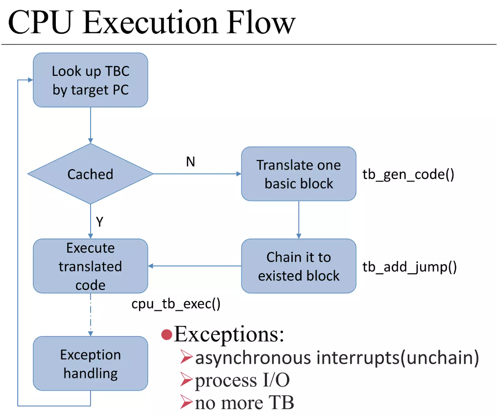

.. Michael Wu 版权所有

:Authors: Michael Wu
:Version: 1.0

QEMU仿真虚拟化
================

环境与版本信息
--------------

环境信息参考: `使用QEMU调试ARM64 Linux内核v6.0.9 <https://blog.csdn.net/thisinnocence/article/details/127931774>`_  
相对上面的环境，下面使用QEMU v8.2.0最新版本，Linux还是v6.0.9版本，编译出来的是arm64架构的Linux
启动脚本进行了些修改，把部分参数挪到了启动文件中，使用 ``-readconfig`` 参数加载配置文件，具体如下:

启动脚本：

.. code-block:: bash

    # start.sh
    qemu/build/aarch64-softmmu/qemu-system-aarch64 \
        -nographic \
        -cpu cortex-a57 \
        -readconfig virt.cfg

配置文件：

.. code-block:: ini

    # virt.cfg 文件
    [machine]
        type = "virt"
        kernel = "linux-6.0.9/build/arch/arm64/boot/Image"
        append = "nokaslr root=/dev/ram init=/linuxrc console=ttyAMA0 console=ttyS0"
        initrd = "initrd.ext4"

    [smp-opts]
        cpus = "2"

    [memory]
        size = "4G"

加载kernel和initrd
-----------------------

这里直接使用QEMU命令行传递内核和initrd，关键的流程步骤:
1. load kernel
2. load initrd
3. load dtb
执行时的callstack如下 ::

    // 1. load kernel
    #0  load_uboot_image (filename=0x555557a469b0 "linux-6.0.9/build/arch/arm64/boot/Image", ep=0x7fffffffd748, loadaddr=0x7fffffffd750, is_linux=0x7fffffffd724, image_type=2 '\002', translate_fn=0x0, translate_opaque=0x0, as=0x555557bcc6c0) at ../hw/core/loader.c:646
    #1  0x00005555559a89bc in load_uimage_as (filename=0x555557a469b0 "linux-6.0.9/build/arch/arm64/boot/Image", ep=0x7fffffffd748, loadaddr=0x7fffffffd750, is_linux=0x7fffffffd724, translate_fn=0x0, translate_opaque=0x0, as=0x555557bcc6c0) at ../hw/core/loader.c:784
    #2  0x0000555555df23ab in arm_setup_direct_kernel_boot (cpu=0x555557b3ca90, info=0x5555579d19b8) at ../hw/arm/boot.c:976
    #3  0x0000555555df2cfe in arm_load_kernel (cpu=0x555557b3ca90, ms=0x5555579d1800, info=0x5555579d19b8) at ../hw/arm/boot.c:1239
    #4  0x0000555555dfa6b2 in machvirt_init (machine=0x5555579d1800) at ../hw/arm/virt.c:2336
    #5  0x00005555559b1215 in machine_run_board_init (machine=0x5555579d1800, mem_path=0x0, errp=0x7fffffffd980) at ../hw/core/machine.c:1509
    #6  0x0000555555d14a46 in qemu_init_board () at ../system/vl.c:2613
    #7  0x0000555555d14cb4 in qmp_x_exit_preconfig (errp=0x5555575a7f20 <error_fatal>) at ../system/vl.c:2704
    #8  0x0000555555d174ed in qemu_init (argc=6, argv=0x7fffffffdc88) at ../system/vl.c:3753
    #9  0x00005555561af787 in main (argc=6, argv=0x7fffffffdc88) at ../system/main.c:47

    // 2. load initrd
    #0  load_uboot_image (filename=0x555557a46e60 "initrd.ext4", ep=0x0, loadaddr=0x7fffffffd6f0, is_linux=0x0, image_type=3 '\003', translate_fn=0x0, translate_opaque=0x0, as=0x555557bcc6c0) at ../hw/core/loader.c:636
    #1  0x00005555559a8a3c in load_ramdisk_as (filename=0x555557a46e60 "initrd.ext4", addr=1207959552, max_sz=2013265920, as=0x555557bcc6c0) at ../hw/core/loader.c:797
    #2  0x0000555555df2731 in arm_setup_direct_kernel_boot (cpu=0x555557b3ca90, info=0x5555579d19b8) at ../hw/arm/boot.c:1048
    #3  0x0000555555df2cfe in arm_load_kernel (cpu=0x555557b3ca90, ms=0x5555579d1800, info=0x5555579d19b8) at ../hw/arm/boot.c:1239

    // 3. load dtb
    #0  arm_load_dtb (addr=1241513984, binfo=0x5555579d19b8, addr_limit=0, as=0x555557bcc6c0, ms=0x5555579d1800) at ../hw/arm/boot.c:518
    #1  0x0000555555df9176 in virt_machine_done (notifier=0x5555579d1958, data=0x0) at ../hw/arm/virt.c:1681
    #2  0x00005555563c7f0c in notifier_list_notify (list=0x555557579390 <machine_init_done_notifiers>, data=0x0) at ../util/notify.c:39
    #3  0x00005555559b1352 in qdev_machine_creation_done () at ../hw/core/machine.c:1557
    #4  0x0000555555d14bbe in qemu_machine_creation_done () at ../system/vl.c:2677
    #5  0x0000555555d14cbe in qmp_x_exit_preconfig (errp=0x5555575a7f20 <error_fatal>) at ../system/vl.c:2706
    #6  0x0000555555d174ed in qemu_init (argc=6, argv=0x7fffffffdc88) at ../system/vl.c:3753

内核启动是需要Bootloader的，硬件初始化，把内核从文件加载到内存，PC设置到入口等等。

选项解析与初始化
-----------------

展开看下QEMU启动一个machine的选项与配置 ::

    qemu_init
        // 1. qemu_add各种opts数据结构
        // 2. pass of option parsing, qemu-options.def 里有各种定义
        // QEMU_OPTION_readconfig
        |   qemu_read_config_file
        |   |   qemu_config_foreach  // 解析配置文件
        |   |       qemu_config_foreach // 跳过空行和注释解析到字典中
        |   qemu_validate_options // 从解析的字典结构判断选项合法性
        |       // 指定了 -kernel 选项，才能指定 -initrd 和 -append
        qemu_validate_options
        qemu_process_sugar_options // 有些 cpu 选项 Deprecated ，可以看文档具体
        qemu_init_main_loop
        qemu_create_machine
        |   select_machine
        |       machine_type = machine类型名字字符串
        |       machine_class = find_machine(machine_type, machines);
        |       current_machine = MACHINE(object_new_with_class(OBJECT_CLASS(machine_class))); // 全局变量machine
        machine_class = MACHINE_GET_CLASS(current_machine);
        current_machine->cpu_type = xx // 解析CPU类型
        qmp_x_exit_preconfig
            qemu_init_board
            |   machine_run_board_init
            |       machine_class = MACHINE_GET_CLASS(machine);
            |       machine_class->init(machine); // 函数指针是 machvirt_init
            |           cpuobj = object_new(possible_cpus->cpus[n].type); // 初始化cpu对象
            |           object_property_set_bool(cpuobj, "has_el3", false, NULL); // 如果secure模式
            |           create_gic
            |           create_uart
            |           ... // 各种设备create
            |           vms->bootinfo = .. // 赋值 bootinfo
            |               arm_load_kernel
            |                   arm_setup_direct_kernel_boot
            qemu_machine_creation_done
                arm_load_dtb

上面就是使用QEMU解析命令行参数和配置文件启动virt(arm machine)跑Linux的流程。

中断的仿真
-----------

| QEMU仿真的核心机制是DBT(Dynamic Binary Translate), 在TCG模块不停的翻译Guest的指令为Host的指令。
| see: `QEMU - Binary Translation <https://www.slideshare.net/RampantJeff/qemu-binary-translation>`_ 

可以看出，QEMU在tcg大循环不停的翻译执行Guest的指令，然后遇到了IO/Exception后，就去执行对应处理 ::

    (gdb) bt
    #0  cpu_exit (cpu=0x5555563bf3fb <qemu_cond_broadcast+71>) at ../hw/core/cpu-common.c:85
    #1  0x00005555561aa4fe in mttcg_kick_vcpu_thread (cpu=0x555557b3d370) at ../accel/tcg/tcg-accel-ops-mttcg.c:130
    #2  0x0000555555d00121 in qemu_cpu_kick (cpu=0x555557b3d370) at ../system/cpus.c:462
    #3  0x00005555561a9d9c in tcg_handle_interrupt (cpu=0x555557b3d370, mask=2) at ../accel/tcg/tcg-accel-ops.c:100
    <||>
    #4  0x0000555555cffb21 in cpu_interrupt (cpu=0x555557b3d370, mask=2) at ../system/cpus.c:256
    #5  0x0000555555e82e75 in arm_cpu_set_irq (opaque=0x555557b3d370, irq=0, level=1) at ../target/arm/cpu.c:954
    #6  0x00005555561b72ad in qemu_set_irq (irq=0x555557b25420, level=1) at ../hw/core/irq.c:44
    #7  0x0000555555a72fd3 in gic_update_internal (s=0x555557c859f0, virt=false) at ../hw/intc/arm_gic.c:222
    #8  0x0000555555a73048 in gic_update (s=0x555557c859f0) at ../hw/intc/arm_gic.c:229
    #9  0x0000555555a73902 in gic_set_irq (opaque=0x555557c859f0, irq=27, level=1) at ../hw/intc/arm_gic.c:419
    #10 0x00005555561b72ad in qemu_set_irq (irq=0x555557c9eb40, level=1) at ../hw/core/irq.c:44
    #11 0x0000555555e93f8c in gt_update_irq (cpu=0x555557b3d370, timeridx=1) at ../target/arm/helper.c:2615
    #12 0x0000555555e941ca in gt_recalc_timer (cpu=0x555557b3d370, timeridx=1) at ../target/arm/helper.c:2690
    #13 0x0000555555e94f8b in arm_gt_vtimer_cb (opaque=0x555557b3d370) at ../target/arm/helper.c:3083
    #14 0x00005555563defc4 in timerlist_run_timers (timer_list=0x5555576e9c80) at ../util/qemu-timer.c:576
    #15 0x00005555563df070 in qemu_clock_run_timers (type=QEMU_CLOCK_VIRTUAL) at ../util/qemu-timer.c:590
    #16 0x00005555563df356 in qemu_clock_run_all_timers () at ../util/qemu-timer.c:672
    #17 0x00005555563da2b8 in main_loop_wait (nonblocking=0) at ../util/main-loop.c:603
    #18 0x0000555555d0e37e in qemu_main_loop () at ../system/runstate.c:782
    #19 0x00005555561af751 in qemu_default_main () at ../system/main.c:37
    #20 0x00005555561af790 in main (argc=6, argv=0x7fffffffdf18) at ../system/main.c:48

定时中断从io-thread报上去，然后执行到cpu_exit，在tcg里面设置一个标记，大循环中检测到后，pc指针设置到中断向量表的位置去执行中断。

