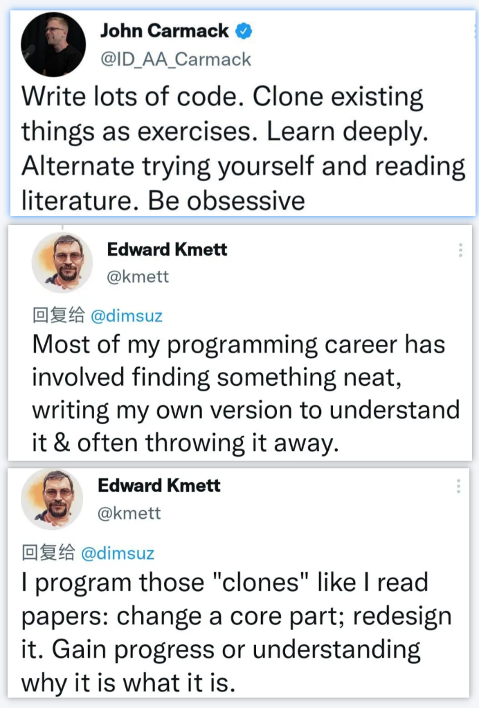

.. Michael Wu 版权所有

:Authors: Michael Wu
:Version: 1.1

2024-Q2
**********

0418 持续学习
=============

今天看了公司余总消费者BG业务宣讲的直播，听的挺带劲。余总分享了自己的几个心得：

1. 持续学习。余总08去欧洲工作，当时就有人借他护照，一问是在买LV等奢侈品报。他说他曾经也很不屑，后来就得不可思议，就与研究
   这些奢侈品品牌，如何做起来一个品牌。后来也就又了华为终端高端手机品牌崛起的故事。并且，国内很多竞争对手对如何做高端品牌
   可能还没有学习和认识到位。
2. 要乐观抗压。他说自己也经常被骂，遇到各种挫折，但是一定要有革命乐观主义精神，别把自己给自己压坏了，有信念，还要看的开。

| 华为计算产品线的一个首席：https://www.zhihu.com/people/yu-yu-37-38-5
| 在 `如何评价华为的余承东这个人？ <https://www.zhihu.com/question/265451154/answer/3229311818>`_  回答中回答：

| 华为的高管基本上都是这种气质，短期战术上的实证主义，加上长期战略上的理想主义。
| 一方面对于虚头巴脑的说教没兴趣，说话做事直达商业本质，绝不容忍弯弯绕绕，
| 根本不顾及别人的自尊心，也不介意别人来伤害自己的自尊心。
| 这一点跟体制内很不一样，体制内讲究个面子上的和谐。

华为fellow夏core的知乎： https://www.zhihu.com/people/xia-jing-jing-57

关于AI芯片
----------

`LLM推理到底需要什么样的芯片？ <https://zhuanlan.zhihu.com/p/683359705>`_

摘录部分精彩回答：

战术层面，其实神经图灵机是一个非常具有潜力的idea。人的学习其实对应的不是深度学习的训练过程，而是inference的一个小步骤，
人的一辈子就是一次inference过程，获取输入，提取经验，再接受新的输入，并根据之前提取的经验快速得到结论。
“经验”其实就类似于attention机制中的权重，inference过程中动态生成，并用于给其他数据进行加权，而神经图灵机将经验存储起来。

当时把问题想复杂了，觉得这种attention动态产生的权重得需要像神经图灵机那样复杂精细管理才能发挥起来，没成想OpenAI
靠着“Scaling is all you need”的信念把复杂精细的算法管理变成了Self Attention这种简单算法+硬件暴力堆料的方式搞成了，
直接O(n^2)的方式算上下文关联度就完事儿了，不需要什么精细结构从茫茫多的上下文中精挑细选相关部分，于是实现AGI的问题很大一
部分简化成了芯片和系统设计的Scaling问题了，一下子就简单了很多，而芯片行业恰恰是人类所有工业体系里面Scaling技能点最牛逼的。

等上下文长度Scaling起来又能把AGI涌现到什么程度我都不敢想。十年内，芯片行业一定天翻地覆。

0421 工作中的战略思考
=====================

最近忙了很多杂事，平时工作少了深度思考和提高的积累。并且，有时判断不清一个事物到底是否是战略，没有好好思考。

我有时候总想能够搞定所有业务细节，那么这几乎是不可能的，这是客观规律，是道。每个细节打开都是有很高的信息密度。一个再简单的问题，
如果去深入细节，一个模块就可以把你拖死了。

高层架构也有对应信息逻辑，核心原理等都是。你能掌控多少，你应该如何更好的入手，当你有很高的自主权，是管理或者架构角色的时候，你就要
思考这个问题了，而不是想着所有细节。因为，你作为一个个体，"算力" 是有限的，你在一个领域精通了，在另一个领域你就会变差，
那么这时你应该怎么做呢，或者如何做更好？知道如何做后如何能够让自己在客观环境中按照自己想的做？最终让自己在战略方向上有效前进。

追求战略，求道，就要有所为，有所不为。战略方向的坚持，要有战略定力。兴趣广泛没有问题，横向多研究也没有问题，但是战略方向上的
长期的投入要保证，这样才能取得战略的成功。

也得警惕这样一种误区：有时觉得自己深度做了一件事情，或者投入了很久，然后心里上有很充实的感觉，但是偏离了最初的战略，这样也
不利于自己原始战略目标的达成。这种也就比无所事事干很多杂事强一点，但是依旧偏离了“道”，没有达到“德高”的状态。要经常思考自己
是不是坚持了战略方向，进行投入与思考。因为我们要取得战略的长期的成功。

随着个人发展，当需要带领团队取得项目的成功的时候，从个人贡献者转变为集体共享者，从某个具体模块开发者，到领域整体架构时，那么就要
思考: 自己应该转变的思维，职责的重心了。所谓“受国之垢，是谓社稷主”。

受国之垢，是谓社稷主
---------------------

受国之垢，是谓社稷主；受国不祥，是为天下王。把身家赌上去，和公司绑在一起的，让自己没有退路的，他们的声誉不会特别好，但他们是真正
的栋梁，背上这些流言蜚语的，才是负责的人。我不相信那些忠义人士的逻辑。

善战者无赫赫之功
-----------------

善战者无赫赫之功，善医者无煌煌之名，赤忠者无夸夸之言。

https://zhidao.baidu.com/question/325416856.html

善于打仗的将领，不会劳师动众作无谓的牺牲，而是用最少的付出去获得最佳的效益，所以就显得没什么惊天动地的功劳。
忠诚的人不会巧言令色，也不会说出什么夸张精彩的言语。
善于行医的人因为总是能提前发现病情，所以人们看不到他的高明之处，因而也就没有什么虚名。

从中间动作评价一个事情，最终只能使事情脱离实际，求名失道，求得了 "赫赫之功", "煌煌之名", "夸夸之言", 却对事情最终成功于事无补。
很多时候过程好，但是产品不成功，项目不成功，也不知道错在哪里。

https://zhuanlan.zhihu.com/p/656741909

《孙子兵法》首篇为《计》。杜牧注解曰：“计，算也”。这里的计并非奇谋巧计或者阴谋诡计，而指的是计算，计算双方实力对比。
主要计算五个方面：道、天、地、将、法，比较七件事：主孰有道？将孰有能？天地孰得？法令孰行？兵众孰强？士卒孰练？赏罚孰明？
孙子本质上是主张 **以实力取胜，而并非以技巧奇谋取胜** 。《孙子兵法》一到四篇都在说明这个道理。孙子讲：“知己知彼，百战不殆。”

第二篇《作战篇》详细介绍了战争代价的高昂。

第三篇《谋攻篇》则说明了战争追求的目标——“百战百胜，非善之善者也；不战而屈人之兵，善之善者也”，
提出了战争策略的优先级——“上兵伐谋，其次伐交，其次伐兵，其下攻城”。孙子处处展示了慎战的思想，处处强调要先知胜后战胜。
真正善于打仗的人，都是胜于庙堂之上，而非战场之内。先要判断实力是否胜于对方，然后才能开始准备作战。
所以《计篇》最核心的一句话：“夫未战而庙算胜者，得算多也；未战而庙算不胜者，得算少也。多算胜，少算不胜，而况于无算乎！”

用兵的上策是用计谋战胜敌人；其次是在外交上战胜敌人；再次是出兵打击敌人；下策是攻打城池。

毛主席讲究“集中优势兵力打歼灭战”。孙子主张以智胜敌而不是以力胜敌，能运用谋略不战而胜、把战争消灭在萌芽状态的属于理想目标，
体现了孙子军事思想的最高境界，就是“不战而屈人之兵”。

三个和尚没水喝
---------------

推进事务，要定唯一责任人。因为，当超过一个人去解决问题的时候，人会趋向于认为：“这个事情我可以放心一点了，因为还会有人想呢。”
问题是，其他人都这么想。所以，这时会导致解决问题多个人比一个人低，因为责任被分摊了，不动脑是大家的锅。

三个和尚没水喝也是责任分散，他们都否认为自己负有责任。在责任分散的心理机制作用下，人越多越容易认为自己身上的责任越小，
大家都秉着“我不去，会有人去”的心理，个体行动力较弱。“三个和尚”的故事也是团队合作的问题。关于人与人的合作，有一个华盛顿合作规律，
它是指一个人敷衍了事，两个人互相推诿，三个人则永无成事之日。

社会生活中有个社会惰化现象，个体在群体中工作不如单独一个人工作时努力的倾向被称为社会惰化，也就是个人与群体成员一起完成一项事情时，
个人的活动积极性与效率下降。个体单独完成任务时，责任感很强，会做出积极反应，但群体共同完成时，群体中的个体的责任感就会比单独个
体的时候弱，这种现象在心理学上称为旁观者效应，在紧急事件中由于有他人在场而产生的对救助行为的抑制作用。调研显示，旁观者人数越多，
抑制程度越高。在一个群体中，旁观者越多，责任越会被分散，个人感受到的责任就越少。

0510 科学的发音
================

感觉有必要练习一下发音，学习一下胸腹联合式呼吸。自己一般说话久了，就会嗓子累，而且自己录下来听自己的发音，也没有那种中气十足
很饱满的感觉。科学的发音，让自己发音说话更加有磁性同事更加的保护嗓子。

身边的同事有专门学过，确实听起来不错，我一直因为本来就是这个声音，没想到他专门练过发声还，效果太好了。记得几年前，听过一个老师说
过这个胸腹联合呼吸发音方法，播音主持专业的基本功，他也提到过如果一般人没有练习过这个，基本说话久了，嗓子都会哑都会受不了，绝大多数
人都不会科学发音。

今年练习练习下这个技能，先网上查查，如果有必要就去找个私教。学习一个技能最快的就是专业私教定制专业的练习方法，自己健身私教的几十节课
确实很有效果，自己一直练就达不到，自学跟私教带着学差异还是效率很不一样的。

0616 克服写作中的拖延
======================

最近工作上有一些写材料的需求，自己拖延的比较厉害，一直到最后才搞差不多。一些体会：

- 不要有完美主义，不要过早排版，先是内容，内容本身才是最关键的；
- 要多看，多思考，多交流，作品是写给读者看的，没有灵感千万别闭门造车，并且还要及时收集周边意见；
- 不要从头开始，先思考大纲和主逻辑，如果有明确的重点，从重点开始也行；
- 可以试着自底向上，把明确的内容，重要的内容写好了，最后选择性的放进去，在反复修改；
- 做好版本管理，不防按照日期或者关键内容来区分版本；
- 平时一定积累好素材，尤其是关键的图标和数据，平时有心得时随后记录下来，记录到本地也好，网上也好，云笔记等都无所谓；
- 尽量找完整不被打断的时间，实在没有思路，就写日志随笔，想到什么写什么，作为草稿，后面在提炼；

自己的心得体会和 :doc:`/think/关于写作` 里所说的很多都十分吻合，果然只有自己做了，才会有深刻体会啊。

0617 聚焦与冥想
===============

看Twitter和知乎，看到了一些关于自我提高的，规律生活作息，规律锻炼，保持写东西，这些都没问题。反思一下自己没做好的：

- 冥想：这个有助于大脑神经链接重塑的，看过多次了一直没做到；
- 聚焦：这个聚焦做重要的事儿，做好最重要的事儿，专注探索擅长领域，平时做事儿有计划有选择，有取舍；

每一个不曾起舞的日子，都是对生命的辜负。每一天，都要做自己想做的事儿，做了自己想做的事儿就是意义。

0626 战略定力
==============

看了中国科学院计算技术研究所包云岗和他学生黄博文的回答，感触很深：

| 中科院计算所有哪些优秀的导师? - 艾斯奥特曼的回答 - 知乎
| https://www.zhihu.com/question/31082887/answer/661216276

.. note::

  这六年里，包老师和我们一起经历过很多研究项目，这其中一直有两根“钢筋”在支撑：

  - 专注于做有影响力的事情，而不局限于paper
  - 专注于做对的事情，哪怕它暂时不符合主流价值观

  包老师的科研理念代表着计算所的研究价值观里更加硬核的一面:

  - 从不追求热点，独立探索能真正产生业界影响力的方向
  - 坚持自研原型系统，哪怕意味着更少的paper

   我们的第一个项目PARD（ASPLOS'15）就是在AI开始大热的那几年里，集中组里的核心主力部队去研究数据中心的QoS架构设计，
   显得非常"古典"（btw，我是PARD项目里最拉垮的一个学生）。当时的热度对比是一个什么状况呢，那年暑假里去楼下网科大数据实验室面试
   的学生数量堪比明星签售会，因为走廊站不下，一路排到了我们计算机系统实验室的地盘上，而我们实验室连同包老师在内六个老师招生，
   面试名单上只有五个学生，平均每个老师只能分到两条腿和一只手，不能再多。就是热到这个份上，PARD项目结束以后，我们也没有转AI大数据，
   而是在"偏门"的道路上越走越远，开始探索当时还非常不成熟的RISCV。

   除了不追热点，包老师还非常坚持自研原型系统，来了解各种设计细节，提前踩坑，并在上面孵化可能产生重大影响的项目。

| 三本考国科大计算所可能考上吗吗？ - 包云岗的回答 - 知乎
| https://www.zhihu.com/question/419133298/answer/1456207430

.. note::

  | 人生就是一场马拉松，起点当然重要，但不是决定性因素。在人生长跑中，我们有很多机会去实现自我，前提是至少要满足上述三个条件：
  | **有梦想、能为梦想坚持、找到自己的长板。**  这样就更能脱颖而出。

自己最近也在研究对应领域，也跟中科院计算所老师有交流，看了包老师上面的回答感触挺深。回想自己，有主动有被动，还有有点追热点，兴趣
广泛不够专注的。如果说工作受制于任务分配，那么业余时间的研究也是常常发散。人的经历有限，必须有取舍，有舍才有得。一个领域想有所建树，
基本的战略定力是要有的，一个领域只有足够的专注和深入，才有有所成。

.. _how_to_code:

如何学好编程
--------------

| 那些编程水平很高的程序员是怎么训练出来的? - IreneGarcia的回答 - 知乎
| https://www.zhihu.com/question/351504112/answer/2798591054

上面是从战术角度，从方法论上给出了好的学习编程的方法。那么做到战略长期坚持，这个回答很好，也是道德经里的哲学：

| 为什么《道德经》中没有「努力」这个概念？ - 夜岚峰的回答 - 知乎
| https://www.zhihu.com/question/275029367/answer/2465570247

.. note::

  | 道德经第二十三章就说：飘风不终朝，骤雨不终日。
  | 意思是说：狂风不会整天整天地刮，暴雨不会整天整天地下。真正能够长久下去的，是梅雨季节的绵绵细雨。

  | 道德经第三十章就说：物壮则老。
  | 意思是说：一个事物如果壮大到了极点，就会走向老态的衰竭。

  | 道德经第四十一章也说：大音希声，大象无形。
  | 意思是说：越好的音乐越悠远飘渺，越好的形象越飘渺宏远。

  | 在哲学上，任何事情都是处于两极同时存在的。
  | 一个人过度地努力，当他倒下的那一刻便是过度的休息和放松。
  | 一个人想要过度地舒服，迎接他的便是无尽的折磨和痛苦。

  任何事情的产生，都会出现一股相反的力量与之进行对抗。你越是过分地努力，当你摔倒的那一天，就越是难以爬起来。

  当坚持不再刻意，而是如同心脏的跳动一般，不需要再时刻地提醒自己或是需要反复地去排练，它便随风潜入夜地变成了嵌入我们生活的一部分，
  从而不会再变成生活中的一个重要负担。

  万事万物要顺应自然的规律，日出而作，日落而息。我们要的不是一瞬间的快感，而是在绵长的生活当中感受那生命长河缓缓地流逝。
  到最后你很可能就会发现：尽管你从来不认为自己有非常艰难地努力过，但是只要你在这条路上走的足够远，你的人生便会越来越开阔越来越
  轻松，每个人都会认为你是多么地努力。

  过度努力的人只是在不断地瞎折腾自己，而真正坚持下来的人往往显得非常轻松，因为他们觉得：这就很好~

0627 体系结构知识面
====================

体系结构的知识面设计太广了，CPU微架构，指令集，bootloader，OS，各种总线，甚至还涉及了编译器。得多维度，从整体到局部，再到整体，
多个面穿插着看才行，否则效率是有点低，还是依托工作用到的为中心进行发散，然后汇总吧。

再回忆一下之前写作写东西的关键技巧：不求完美，先整体大纲，从某个明确的重点入手，然后整体完善，绝不是从头，也绝不是一遍搞好。
并且还要多看，多借鉴，多思考，多交流。尽量能够达到心流模式。