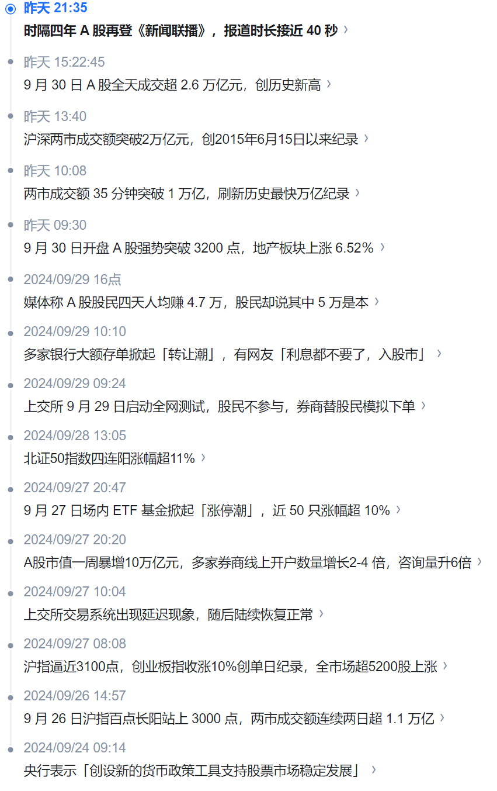

.. Michael Wu 版权所有

:Authors: Michael Wu
:Version: 1.1

2024-Q3
************************

0708 学英语方法思考
===================

看了一个关于中国和欧洲一个非英语母语国家的成绩对比，中国学生在数学、团队合作、创新等都明显领先，而唯独英语不行，尤其是对于英语的听力
，甚至书面的完形填空等也不行。两者很大的差异是：中国英语教育靠的是记忆单词和各种复杂的语法规则等，而欧洲国家孩子则是鼓励用英文交流，
让学生尽量在英语环境中，听读等，事实证明这种方法确实比死记硬背规则更加适合学习英语。而且，记得公司架构师Kenneth-Lee也说过，“我学英文
的方法就是大声有感情的反复朗读”，而小孩子学第一门语言，也是靠的是周围的语言环境，先是听和说，后面是看和写。AI-LLM大语言模型在语言
方面表现最佳，感觉可以得出一个结论，学习英文的最好办法不是死记硬背语法规则单词，而是尽量沉浸到英文环境，听并且大声的说出来。

那么，在进而思考，结合一个领域知识本身的规律，还有大脑神经网络的特点，各种领域学习应该确实有最佳的时间。前阵子看
的 :ref:`how_to_code` 里大佬给出的办法，也正好的说明了，练习好代码的很好的技巧就是看经典代码，尝试自己进行最佳实现。

在进一步思考，健身有最佳的科学时间，肌肉有最佳的刺激方法，负荷训练和超量恢复，以及科学的时间进行营养的补充。以及时间的要求，如何
能够更加的持久，而不是三分钟的热度。完全科学的方法，消耗了过量的心智，也会导致不长久，正如人的专注力是有限的，如果是长期目标，完全
没必要太过苛刻。还有，学习乐器等等应该都有才对。

科学的做事情，才能事半功倍。

0915 年龄对学习的影响
========================

1. 影响语言口语的学习。超过一定的年龄，大脑负责语言能力尤其是口语的神经网络估计已经失去了相当的可塑性了。

    智力差距的直接因素是什么？ - 马达熊的回答 - 知乎
    https://www.zhihu.com/question/654571849/answer/3485953941
    比如语言学习能力的高峰是小学前，而完整的语言学习能力只保存到青春期前。（12岁前到美国的中国孩子都
    能成为native speaker，而12岁后才到的就很少有人能做到了）

这也解释了很多的学霸大佬的英语口语很多都不太好，比如：雷军、余承东等等。

2. 年龄对神经反应速度的影响。电竞职业选手的平均退役年龄仅为24岁，很大的一个原因是电竞对于神经反应速度的高要求。

所以，对于成年人，想去学习一个新技能时，也要调研一下由于年龄增长所带来的大脑身体机能的变化对于该技能学习的影响。年龄大，就不去
执着于练习一口类似native的外语了，也不要去挑战极度依赖反应的运动了。

0919 Linux内核复杂度
=====================

晚上跟公司技术大佬聚餐吃饭，提到了Linux的复杂度，大佬40+的年龄，说当时在Linux 2.6之前(2.6还是2.4记不太清了)，都还能够完全理解，
CPU发展到多核时代，Linux内核也支持多核SMT/SMP后，操作系统就变得巨复杂了，一般人根本搞不定了。他们那个时代都是自己写bootloader，
自己写个简单的OS不在话下的，各种小的OS也是百花齐放状态，但是多核之后，Linux也引入了多核支持后基本Linux就一统江湖了，而且
Linux 2.6之后，也没有专门书籍去介绍Linux了，复杂度已经提升到了很夸张的两级，估计作者也看不懂了。你们这代人单枪匹马高新的OS的时代
已经过去了，想想Linux现在内存子系统，支持swap，支持虚拟化，各种锁，脑子演绎一下那个场景想想就复杂。研究代码要研究商用OS，研究demo
的知道基本原理就行了，想要形成生产力和技术护城河，还是需要研究商用OS才行。

Linux的多核支持，也是IBM之前搞大型机(小型机没听清楚)的人搞的，有一路演进过来的经验，一点点把Linux给去除全局锁慢慢支持了多核系统的。
没有经历这个演进过程，或者可以参考的机制源码的，从零开始直接想出来很难，这种体系结构下的OS代码都是全人类智慧的结晶了。

    现在的 Linux 内核和 Linux 2.6 的内核有多大区别？ - larmbr宇的回答 - 知乎
    https://www.zhihu.com/question/35484429/answer/62964898

    概述：内存管理子系统，作为 kernel 核心中的核心，是承接所有系统活动的舞台，也是Linux kernel中 **最为庞杂的子系统, 没有之一** 
    （PS：公司的大佬的看法也是一样的)
    截止 4.2 版本，内存管理子系统(下简称 MM)所有平台独立的核心代码(C文件和头文件)达到11万6千多行，这还不包括平台相关的 C 代码, 
    及一些汇编代码；与之相比，调度子系统的平台独立的核心代码才2万８千多行。

练手的C++项目
---------------

有哪些适合个人练手的中等规模的C++项目？ - Rocky0429的回答 - 知乎
https://www.zhihu.com/question/56579764/answer/3183916295

0930 A股
==========

最近一周A股这的是涨疯了，mark一下。后续对于理财还需要一个系统性的学习。

https://www.zhihu.com/question/694696726

记录几个我认为不错的知乎回答:

| 时隔四年 A 股再登《新闻联播》，报道时长接近 40 秒，2.6 万亿天量成交引瞩目，透露出哪些信号？ - 现实主义理想者的回答 - 知乎
| https://www.zhihu.com/question/705357112/answer/3954908877

    | 我能比较肯定的是，如果是闲钱投资，如果能承受一定程度的浮亏，
    | 目前部分较为稳健和优质的大企业（比如从沪深300成分股中选）,
    | 我认为仍然可以买。

| 时隔四年 A 股再登《新闻联播》，报道时长接近 40 秒，2.6 万亿天量成交引瞩目，透露出哪些信号？ - 奥特之父的回答 - 知乎
| https://www.zhihu.com/question/705357112/answer/3949663291

    | 今天随便写点，大家看得懂的多些思考。
    | 缅A总市值是12万亿美元，大家可以理解为每个人都有一万美元扔在股市里。
    | 房地产总值是90万亿，每个人平均有七万美金投入了房子。
    | 储蓄总量则是20万亿美元，其中每个人平均1.7万美刀左右。（以上都是约数）
    | 而美股总量是60万亿美元，是房地产总市值的两倍。
    | 平均每个美国家庭持有美股达到二十万美刀。
    | 换句话说，美国通过股票，形成了另一种意义的“全民公有制”。
    | 另外美国的人均存款有五万美元。住房类项目的投资属性是很弱的，我可以很明确地告诉大家，只要住宅类租金小于年化6%，
    | 商铺类小于5%的一定是亏损的（除非后续高通胀，也正因为如此一定要高通胀）。新的锚点可能是黄金，可能是股票，
    | 可能是大家不知道的什么东西，但通胀本身是不可逆的。另外就是风险，从人均存款和房地产和股票的市值对比，
    | 我们甚至是很健康的。美国的好公司很多，但好公司和好股票不能简单画等号，还得看市盈率和隐患。

| 9月30日A股全天成交超 2.6 万亿元，创历史新高，本轮行情是做多中国股市的最佳机遇吗？ - 银河证券周建华的回答 - 知乎
| https://www.zhihu.com/question/697059573/answer/3871713269

    1. 9.18，创本轮行情低点2689点
    2. 9.19，美联储降息50bp
    3. 9.24，金融三巨头新闻发布会，降准降息降首付，8000亿贷款驰援A股，股市暴涨。
    4. 9.25，试射全程洲际导弹
    5. 9月26日，更高层会议，表态打通市场堵点，引导长期资本入市，市场再次暴涨
    6. 9月27日，三个阳线改三观，周五成交激增，卡死上交所
    7. 周末，中东加剧动乱
    8. 9月30日，市场更疯美联储降息后全力发动行情，背后还是对世界资金的争夺，房地产带不动以后，
       资本市场是唯一容纳这么多资金的蓄水池，对内发动行情能解决很多现实问题，价量齐升，这种速度的行情不轻易看空

| A 股连续多日暴涨，这一轮大涨还有多大空间？普通人应该出手抓住这一波机会还是冷静旁观？ - YULI宏观财经的回答 - 知乎
| https://www.zhihu.com/question/696473828/answer/3865153295

    未来，A股的核心资产——沪深300指数，将承担剩余资金的流向。这也是央企市值管理的大背景。如果沪深300指数成为高收益资产，
    它的夏普比率将成为重要的衡量指标。财政政策和货币政策都会围绕这个中轴展开。

| 亏损后的回本公式！
| https://xueqiu.com/5483912435/120031317

    | 昨天在公众号末尾出了道数学题：“一只股票，昨天跌80%，今天涨80%，请问盈亏的百分比是多少？”。
    | 我知道很多人觉得太小儿科了，但你们是没看到我后台的留言。有很多人的结果，计算的并不准确，还有一些人居然认为盈亏是持平的……
    | 我用10元来举例，跌80%=2元。2元涨80%=3.6元。
    | 正确答案是亏损64%。
    | …………
    | 亏10%，涨11%回本；
    | 亏20%，涨25%回本；
    | 亏30%，涨42.86%回本；
    | 亏40%，涨66.67%回本；
    | 亏50%，涨100%回本；
    | 亏60%，涨150%回本；
    | 亏70%，涨233.33%回本；
    | 亏80%，涨400%回本；
    | 亏90%，涨900%回本。
    | …………
    | 亏损后的回本公式：
    | 比如亏损54%
    | 1/（1-54%）-1=117.4%，也就是要涨117.4%才回本。
    | …………
    | 有亏损的朋友，自己对照下吧。看看自己还要多少才能回本。
    | 投资人并不需要做对很多事情，重要的是不犯重大的过错。---沃伦.巴菲特。
    | 投资最重要的三件事：第一，保住本金；第二，保住本金；第三，时刻牢记前两条。---沃伦.巴菲特。
    | 这个时候再看看巴菲特老爷子的名言，可能大家的感触会更深一些吧！

.. note:: 
    
    跟北大一搞AI的哥们交流，如果是在忍不了亏，那就快点跑，20%就跑吧。根据的就是上面的逻辑。
    不过其实还是一个系统性的，毕竟理财还是要系统性的学习一下的，否则上来很多观点直接就给你带跑了。

    每次的大牛市，大政策，都有历史大势。难道未来国家目的把资金的蓄水池往股市赶一赶。以及自己没时间买自选股，就可以选一些指数，
    最起码跟着大势赚一些时代的红利。

| 如何看待9月30日的A 股突破 3300 点，国庆节假日后的一周内有望突破3500点吗？ - 鹰眼看风的回答 - 知乎
| https://www.zhihu.com/question/694856157/answer/3920739694

    我多次提到上涨衰竭这个概念，这个主要就是通过技术面分析观测的。这也是《缠论》的核心思想。衰竭的意思是，上涨力量出现背离。

    A股目前没有衰竭迹象。涨幅、成交量都在刷新高，越来越强。涨幅最大的科创50，都还在加速。将来，就算衰竭，也应该是科创50最先，
    然后创业板，然后才是主板。所以，现在继续买入主板ETF，其实风险是不高的。

