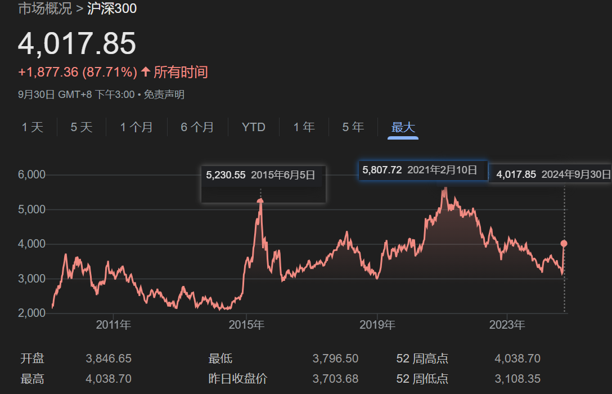

.. Michael Wu 版权所有

:Authors: Michael Wu
:Version: 1.1

2024-Q4
************************

1002 理财
==========

指数基金
---------

https://www.zhihu.com/question/378778601/answer/2541674011

    指数型基金不专门投资 **债券** 和 **个股** ，属于跟踪指数变化的基金。

https://xueqiu.com/edu/invest-edu/education/begin/1894299685/83785337

    交易所开放式指数基金(ETF Exchange-traded fund)又被称为交易所交易基金，是在交易所上市交易的、基金份 额可变的一种开放式基金。
    ETF 一般采用被动式投资策略跟踪某一标的市场指数，因此具有 指数基金的特点。ETF 结合了封闭式基金与开放式基金的运作特点;
    投资者既可以像封闭式2基金那样在交易所二级市场买卖，又可以像开放式基金那样申购、赎回。不同的是，它的申购是用一篮子股票
    换取 ETF 份额，赎回时则是换回一篮子股票而不是现金。这种交易制度使 该类基金存在一级和二级市场之间的套利机制，
    可有效防止类似封闭式基金的大幅折价。此 外，ETF 还具有交易费用低廉、投资组合透明、实时交易的特点。

https://en.wikipedia.org/wiki/Exchange-traded_fund

    An exchange-traded fund (ETF) is a type of investment fund that is also an exchange-traded product, i.e., 
    it is traded on stock exchanges.ETFs own financial assets such as stocks, bonds, currencies, debts, 
    futures contracts, and/or commodities such as gold bars. Many ETFs provide some level of diversification 
    compared to owning an individual stock.

1005 沪深300计算方法
---------------------

`沪深 300 指数编制方案 - 2023 年 9 月 <https://csi-web-dev.oss-cn-shanghai-finance-1-pub.aliyuncs.com/static/html/csindex/public/uploads/indices/detail/files/zh_CN/000300_Index_Methodology_cn.pdf>`_ 

沪深 300 指数由沪深市场中规模大、 流动性好的最具代表性的 300 只证券组成， 于 2005 年 4 月 8 日正式发布， 以反映沪深市场上
市公司证券的整体表现。

沪深 300 指数以“点”为单位， 精确到小数点后 3 位。沪深 300 指数以 2004 年 12 月 31 日为基日， 基点为 1000 点。

.. math::

  \text{沪深300指数} = \frac{\sum (\text{证券价格} \times \text{调整股本数})}{\text{基期市值}} \times 1000

这一波大涨，记录一下指数的涨幅

这一轮的刺激理论是超过2015,2021的，那么从这个角度，现在这个指数基金短期看，还有很大涨幅空间。