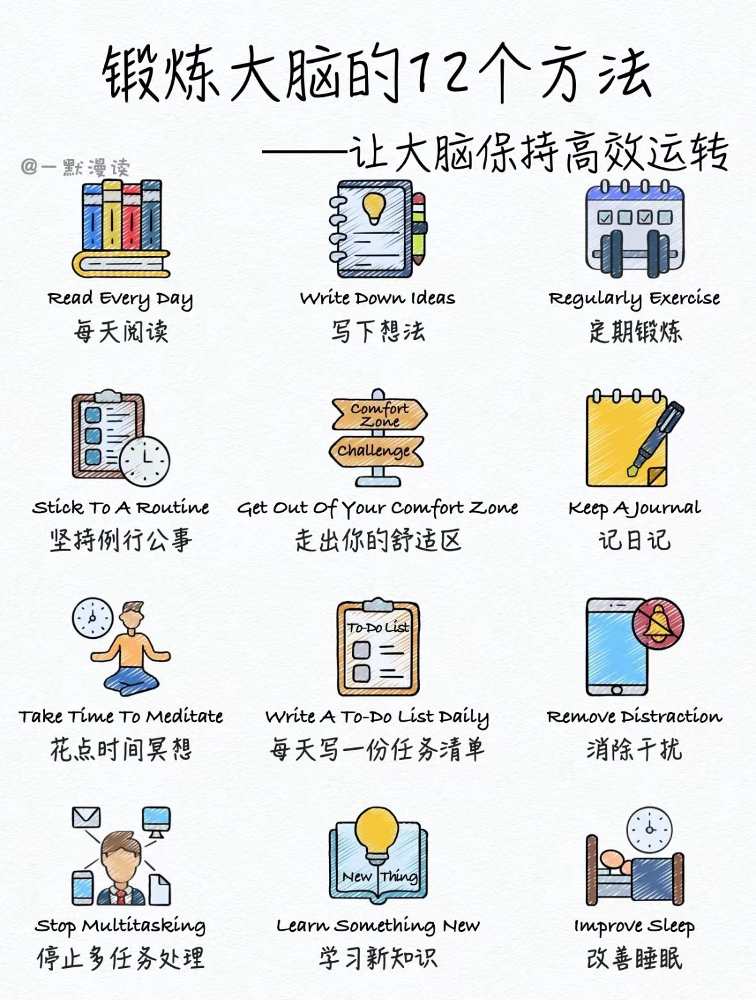

.. Michael Wu 版权所有

:Authors: Michael Wu
:Version: 1.1

2024-Q4
************************

1006 理财学习
=============

后面理财先放到『思考』类别下。 :doc:`/think/理财投资`

1102 写作
=============

.. _wirte_paul:

paul graham谈写作
--------------------

| 一个关于写作的推文：https://x.com/howie_serious/status/1851844002628407692
| 是对这篇文章的评价：https://mp.weixin.qq.com/s/xt88sYrD3f1Qbgemd5taiQ

paul graham 的这篇文章，虽然很短，但是很重要（值得多次诵读，甚至背诵的那种。我翻译过程中，原文读了5678遍，
译文也改了5678轮）。他点明了一个巨大且重要的真相：写作与思考的关系，我们为什么要坚持写作，坚持思考。“如果你思考
而不写作，你只是以为自己在思考。” 这句话，我感受太深了。在我2012年的年度目标里，就有很重要的一条：成为一个 writer。
不是说要成为一个专职作家，而是成为一个“写作的人”，成为 one of the writes。多年以后，我仍然坚信，包括我自己，包括
我的孩子，我们都必须成为一个“写作的人”。具体来讲，“写作”不是在互联网上像小狗撒尿或者电线杆上糊牛皮藓广告，到处张贴
文字垃圾（有很多人教你这么做，说什么打造个人IP，别信，没用）。

.. note::
    对于 80% 以上的人， **真正的写作更多是发生在学习场景** 、工作场景中的文字书写，是写笔记，在自己的笔记工具、自己的
    知识管理系统里。因为， **写作的本质是思考。而学习的本质也是思考。学习与思考之间，有一个共同的桥梁：写作。**

    **通过写作，大量的写笔记，写费曼笔记，配合适当的文章输出，我们才能抵达清晰的思考，有效的学习。**

这个也体会比较深，可能是由于人的大脑内存比较小的缘故，深入的思考需要沿着逻辑链循序渐进就需要用语言描述下来，表述
成语言，也会触发对应思考。可能这个在平时工作的学习中更加的关键。

.. note::
    突然想起了高中老师同学都层说过的，做题很关键，但是把课本上的例题学习透彻，拿出一张白纸把知识网络写出来，真
    整理解透彻，更加关键。实操练习很关键，但是代替不了这种写作，自己输出理解和总结。

摘抄部分作者的经典原文:

    The reason so many people have trouble writing is that it's fundamentally difficult. To write well
    you have to think clearly, and thinking clearly is hard.

    And yet writing pervades many jobs, and the more prestigious the job, the more writing it tends to require.

    In fact there's a kind of thinking that can only be done by writing. You can't make this point better
    than Leslie Lamport did:

    | **If you're thinking without writing, you only think you're thinking.**
    | **如果你思考而不写作，你只是以为自己在思考。**

学术训练首先就是写作训练
------------------------

翻了一下自己的收藏，还有这个： https://x.com/22HomoPoliticus/status/1815882410870899056

    我们接受学术训练首先就是写作训练，因为所谓思辨和研究训练就是在写作中锻炼出来的。对于口头传统被书写传统取代的
    时代来说，思考能力就是写作能力。

    如果你没办法把观点写出来，你的观点就始终只是一种私人意见罢了。只有当你在写作中发现问题和经过自我辩论以后，你
    才能把观点变成思想和概念。

这个观点也是，写作对于增加一个人的自身影响力，非常的关键。自己以前也记过写作的日记 :ref:`write_think`， 还有
这个如何进行正式写作的一些方法 :doc:`/think/关于写作` , 这个更像是一个正式写作文章的方法。

写作之于大脑锻炼
------------------

还有这个： https://x.com/didengshengwu/status/1806974257853087901

里面有两个tip就是：写想法、写日记，还有阅读和学习，而这个学习过程辅助还有自己的写作，正如 :ref:`wirte_paul` 提
到的学习过程中很重要的一环就是自己的思考写作。

1114 PC环境配置
================

新的PC配置时，又遇到了一些环境代理的问题。系统软件都是在演进的，形式想着把所有的配置都记录不变也不大可行。有的还是需要理解
一些对应的原理才行。