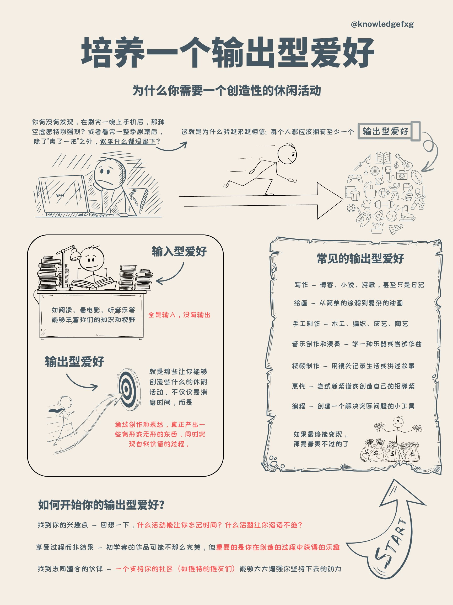
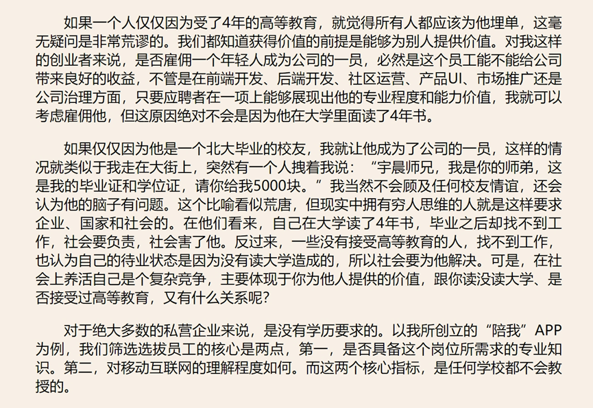
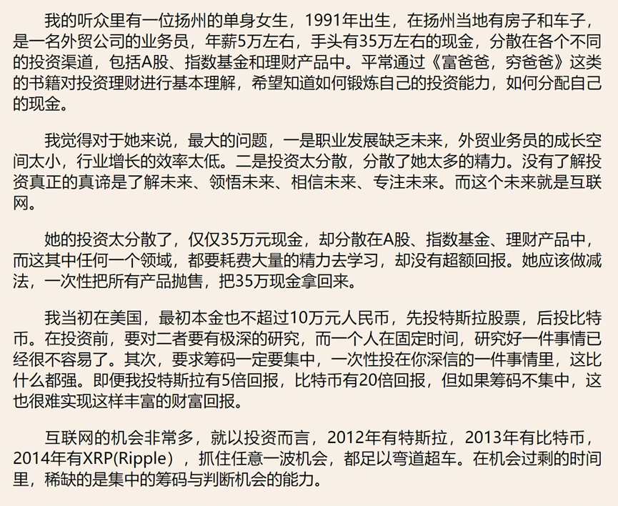
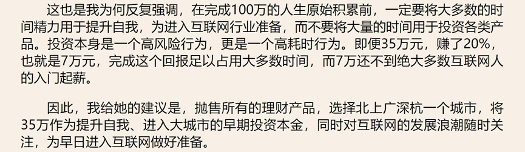

.. Michael Wu 版权所有

:Authors: Michael Wu
:Version: 1.1

2025-Q2
*******

2025年4月
===================

周末的规划策略
-------------------

想玩好休息好。周末也要有一定策略。

首先, 从身体层面, 如何休息好？

    - 晒太阳。否则眼睛会不舒服, 身体的激素分泌也会受影响；
    - 要动脑。需要规划一些事情, 能够产生成就感的, 否则会陷入漫无目的刷手机信息流等, 这样休息不充分, 大脑会缺少内啡肽等分泌调节；
    - 要说话。人有社交需求, 要与人交流才行。
    - 要运动。这个和晒太阳结合, 要有一定的运动量, 否则身体也会修复不好。
    - 少熬夜。控制好作息时间, 会影响大脑和身体状态。
    - 有规划。有个主动的规划, 不一定多复杂充实, 关键是有, 哪怕规划玩点啥。

`如何彻底荒废一个周末（建议反着做） <https://mp.weixin.qq.com/s/TOA3vF2mDcG1JaDgTCAHzA>`_

1. 有规划

    过周末的第一大忌就是缺乏对周末的规划。

    没有计划只得临阵磨枪, 要不要出去玩、要约谁一起玩、该去哪里玩、要不看看攻略......

    当过多的选择摆在我们面前时, 我们更容易陷入决策瘫痪（Decision Paralysis）。光是思考这些问题, 都让人头大。几乎每一个临时做决定的
    事情, 都在消耗我们的认知资源, 让我们感到疲惫。

    因此在走完这一整个漫长的心理历程之后, 你大概率会发现, 启动起来反而更加困难了, 可能会拖延出门玩的时间, 又或者觉得心累、干脆不
    出门了。

    .. note::

        更糟糕的是, 当我们缺乏一定的规划时, 大脑对时间的感知会变得模糊, 让我们产生时间还很充裕的错觉, 进而更容易把时间花在碎片化
        的活动上, 比如无目标地刷手机, 在各大社交媒体里频繁切换刷信息流。

        提前为周末做准备, 关键并不在于你要计划得多么详实, 而是在于你要有「主动计划」的这个动作。

        不论你是用各种活动填满你的周末, 还是无所事事地过一天, 这些都是在思考后自己主动做出决策的结果, 而不是让那些无意识的行为悄悄
        偷走你的时间。

2. 不要报复性地熬夜、补觉

    维持相对稳定的昼夜节律和充足的睡眠时长。如果很难做到, 在周末补觉控制在 2 小时以内最好

3. 不要刷手机、追剧、只做不动脑子、不费力气的事

    很多人对于休息的理解就是去做一些低能耗的活动, 具体来说就是多多放松身体, 比如按摩、泡澡；在心理上转移自己的注意力, 让
    自己放空或者做一些不动脑子的事情, 比如刷手机、追剧。

    但研究发现, 这种休息方式无法让我们获得真正、彻底的休息。一项荟萃研究总结了四种最为常见的休息方式：

        1. 心理脱离（psychological detachment）：转移自己的注意力, 在休息时间将注意力完全从工作上移开。
        2. 放松（relaxation）：降低身体的生理激活水平, 让自己处在低能耗的状态从而实现放松。
        3. 精通（mastery）：学习新技能或者完成具有挑战性的任务。
        4. 控制（control）：个体对休息的自主控制权, 可以选择何时休息、选择什么样的休息活动。

    前两种休息方式指向的便是那些低能耗的活动。它们都属于被动休息, 可以快速缓解疲劳, 但无法为我们带来持续的幸福体验。

    而主动休息是那些需要身体或精神参与的活动：

        1. 轻体力劳动：画画、做手工、冲泡咖啡, 甚至做家务也算。
        2. 要投入注意力和创造力的事情：长文本阅读、看纪录片、写日记。

    **换句话说, 消除疲惫最好的方式不是什么都不做, 而是去做那些需要投入体力或脑力的事情。**

    并且这些需要高度参与的活动, 还会让人感觉时间更长、更充实。我们对于时间的感知, 很大程度上依赖于事件的密度和新鲜度。
    时间分块理论认为,  人们在回忆一段时间时, 会根据有多少个记忆点来判断时间的长度。

    越是经历了不同的活动, 越能增强我们主观上的时间拉伸感。如果一整天都在做着差不多的事情, 玩手机、看剧, 就会更容易产生
    时间如流水的主观感受。

4. 不要过多的高强度活动安排

    我们管理时间的方式可以分为两种, 活动最大化和结果最大化。

    活动最大化是最大程度上增加活动的数量, 而结果最大化则是指我们对这些活动的预期, 希望它们可以带来尽可能多的享受。但二者常常是冲突的。

    这意味着, 当我们给自己安排过多的项目追求活动最大化时, 可能并不利于结果的最大化, 进而降低主观的幸福感。

    这是因为, 在这个过程中我们的自主感（Autonomy）很容易被剥夺。每一个安排似乎都在指挥着我们下一步该做什么, 我们就像被提前设定好
    的程序一样, 被裹挟着只能被动去执行。试想一下, 你计划了一场高强度的周末旅行, 要不断地赶行程、打卡景点, 这时的旅行不再是享受, 而
    变成了不得不完成的几个任务, 乐趣自然大打折扣, 玩一趟下来身累心更累。

5. 不要陷入周末焦虑

    对于假期即将结束的遗憾和面对未知工作的恐惧, 让我们的大脑一直处在高度警觉的状态, 从而更难放松和休息。这个我倒是没怎么遇到。

6. 不要把快乐都「攒到」周末和假期

    我们很多人都是为周末而活, 不自觉地把生活切分为泾渭分明的工作日和假期。工作日就是为了生存和搞钱, 只有周末才能给予我们生活的自由。

    在这种状态下, 周一到周五就变成了忍耐、应付的日子, 始终眼巴巴地盼望着周末和假期的到来, 似乎只有到了休息日才能体验到什么是真正的活着。

    这种状态被称作周末依赖（TGIF, Thank God It’s Friday）。TGIF心态是一种隐藏的心理陷阱, 期待周末的到来在某种程度上给我们提供了
    动力, 但它也让我们忽视了珍视当下的价值。

.. _stay_home:

家里蹲的精神痛苦
----------------

为什么家里蹲会带来精神痛苦？ - 赵初雨的回答 - 知乎
https://www.zhihu.com/question/649976562/answer/1893695374948022083

恰恰相反, 你以为的精神痛苦实际上是生理痛苦。

1. 长期不接触自然光会使眼轴过度增长, 近视畏光青光眼干眼症风险猛增。
   眼睛的难受会让你对电子产品极度抗拒, 但你又只能接触电子产品, 视力状况只会每况愈下。

2. 长期不接触自然光, 长期没有户外运动会让你的骨密度和肌肉量断崖式下降。
   直接影响是你会发现你非常容易骨折, 一点跌打损伤可能就会把你送进医院。
   你的体力会大幅度衰减, 以前跑个几公里马马虎虎, 现在出去走两步就不想动了。
   间接影响是你的预期寿命直线降低, 你主观上可能感觉不到, 但你的本能会让你恐慌, 让你抑郁, 让你焦虑, 负反馈让你的生理状况越来越差。

3. 长期缺乏社交会使你的大脑, 智力水平, 抽象思考能力衰退。
   人是社会动物, 并不意味着人不可以独处, 但不能离群索居, 生活中需要一些正向的社会联系人机支持给你补充“精神能量”, 很多时候人生
   的“意义感”自我的“有用感”就来自于正向的社会交往体验。

4. 长期营养不良或是摄入食物种类营养成分过于奇葩的话肠胃要遭罪了, 肠胃一遭罪皮肤也跟着遭殃了, 各种什么爆痘啦, 看上去老了十几岁啥的
   其实很大程度上就是饮食和心理状态同时出问题了。

关于消费的一个观点
-----------------------

钱只有在你花它的一瞬间才是你的钱。你多赚了一些钱, 你有话不掉, 有什么用。看到这个说法有意思, 哈哈。

对比几个LLM写代码能力
--------------------------

最近对比了几个大模型的写代码能力, 把全量需求告诉给大模型, 然后详细对比了下面几个：

时间: 2025年4月28日

- 腾讯元宝DeepSeek R1, 写出来的代码逻辑不够, 不符合我的需求；
- ChatGPT4.0, 写出来代码完备性可以, 但是还是有逻辑的偏差；
- Google Gemini Flash(experimental), 写出来的代码完备性可以, 意想不到是最好的, 长代码逻辑准确性最高；

由于工程的问题, 写很长的代码需要把需求做详细拆分, 然后写完测试完, 自己完成工程上的对接。还是提高了效率很多的。但是也要求, 你必须
有基础, 有工程能力和动手能力, 才能更好的发挥AI的能力。Mark一下, 知道哪个最好, 后续再对比各家。

2025年5月
===================

培养输出型爱好
---------------

再Twitter上看到个帖子：  `培养输出型爱好 <https://x.com/knowledgefxg/status/1920491387906064607>`_

很有道理。确实, 有时候这种反而是更有意思的一种娱乐方式, 带来不一样的乐趣。

自由支配时间
-----------------

还看了下面的这个文章, 也挺有意思：

`大家有没有发现一个奇怪的现象？辞职或失业后不上班的人, 虽然没有工资, 但时间久了却再也不想回去上班了。这是为什么呢？ <https://mp.weixin.qq.com/s/uWieH4XSK9Yr6wN8AzCF9w>`_

我自己的想法是：有一部分人确实是为了价值实现, 尤其是创业老板, 是真的在实现自己的价值。但是, 更多的是人们为了生存, 维护一个身份,
维护一个生活规律, 维护一个社交圈子, 好融入社会, 工作寄托了自己的个体价值实现, 自己的身份地位等。

上面的公众号文章里有的说的挺好：

.. note::
    - 工作的原因真的是缺钱吗？因为"缺钱"只是个借口, 真实原因是——害怕失去"身份"。
    - 我想过这个问题, 真正舒服的不是"不上班"这个状态, 而是"自由掌控时间"的感觉。
    - 我们打工的时候, 时间不是自己的, 别人安排你干啥就得干啥, 赚的是卖时间的钱。

    最悲哀的是, 很多所谓的成功人士, 从来没体验过真正的自由。问他们为啥工作, 他们说为了梦想、为了成就感、为了责任...都是放屁！
    说白了, 还不是被体制驯化的太彻底, 已经没法过正常人的生活了。

    不过确实有种人确实得回去上班, 因为他们除了上班啥也不会, 人生没有目标方向, 不知道自己喜欢啥, 就只会被人安排。不上班的日子里
    如果天天刷短视频打游戏, 那还不如回去上班混日子。

还有前面, 如果没有任何自己的事情, 自己要做的事情, 想做的事情, 反而可能会过得更加无规律。:ref:`stay_home` 也说了这个点, 如果自己
很自由, 那么得有自己要做的事情, 有自己的领域, 有自己的输出型爱好, 有自己的社交圈子, 只有纯粹的玩乐, 那还不如上班, 因为可能连最基本
的规律生活都做不到, 直接损害身体健康了都。

所以, 先有输出型爱好, 有自己的兴趣价值领域, 这些才是为后面自己有足够自由可支配时间所准备好的, 并且这些也很关键, 甚至对于上班的生
活也是, 因为除非上班恰好就是自己的爱好价值所在, 不过大概率不可能全是, 因为上班, 工作都是来源于组织的分配的。比如, 很多的大佬程序员,
他上班也无法深耕自己感兴趣和热爱的领域, 可能业余或者自己做的项目才是他真正感兴趣的领域。

巴纳姆效应
--------------

学到了1个巴纳姆效应(Barnum effect), 其指人们倾向于相信那些模糊、普遍适用的描述, 认为它们是针对自己的个性化描述。这个效应
在心理学和占星术中经常被提及。下面的Twitter帖子总结的不错：

- https://x.com/knowledgefxg/status/1914689186332074031

.. image:: pic/Barnum-effect.png
    :scale: 50%
    :alt: 巴纳姆效应

还有峰哥的下面的切片哈哈, 说的有意思：

- `峰哥:相信算命的都是傻比！ <https://www.bilibili.com/video/BV1NgVfzZELD/?spm_id_from=333.337.search-card.all.click&vd_source=f7b8e2d66d4b85cd95e1a463f568439f>`_
- `峰哥:“为啥丑逼穷逼都爱算命。” <https://www.bilibili.com/video/BV1jP4y1L79s/?spm_id_from=333.337.search-card.all.click&vd_source=f7b8e2d66d4b85cd95e1a463f568439f>`_

对内核开发祛魅
--------------------

今天刷知乎, 看到了这个问题： `为什么大部分杰出的程序员都在内心倾向于研究操作系统和编译器？ <https://www.zhihu.com/question/48732733>`_

有个高赞的答案回答非常的好, 而且点开答主的资料, 发现还是自己公司的同事。

回答： https://www.zhihu.com/question/48732733/answer/2850032993

作者在学生阶段的观点还是：认为应该研究更底层的基础系统, 那很牛逼。我也有过类似的想法, 早起也研究了很多理论, 不过惭愧的是并没有
真正的深入, 缺乏实践和真正的项目。后来工作久了, 观念也发生了变化。与上面作者的观点不谋而合。作者的观点是：

.. note::

    优秀的程序员要把学习技术的能力作为锻炼的关键能力, 把应用技术解决问题、创造价值的价值思维当做做事的主要思考动机, 优秀的程
    序员也要是一个优秀的技术决策者、懂业务懂team work, 见过很多优秀程序员还有优秀的产品思维, 甚至商业思维, 产品思维和技术思维可
    能是放大技术价值的有一次突破, 技术不存在高低, 研究技术变迁就很容易发现, 所有的技术从火热到冷门、从冷门到火热, 基本都是围绕价
    值需求再变化, 主要以商业价值驱动, 所以不轮操作系统还是Java、python应用开发, 有用就学, 用处少就降权, 不断调整自己方向适应价值。

作者的下面的经历也说明了作者在底层OS领域身后的功底：

.. note::

    研究生研究的是内核网络协议栈在多核处理器上的并行系统设计和优化, 我主要工作就是在为这个系统设计和实现一个能线速处理10Gbps流量
    的IO系统, 所以在校期间移植了Qualcomm（那时候居然不知道是高通, 只知道英文名是qualcomm）开源的的一个Intel XGBE UIO系统, 优化
    它的性能（记得是对照一个SIGCOMM的论文的某段一句话一句话揣摩, 人家也没开源代码, 只说几句似懂非懂的内核优化策略）, 实验室里一个人
    钻研内核, 到关键处抱着驱动芯片mannual连续啃多天, 一个参数一个参数试（记得身为Linux kernel maintainer, 还有intel编译器实验
    室老师, 两个老师都也帮不了）, 最后甚至学会了tuning x86处理的一次cache miss是哪种原因导致的, 移植驱动花了一个月, 性能优化硬杠
    驱动6个月, 最终才算复现了SIGCOMM的论文结论, 很兴奋。后面师兄还帮我提交了一个我改进的Linux kernel network patch, 毕业后也有
    不少芯片制造商公司给操作系统方向的offer, 但是其实隐约还是觉得 **这类工作缺少创造性, 这种创造性就是你要思考才能得到, 是一种发明
    创造, 但是实际内核工作中99%可能是dirty work** （记得还发现了intel westmere这类微架构IOH互联方面的bug, 一直不敢说, 也没法验
    证, 人微言轻, 但是后来看到那篇SIGCOMM作者团队在其他地方提到他们跟intel确认了这个bug）。

现在想也是, 如果你最还是想搞OS, 那么要去想当今市面上的需求是什么了。比如内核的调度模块, 就很稳定了。驱动BSP等还比较多, 存在于芯片
原厂和各种硬件厂商。还有就是致力于想搞OS的厂商了。

所以, 如果职业周期拉长, 那么一定会接触很多很多的技术的。比如自己大规模使用过的：C/C++, Python, Go编程语言, 主要是开发经历还是围绕
实际工作上的需求。再研究生期间做项目用过Java, 也有一定的了解。现在自己又学习了JavaScript, 因为对现在前端有点兴趣想了解, 同时也帮
自己对象做一些小的web应用, 有实用价值了, 虽然这些不向底层那么看起来高端, 但是更加贴近应用, 接近业务, 也就接近商业闭环, 而且用户也
会有点意思。

那么这些底层的技术是不是就不研究了呢, 我也觉得也不是, 不定期的研究一下原理, 尤其是AI这么发达, 本着探索或者爱好的角度也是可以研究研究的。
也就是不会那么功利了, 觉得高大上而去研究, 而是对未知的探索, 对知其然的好奇的追求而已了。

减少多线程工作
------------------------

下面的文章再次从脑科学角度分析了, 总是切换多线程工作会导致的认知损耗。

https://mp.weixin.qq.com/s/Yftu3UrYreydioarR2oxEw

.. note::

    2019年, 硅谷新星工程师马克·李登上《福布斯》"30岁以下精英榜", 他同时运营三个创业项目、每天学习两门外语、坚持更新技术博客。
    但三年后, 他的公司全部关闭, 个人诊断出焦虑症。

    "我像同时发射100支箭的弓箭手, 却忘了箭靶在哪里。"他在采访中反思。马克的经历并非个例, 现在越来越多的人, 标榜自己为斜杠青年, 但是,
    绝大多数斜杠青年都很平庸。而心理学研究揭示了这类"高精力低成就"现象背后的科学机制。

    一、认知带宽被切割的代价

    诺贝尔奖得主丹尼尔·卡尼曼在《思考, 快与慢》中提出"认知资源有限模型"：人脑处理信息的带宽约为120比特/秒, 相当于同时理解1.7个人说话。
    当注意力不断切换时, 前额叶皮层会产生"转换损耗", 也就是你的大脑出现了额外的损耗, 不利于你专注的去解决一些问题。
    微软研究院对200名员工进行的脑电波监测显示：收到邮件通知后, 员工平均需要23分15秒才能回归深度工作状态。持续的多线程工作者, 其有效
    智力水平相当于醉酒状态。

    纽约时报记者尼克·比尔顿曾沉迷于同时操作5块电子屏幕。神经影像显示, 这种状态下他的杏仁核（情绪中枢）异常活跃, 而前额叶（决策中枢）活
    跃度下降60%。他在《摧毁思维的智障》中写道："我的大脑变成了不断重启的电脑, 永远无法完成系统升级。"

https://www.yuque.com/serviceup/misc/cn-the-real-cost-of-an-interruption-and-context-switching

还有上面的文章：《程序员中断：中断和上下文切换的实际成本》

当在复杂的编程任务之间切换时, 返回到流状态通常比从“简单”中断返回更费脑力。完全切换到其他东西需要刷新缓存（短期内存）并加载一个
全新的上下文。这个过程需要时间、精力和精神能量, 这些能量是有限的, 并且会在一整天内消耗殆尽。这些硬性限制是由人脑强加的。

内在动机被污染
--------------

.. note::

    心理学家爱德华·德西的"自我决定理论"指出：当外在动机（金钱、点赞）挤压内在动机（兴趣、使命）时, 人会进入"动机排挤"状态,
    创造力下降40%。杜克大学让两组学生玩解谜游戏：A组获得奖金, B组纯娱乐。三天后, A组继续游戏的人数比B组少63%。过度外部激励反而
    消解了内在驱动力。互联网教育平台Udemy调研发现：购买超过3门课程的用户, 完课率不足4%。知识焦虑催生的"松鼠症"患者, 将囤积行为
    本身当成了目标。正如《浅薄》作者卡尔所说："我们正在培养知道如何点击'购买'按钮, 却失去深度学习能力的新人类。"

选择权泛滥
----------------

.. note::

    心理学家罗伊·鲍迈斯特提出了"自我损耗理论"：每个决策都消耗葡萄糖和意志力资源, 连续决策会导致"决策逃避"现象, 此时人更倾向选择
    默认选项或维持现状。以色列监狱假释委员会的数据显示：法官早餐后的假释通过率65%, 午餐前降至15%。决策质量随认知资源消耗呈
    断崖式下跌。苹果前首席设计师乔纳森·艾维透露, 乔布斯十年如一日穿黑色高领衫, 正是为了减少着装决策损耗。扎克伯格的衣柜里挂
    着15件相同灰色T恤, 这种"认知节能策略"使其日均有效决策时长延长2.8小时。

DMN网络
---------

.. note::

    神经科学证实, 人类大脑进化出"默认模式网络"（DMN）, 其最大创造力迸发于静息状态。正如卡尔·荣格所言："向外张望的人在梦中,
    向内审视的人终将觉醒。"当社会将忙碌包装成美德, 真正的智慧或许在于：用战略性的克制, 守护认知火种不灭。

默认模式网络（Default Mode Network, DMN）​​ 是大脑在静息状态下活跃的神经网络, 涉及自我反思、记忆整合和未来规划。当人处于
“走神”或“白日梦”状态时, DMN会高度活跃；而专注任务时, DMN活动降低, 执行控制网络（如前额叶皮层）接管。
过度活跃的DMN可能导致注意力分散、焦虑或低效思考。

2025年6月
===================

孙宇晨的经历
--------------

在知乎微博上看了几个孙宇晨的帖子, 惊叹该人真乃神人也, 帖子链接：

- `孙宇晨去参加特朗普晚宴了, 对此你怎么看？ - 不要贪刀的回答 - 知乎 <https://www.zhihu.com/question/1909212060732102446/answer/1910879393246610711>`_
- `孙宇晨去参加特朗普晚宴了, 对此你怎么看？ - 沧海一舟笑的回答 - 知乎 <https://www.zhihu.com/question/1909212060732102446/answer/1912626200096007558>`_
- `为什么孙宇晨一个小硕士, 就有几百亿身家。我们博士天天熬夜做着高风险的剧毒苦力活, 银行卡里只有几百元钱？ - 风满楼5s的回答 - 知乎 <https://www.zhihu.com/question/328860831/answer/713404634>`_
- `《孙割列传》- 西门大妈微博 <https://weibo.com/6154203482/OmpYIiVYD>`_

| 他的Twitter账号：
| https://x.com/sunyuchentron

谈就业：

谈投资：

谈原始积累：

谈勇气和格局：

.. important::

    勇气本身就是极大的竞争优势。你敢做, 别人不敢做, 在这个过程中, 你就已经淘汰了很多的人。勇气是格局的重要载体,
    格局大, 胆子就打。

中产的投资认知
----------------

一篇投资文章：

`窒息的沦为牛马的名校毕业中产们, 只因做错了这个 <https://mp.weixin.qq.com/s/Osb-3Ax46oDJX63mYmTCEw>`_

.. note::

    孙悟空大闹天宫的全部本事, 学自菩提祖师。他是怎么学的呢？菩提祖师曾先后让他学道字门, 流字门, 静字门, 动字门, 而
    他只问了一句“可得长生么”, 只要不能长生, 他就不学。

    祖师闻言, 咄的一声, 跳下高台, 手持戒尺, 指定悟空道：“你这猢狲, 这般不学, 那般不学, 却待怎么？”走上前, 将悟空头上打了三下。
    唬得那一班听讲的, 人人惊惧, 皆怨悟空道：“你这泼猴, 十分无状！师父传你道法, 如何不学, 却与师父顶嘴？这番冲撞了他, 不知几时才出
    来啊！”此时俱甚抱怨他, 又鄙贱嫌恶他。悟空一些儿也不恼, 只是满脸陪笑。

因为世俗观念的灌输, 就是告诉你老老实实学, 行行出状元。所以他们学了一堆炮弹知识, 只是获得了一个硕士名头, 一个博士名头, 却把
自己最富创造力的10年给搭进去了。而孙悟空不扯这些虚的, 因为孙悟空明白, 我来就是学赚钱的真本事的, 那些不能赚钱的知识, 就不能在上面
浪费时间。他和那些已被世俗观念灌输的同学不一样, 所以面对同学的抱怨时就只能满脸堆笑。

真正有价值的, 精准命中市场需求的赚钱的知识, 根本不会在公开领域免费流通。你只能依靠自己, 以我为主, 根据试错和市场反馈,
一点点的开始架构起自己的导弹知识体系。过程和方法论, 并不那么重要。重要的是你开始意识到这一点。而当这个精确制导的种子一旦在
心中种下, 在合适的时候, 它就会开始野蛮生长。

嵌入式软件开发
--------------

如果你是一名编程高手, 并且还有很不错的学历, 那么选择嵌入式不是一个最好的选择。嵌入式本身知识面广, 但是很多更加偏经验, 而且大多和制造
也挂钩, 芯片原厂几乎已经是最好的选择, 国内头部就那么几家, 而且又细分的非常的多。

单单就变成来说, 不如做 C/C++ infra 的开发, 去做互联网的infra, 或者说做OS内核, 做上层应用程序, 不能局限于外围的驱动等。那些很多也
并不是太复杂需要动脑子, 脏活累活特别多, 很难达到互联网程序, 上层应用程序的趣味性, 而且因为绑定具体的硬件产品, 无法发挥软件边际成本
为0的优势, 去做自己的东西, 利用规模来创造更大的财富的能力。

下面的知乎的回答就说的非常的好：

| 985大二学生想自学嵌入式, 如何进行？ - ggboy的回答 - 知乎
| https://www.zhihu.com/question/26713409/answer/3337339210

| 该不该放弃嵌入式, 单片机这条路？ - 梦人亦冷的回答 - 知乎
| https://www.zhihu.com/question/370606355/answer/1865920389

摘录部分回答：

    985干嵌入式有点浪费。

    嵌入式根本学不完的, 嵌入式之间壁垒很大。你简历上写mcu, 面linux没有一点用。写linux应用, 面linux
    驱动, bsp没用。岗位之间有差异, 并不是java那样比谁学的多。(全会全写默认啥也不会)。

    最好先确认方向。

    - 传统单片机:(单片机硬件逃不掉)
    - 软件:STM32 + RTOS + LWIP + modbus + C#
    - 上位机+各种通信协议SPI I2C等
    - 电力电子方向还有DSP + 逆变器(比较小众)
    - 汽车电子也是单片机: mcu(一般是ti的用贵的) + rtos + autosar
    - linux驱动/BSP/安卓底层
    - linux应用: 普通应用(不包括音视频), 学完linux系统编程 + C语言就差不多了。有些可能有点QT要求, 要求会基本C++。
      如果还干其它的就不属于嵌入式相关了, 纯C++岗位, 是另外一大套东西, 什么视觉opengl, 图形学什么的。

    市场上岗位最多的就是 传统单片机 和 linux应用。基本上北上深杭, 二线宁波, 苏州, 珠海, 东莞等地方岗位稍微多点, 其它地方岗位少。

    其实嵌软linux和C++。对基本功要求是差不多的。四大件:编译原理+计算机网络+CPU体系架构+操作系统。b站:李述铜:自己写一个操
    作系统和TCP/IP协议栈。看完了, 受益匪浅, 打基础。

    985这么多吗？再劝退一波吧, 不然坑这么多祖国的花朵进入制造业打螺丝, 良心上过不去。嵌入式并不是什么好活, 苦逼得很, 性价比很低。
    不过985求稳降级打击也是不错的一种选择。

    嵌入式并不是什么高深的技术, 只是像前端一样, 可以实实在在搞出东西来, 给新人冲击性比较强, 嵌入式以前都是留给大专和二本的赛
    道, 而且是制造业注定上限不高。以前是不卷但钱少。现在卷不比互联网轻松代遇上来了但可能只有60-70%左右。

    嵌入式岗位少, 总岗可能比java的十分之一还少。而且...同样是嵌入式, 壁垒很大, 跳槽难, 可能一辈子绑在某个行业某个城市。我默认
    你是985。如果说大厂没进去, 你接受中小厂吗？嵌入式中小厂才是常态。你很有可能干全栈, 不止软件硬件售后支持结构都是你, 中
    小厂就是这样的, 老板接个项目下来, 你不干也得干。你不接受中小厂, 唆哈大厂...emm..路是窄中窄。从一开始选嵌入式路就走窄了。

    给所有的喜欢技术的人一个忠告: 杀人诛心, 技术其实不值钱。没有越老越吃香的职位, 这只是一种现象, 某些人跟着行业成长起来了, 吃
    到了红利, 仅此而已。说不定你上车就翻车了。以前这个红利叫房地产, 后来叫金融, 接着是互联网, 然后是教培, 马上快结束的是芯片。
    技术都是奇技淫巧。市场不需要你的时候, 手搓火箭手搓芯片手搓出花来了也没用。

    嵌入式技术是一门可以窥探计算机体系架构的好技术, 但是绝大多数嵌入式岗位都是糟糕的。以前怀着热情和兴趣加入到这个阵营的人, 很多
    都被生活熬走了。这片远古战场上的工程师早就把嵌入式本身的价值卷烂了, 看看你自己身边白菜价的电子产品。嵌入式天生就是一种省成本
    的手段, 越是硬件成本下降芯片性能上涨, 软硬件剪裁定制的效果越差, 岗位价值越低, 嵌入式和计算机的边界越模糊, 核心竞争力越低下。

    因为本身提供的价值越来越少, 市场就会驱赶嵌入式工程师往应用和业务跑, 这就是所谓的方向和行业。向钱看, 行业和方向的价值
    远大于嵌入式本身, 懂底层通杀的情况早就不存在了, 只会越走越窄。嵌入式在中小企业里的角色, 会被迫发展成多面手, 不止要
    懂嵌入式, 还要懂上位机要懂行业标准要懂电机懂控制懂高速电路懂EMC, 不断往其它地方给自己加筹码。

    很多嵌入式岗位都名存实亡了, 表面上它是嵌入式工程师, 实际上它只是在嵌入式上做开发。它可能是协议栈工程师,
    电机工程师, 数学电源工程师, 摄像头工程师, 音视频工程师, 控制工程师, 它们的核心价值都不是嵌入式。也许芯片原厂
    的驱动还是老本行, 但也会越走越窄, 你还能往哪跳？往底层跑, 干个三五年, 你就会发现, 前辈们把该干的都干完了, 剩下的
    就是CV大法, 图形化点点点, 改改板, 调调参, 对于企业而言, 60分的工程师和100分的工程师没有太大区别, 生活不是考试。

    当60分到100分中间的价值与时间成本不成正比时, 当技术瓶颈来临时。躺平的人选择啥也不干, 在技术和生活之间, 选择了
    生活。拧巴的人, 会往又深又窄的方向钻。有技术包容足够卷的人, 会多向发展。有想法的人, 会去新行业寻求活力和生机。而对技
    术失望者, 先做Fae, 再转行销售。传统制造业熬人, 没有技术信仰以及耐心和决心, 嵌入式不适合你, 坚持不住的, 没头没脑进来注定是
    追跌涨杀, 被别人割韭菜。

    我觉得吧这个时间点。985入嵌入式性价比极低。随着这种小芯片公司逐渐落幕。资本退潮, 已经请不起装门面的高材生了。

    说白了, 之前为啥这么多钱招嵌入式。因为这些小芯片公司。都在骗国家的补贴。至少要请几个人装门面吧, 顺便找找专业的人做, 说不定做
    起来了。做不起来也是赚。做起来了就是赚大了。资本退潮之后, 剩下来的角色。都是能靠业务赚钱的。哪些能赚钱了？无非就是中大型的
    芯片企业。这种角色在上游通杀的, 店大欺客, 在里面做牛马会相对舒服, 相对受人尊敬;还有就是中游干苦活累活的方案公司, 方案公司
    最明显的特征是什么？就是他们靠卖板子赚利润。他们的毛利是很低的。纯苦逼仔, 但是有些产品利润高, 相对给的多;下游是什么？下游
    就是那些做器件的, 做那种简单的那种电阻的, 那种很小的ic的模组厂以及他们的代理商, 你去那种公司做技术就相当于做技术支持, 有的
    滋润的业务好的不出差, 有的这种下游公司巴结上芯片原厂了, 甚至活的很滋润。逼格也高。但是绝大多数这种器件厂, 因为处于最下游, 是
    被通杀的。任何一个链条上的人都能够屌你。有些很垃圾的下游公司, 中游方案公司直接让你出差到他们公司调试, 说不定一待就是半个月, 不
    调好不准走。客户就是上帝呀, 那种活的滋润的下游公司就是客户多了, 名气上来了, 开始挑食了。钱不好挣啊。嵌入式这行绝大多数都在
    实业, 实业利润低呀！那种一本仔, 二本仔。想打个比赛。毕业拿1万好几。基本不可能了, 我觉得。一个是不缺人。另一个是没有市场溢价。

    你们这些没进入工作的学生可能不懂。哪怕你在学校基础多好, 实力多强。不存在你一上来就能做项目。除非是那种超低端的, 超低端的消
    费电子。这种公司基本没希望。干个三年, 上万都很难, 但凡有点实力的都跑了。那种能靠一个人。三四个月手搓出来的项目。基本上上不了
    台面。能上台面的, 比如手机, 某些测绘工具, 车载诊断器, 高级仪器仪表, 还有某些垄断性的行业。这些才是嵌入式梯队里的高端产品, 高端
    产品意味着利润高, 这里面才有搞头。那种做简单产品的, 基本上只有做到头部企业才能做到这种高利润, 同样是电子垃圾, 为什么别人一个
    耳机能卖1000多, 2000多？有些小方案公司拼多多上只能卖9块9, 技术只是一方面, 营销做的好才是真的好, 消费者才肯买单, 做出来了, 没人
    买单才是最可笑的。像我上面说的高端产品。基本上只有少部分方案公司涉及到。

    其实在芯片潮没来之前, 电子这行最好的出路不是在芯片厂。而是去小米, OPPO, vivo这种手机方案公司去做996/007牛马。说白了, 之前
    电子完全被计算机吊打。。有实力的都去搞计算机了。

    没实力的或者脑子不灵光的才去搞电子。矮个子里面拔将军。矮将军去了头部方案公司, 剩下的那种二本仔, 有点实力但不多才去芯片原厂。
    为啥有实力的都去了头部的方案公司。无它头部手机方案公司给的钱多, 之前蓝厂绿厂, 骁龙4系列当旗舰机卖, 纯噶韭菜。。当时国内有个
    蛋的芯片原厂, 都是些二逼废物芯片公司, 一堆bug手册写的跟答辩一样, 手册只能信一半。以前这种方案公司统称为ODM。如果公司还涉及到
    自产自销的话, 那就是OEM。现在反过来了。芯片原厂变成香膜膜了, 逼格也上来了, 对接国际了还按时放假, 待遇反超方案公司一
    大截。时也命也。

    再说一个结论。嵌入式这种上游, 中游, 下游的差异是最大的。哪怕你工作10多20年了, 你不可能说跨步这么大。从方案公司跳到
    芯片原厂基本不可能。

    生态就不一样, 你以为代码这种是全开放的吗？实际开发过程中多的是这种闭源的东西, 有些复杂度高的东西把源码
    开放给你, 你也看不懂, 做嵌入式就不要有那种想只手遮天的想法, 这么干会走火入魔, 自己把自己逼死。一样的只有什么呢？只有那种
    通识的部分。其实招个新人来干差不多。经验丰富, 不如别人年轻聪明, 说不定还学历高。

    再说个结论吧。基于目前的情况, 985, 如果你去不了芯片原厂, 基本上就没有性价比。二本仔去冲一些高端产品的方案公司。或者那些做
    低端产品的大厂。我觉得还是性价比挺高的, 钱相对多点, 多少还能镀点金。985去方案公司没有性价比, 哪怕你去小米ov, 工作强度比纯软
    还强, 钱比纯软少一半。你为啥不去干Ctrl cv？图什么？热爱？嵌入式这行终究还是电子二本仔的归宿。放在这儿看吧。可能再过两年, 就
    没有985/211的说要转嵌入式了, 又是那个嵌入式狗都不学的言调。嵌入式好不容易来的这班快车。来的也快, 去的也快。已经上车了, 就
    苟着, 这种出道即巅峰的机会不多。没上车的, 考虑要不要放下身段, 走走泥巴路。挣钱不寒碜, 人总要面对社会, 面对现实。不愿意走
    嵌入式这条泥巴路的。就想想有没有其他出路。

    补充一下吧。其实还有一些小领域, 我觉得有些学历高一点的可以去卷卷。比如某些做算法的小公司。摄像头算法, 等算法。还有那种专门做
    tee加密/OTA升级的公司, 诸如此类的公司可以自行散发一下思维哦, 别觉得不靠谱, 这种公司收费一般都是按百万起步收的年费, 方案公司业
    务体量到达了一定的程度之后, 这些服务是必买的, 不买不行啊, 自己做不了这么专业, 花钱买服务比自己组建团队要划算的多。这些公司
    其实也是属于就是嵌入式领域的, 至少他客户都是做嵌入式的, 间接吃的也是电子这碗饭。但是跟一些大众的方向区别挺大的。这些公司招的
    话一般会招学历比较高的。普通硕士吧。应该就够了。算是一些剑走偏锋的路子吧。我觉得也挺好啊。走深巷, 入窄门。

还有下面几个说到电子的视频：

- `学CS千万别碰硬件和嵌入式！ <https://www.youtube.com/watch?v=tYx0oP0O03g&ab_channel=%E7%AB%8B%E5%85%9Alidang>`_
- `千万别碰嵌入式，谁碰谁倒霉！ <https://www.youtube.com/watch?v=ipy1z6I1At0&t=1167s&ab_channel=%E7%AB%8B%E5%85%9Alidang>`_
- `嵌入式为什么是天坑技术？ <https://www.youtube.com/watch?v=HBnmc8bavXg&t=5343s&ab_channel=%E7%AB%8B%E5%85%9Alidang>`_

知道这些后，应该就知道哪些领域才是值得长期投入的，也帮助自己在工作中看对方向。
