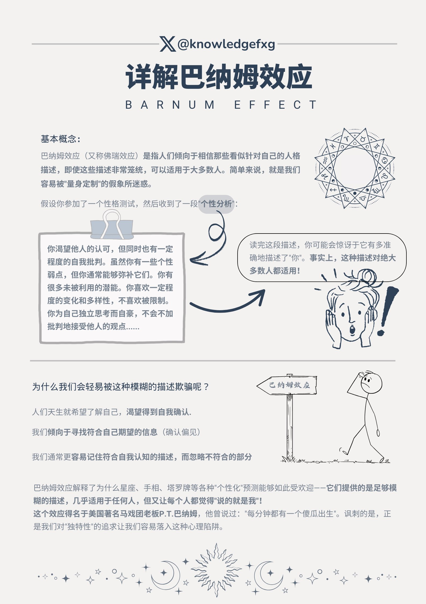

.. Michael Wu 版权所有

:Authors: Michael Wu
:Version: 1.1

2025-Q2
**********

0415 周末的规划策略
===================

想玩好休息好。周末也要有一定策略。

首先，从身体层面，如何休息好？

    - 晒太阳。否则眼睛会不舒服，身体的激素分泌也会受影响；
    - 要动脑。需要规划一些事情，能够产生成就感的，否则会陷入漫无目的刷手机信息流等，这样休息不充分，大脑会缺少内啡肽等分泌调节；
    - 要说话。人有社交需求，要与人交流才行。
    - 要运动。这个和晒太阳结合，要有一定的运动量，否则身体也会修复不好。
    - 少熬夜。控制好作息时间，会影响大脑和身体状态。
    - 有规划。有个主动的规划，不一定多复杂充实，关键是有，哪怕规划玩点啥。

`如何彻底荒废一个周末（建议反着做） <https://mp.weixin.qq.com/s/TOA3vF2mDcG1JaDgTCAHzA>`_

1. 有规划

    过周末的第一大忌就是缺乏对周末的规划。

    没有计划只得临阵磨枪，要不要出去玩、要约谁一起玩、该去哪里玩、要不看看攻略......

    当过多的选择摆在我们面前时，我们更容易陷入决策瘫痪（Decision Paralysis）。光是思考这些问题，都让人头大。几乎每一个临时做决定的
    事情，都在消耗我们的认知资源，让我们感到疲惫。

    因此在走完这一整个漫长的心理历程之后，你大概率会发现，启动起来反而更加困难了，可能会拖延出门玩的时间，又或者觉得心累、干脆不
    出门了。

    .. note::

        更糟糕的是，当我们缺乏一定的规划时，大脑对时间的感知会变得模糊，让我们产生时间还很充裕的错觉，进而更容易把时间花在碎片化
        的活动上，比如无目标地刷手机，在各大社交媒体里频繁切换刷信息流。

        提前为周末做准备，关键并不在于你要计划得多么详实，而是在于你要有「主动计划」的这个动作。

        不论你是用各种活动填满你的周末，还是无所事事地过一天，这些都是在思考后自己主动做出决策的结果，而不是让那些无意识的行为悄悄
        偷走你的时间。

2. 不要报复性地熬夜、补觉

    维持相对稳定的昼夜节律和充足的睡眠时长。如果很难做到，在周末补觉控制在 2 小时以内最好

3. 不要刷手机、追剧、只做不动脑子、不费力气的事

    很多人对于休息的理解就是去做一些低能耗的活动，具体来说就是多多放松身体，比如按摩、泡澡；在心理上转移自己的注意力，让
    自己放空或者做一些不动脑子的事情，比如刷手机、追剧。

    但研究发现，这种休息方式无法让我们获得真正、彻底的休息。一项荟萃研究总结了四种最为常见的休息方式：

        1. 心理脱离（psychological detachment）：转移自己的注意力，在休息时间将注意力完全从工作上移开。
        2. 放松（relaxation）：降低身体的生理激活水平，让自己处在低能耗的状态从而实现放松。
        3. 精通（mastery）：学习新技能或者完成具有挑战性的任务。
        4. 控制（control）：个体对休息的自主控制权，可以选择何时休息、选择什么样的休息活动。

    前两种休息方式指向的便是那些低能耗的活动。它们都属于被动休息，可以快速缓解疲劳，但无法为我们带来持续的幸福体验。

    而主动休息是那些需要身体或精神参与的活动：

        1. 轻体力劳动：画画、做手工、冲泡咖啡，甚至做家务也算。
        2. 要投入注意力和创造力的事情：长文本阅读、看纪录片、写日记。

    **换句话说，消除疲惫最好的方式不是什么都不做，而是去做那些需要投入体力或脑力的事情。**

    并且这些需要高度参与的活动，还会让人感觉时间更长、更充实。我们对于时间的感知，很大程度上依赖于事件的密度和新鲜度。
    时间分块理论认为， 人们在回忆一段时间时，会根据有多少个记忆点来判断时间的长度。

    越是经历了不同的活动，越能增强我们主观上的时间拉伸感。如果一整天都在做着差不多的事情，玩手机、看剧，就会更容易产生
    时间如流水的主观感受。

4. 不要过多的高强度活动安排

    我们管理时间的方式可以分为两种，活动最大化和结果最大化。

    活动最大化是最大程度上增加活动的数量，而结果最大化则是指我们对这些活动的预期，希望它们可以带来尽可能多的享受。但二者常常是冲突的。

    这意味着，当我们给自己安排过多的项目追求活动最大化时，可能并不利于结果的最大化，进而降低主观的幸福感。

    这是因为，在这个过程中我们的自主感（Autonomy）很容易被剥夺。每一个安排似乎都在指挥着我们下一步该做什么，我们就像被提前设定好
    的程序一样，被裹挟着只能被动去执行。试想一下，你计划了一场高强度的周末旅行，要不断地赶行程、打卡景点，这时的旅行不再是享受，而
    变成了不得不完成的几个任务，乐趣自然大打折扣，玩一趟下来身累心更累。

5. 不要陷入周末焦虑

    对于假期即将结束的遗憾和面对未知工作的恐惧，让我们的大脑一直处在高度警觉的状态，从而更难放松和休息。这个我倒是没怎么遇到。

6. 不要把快乐都「攒到」周末和假期

    我们很多人都是为周末而活，不自觉地把生活切分为泾渭分明的工作日和假期。工作日就是为了生存和搞钱，只有周末才能给予我们生活的自由。

    在这种状态下，周一到周五就变成了忍耐、应付的日子，始终眼巴巴地盼望着周末和假期的到来，似乎只有到了休息日才能体验到什么是真正的活着。

    这种状态被称作周末依赖（TGIF，Thank God It’s Friday）。TGIF心态是一种隐藏的心理陷阱，期待周末的到来在某种程度上给我们提供了
    动力，但它也让我们忽视了珍视当下的价值。

.. _stay_home:

家里蹲精神痛苦？
----------------

为什么家里蹲会带来精神痛苦？ - 赵初雨的回答 - 知乎
https://www.zhihu.com/question/649976562/answer/1893695374948022083

恰恰相反，你以为的精神痛苦实际上是生理痛苦。

1. 长期不接触自然光会使眼轴过度增长，近视畏光青光眼干眼症风险猛增。
   眼睛的难受会让你对电子产品极度抗拒，但你又只能接触电子产品，视力状况只会每况愈下。

2. 长期不接触自然光，长期没有户外运动会让你的骨密度和肌肉量断崖式下降。
   直接影响是你会发现你非常容易骨折，一点跌打损伤可能就会把你送进医院。
   你的体力会大幅度衰减，以前跑个几公里马马虎虎，现在出去走两步就不想动了。
   间接影响是你的预期寿命直线降低，你主观上可能感觉不到，但你的本能会让你恐慌，让你抑郁，让你焦虑，负反馈让你的生理状况越来越差。

3. 长期缺乏社交会使你的大脑，智力水平，抽象思考能力衰退。
   人是社会动物，并不意味着人不可以独处，但不能离群索居，生活中需要一些正向的社会联系人机支持给你补充“精神能量”，很多时候人生
   的“意义感”自我的“有用感”就来自于正向的社会交往体验。

4. 长期营养不良或是摄入食物种类营养成分过于奇葩的话肠胃要遭罪了，肠胃一遭罪皮肤也跟着遭殃了，各种什么爆痘啦，看上去老了十几岁啥的
   其实很大程度上就是饮食和心理状态同时出问题了。

0427 关于消费的一个观点
=======================

钱只有在你花它的一瞬间才是你的钱。你多赚了一些钱，你有话不掉，有什么用。看到这个说法有意思，哈哈。

0428 对比几个大模型写代码能力
====================================

最近对比了几个大模型的写代码能力，把全量需求告诉给大模型，然后详细对比了下面几个：

时间: 2025年4月28日

- 腾讯元宝DeepSeek R1, 写出来的代码逻辑不够，不符合我的需求；
- ChatGPT4.0，写出来代码完备性可以，但是还是有逻辑的偏差；
- Google Gemini Flash(experimental)，写出来的代码完备性可以, 意想不到是最好的，长代码逻辑准确性最高；

由于工程的问题，写很长的代码需要把需求做详细拆分，然后写完测试完，自己完成工程上的对接。还是提高了效率很多的。但是也要求，你必须
有基础，有工程能力和动手能力，才能更好的发挥AI的能力。Mark一下，知道哪个最好，后续再对比各家。

0510 培养输出型爱好
========================

再Twitter上看到个帖子：  `培养输出型爱好 <https://x.com/knowledgefxg/status/1920491387906064607>`_

很有道理。确实，有时候这种反而是更有意思的一种娱乐方式，带来不一样的乐趣。

.. image:: output-hobbies.png
    :scale: 50%

自由支配时间
-----------------

还看了下面的这个文章，也挺有意思：

`大家有没有发现一个奇怪的现象？辞职或失业后不上班的人，虽然没有工资，但时间久了却再也不想回去上班了。这是为什么呢？ <https://mp.weixin.qq.com/s/uWieH4XSK9Yr6wN8AzCF9w>`_

我自己的想法是：有一部分人确实是为了价值实现，尤其是创业老板，是真的在实现自己的价值。但是，更多的是人们为了生存，维护一个身份，
维护一个生活规律，维护一个社交圈子，好融入社会，工作寄托了自己的个体价值实现，自己的身份地位等。

上面的公众号文章里有的说的挺好：

.. note::
    - 工作的原因真的是缺钱吗？因为"缺钱"只是个借口，真实原因是——害怕失去"身份"。
    - 我想过这个问题，真正舒服的不是"不上班"这个状态，而是"自由掌控时间"的感觉。
    - 我们打工的时候，时间不是自己的，别人安排你干啥就得干啥，赚的是卖时间的钱。

    最悲哀的是，很多所谓的成功人士，从来没体验过真正的自由。问他们为啥工作，他们说为了梦想、为了成就感、为了责任...都是放屁！
    说白了，还不是被体制驯化的太彻底，已经没法过正常人的生活了。

    不过确实有种人确实得回去上班，因为他们除了上班啥也不会，人生没有目标方向，不知道自己喜欢啥，就只会被人安排。不上班的日子里
    如果天天刷短视频打游戏，那还不如回去上班混日子。

还有前面，如果没有任何自己的事情，自己要做的事情，想做的事情，反而可能会过得更加无规律。:ref:`stay_home` 也说了这个点，如果自己
很自由，那么得有自己要做的事情，有自己的领域，有自己的输出型爱好，有自己的社交圈子，只有纯粹的玩乐，那还不如上班，因为可能连最基本
的规律生活都做不到，直接损害身体健康了都。

所以，先有输出型爱好，有自己的兴趣价值领域，这些才是为后面自己有足够自由可支配时间所准备好的，并且这些也很关键，甚至对于上班的生
活也是，因为除非上班恰好就是自己的爱好价值所在，不过大概率不可能全是，因为上班，工作都是来源于组织的分配的。比如，很多的大佬程序员，
他上班也无法深耕自己感兴趣和热爱的领域，可能业余或者自己做的项目才是他真正感兴趣的领域。

0520 巴纳姆效应
========================

学到了1个巴纳姆效应(Barnum effect), 其指人们倾向于相信那些模糊、普遍适用的描述，认为它们是针对自己的个性化描述。这个效应
在心理学和占星术中经常被提及。下面的Twitter帖子总结的不错：

- https://x.com/knowledgefxg/status/1914689186332074031

还有峰哥的下面的切片哈哈，说的有意思：

- `峰哥:相信算命的都是傻比！ <https://www.bilibili.com/video/BV1NgVfzZELD/?spm_id_from=333.337.search-card.all.click&vd_source=f7b8e2d66d4b85cd95e1a463f568439f>`_
- `峰哥:“为啥丑逼穷逼都爱算命。” <https://www.bilibili.com/video/BV1jP4y1L79s/?spm_id_from=333.337.search-card.all.click&vd_source=f7b8e2d66d4b85cd95e1a463f568439f>`_

0522 对内核开发祛魅
========================

今天刷知乎，看到了这个问题： `为什么大部分杰出的程序员都在内心倾向于研究操作系统和编译器？ <https://www.zhihu.com/question/48732733>`_

有个高赞的答案回答非常的好，而且点开答主的资料，发现还是自己公司的同事。

回答： https://www.zhihu.com/question/48732733/answer/2850032993

作者在学生阶段的观点还是：认为应该研究更底层的基础系统，那很牛逼。我也有过类似的想法，早起也研究了很多理论，不过惭愧的是并没有
真正的深入，缺乏实践和真正的项目。后来工作久了，观念也发生了变化。与上面作者的观点不谋而合。作者的观点是：

.. note::

    优秀的程序员要把学习技术的能力作为锻炼的关键能力，把应用技术解决问题、创造价值的价值思维当做做事的主要思考动机，优秀的程
    序员也要是一个优秀的技术决策者、懂业务懂team work，见过很多优秀程序员还有优秀的产品思维，甚至商业思维，产品思维和技术思维可
    能是放大技术价值的有一次突破，技术不存在高低，研究技术变迁就很容易发现，所有的技术从火热到冷门、从冷门到火热，基本都是围绕价
    值需求再变化，主要以商业价值驱动，所以不轮操作系统还是Java、python应用开发，有用就学，用处少就降权，不断调整自己方向适应价值。

作者的下面的经历也说明了作者在底层OS领域身后的功底：

.. note::

    研究生研究的是内核网络协议栈在多核处理器上的并行系统设计和优化，我主要工作就是在为这个系统设计和实现一个能线速处理10Gbps流量
    的IO系统，所以在校期间移植了Qualcomm（那时候居然不知道是高通，只知道英文名是qualcomm）开源的的一个Intel XGBE UIO系统，优化
    它的性能（记得是对照一个SIGCOMM的论文的某段一句话一句话揣摩，人家也没开源代码，只说几句似懂非懂的内核优化策略），实验室里一个人
    钻研内核，到关键处抱着驱动芯片mannual连续啃多天，一个参数一个参数试（记得身为Linux kernel maintainer，还有intel编译器实验
    室老师，两个老师都也帮不了），最后甚至学会了tuning x86处理的一次cache miss是哪种原因导致的，移植驱动花了一个月，性能优化硬杠
    驱动6个月，最终才算复现了SIGCOMM的论文结论，很兴奋。后面师兄还帮我提交了一个我改进的Linux kernel network patch，毕业后也有
    不少芯片制造商公司给操作系统方向的offer，但是其实隐约还是觉得 **这类工作缺少创造性，这种创造性就是你要思考才能得到，是一种发明
    创造，但是实际内核工作中99%可能是dirty work** （记得还发现了intel westmere这类微架构IOH互联方面的bug，一直不敢说，也没法验
    证，人微言轻，但是后来看到那篇SIGCOMM作者团队在其他地方提到他们跟intel确认了这个bug）。

现在想也是，如果你最还是想搞OS，那么要去想当今市面上的需求是什么了。比如内核的调度模块，就很稳定了。驱动BSP等还比较多，存在于芯片
原厂和各种硬件厂商。还有就是致力于想搞OS的厂商了。

所以，如果职业周期拉长，那么一定会接触很多很多的技术的。比如自己大规模使用过的：C/C++, Python, Go编程语言，主要是开发经历还是围绕
实际工作上的需求。再研究生期间做项目用过Java，也有一定的了解。现在自己又学习了JavaScript，因为对现在前端有点兴趣想了解，同时也帮
自己对象做一些小的web应用，有实用价值了，虽然这些不向底层那么看起来高端，但是更加贴近应用，接近业务，也就接近商业闭环，而且用户也
会有点意思。

那么这些底层的技术是不是就不研究了呢，我也觉得也不是，不定期的研究一下原理，尤其是AI这么发达，本着探索或者爱好的角度也是可以研究研究的。
也就是不会那么功利了，觉得高大上而去研究，而是对未知的探索，对知其然的好奇的追求而已了。

0525 不要总是多线程工作
========================

下面的文章再次从脑科学角度分析了，总是切换多线程工作会导致的认知损耗。

https://mp.weixin.qq.com/s/Yftu3UrYreydioarR2oxEw

.. note::

    2019年，硅谷新星工程师马克·李登上《福布斯》"30岁以下精英榜"，他同时运营三个创业项目、每天学习两门外语、坚持更新技术博客。
    但三年后，他的公司全部关闭，个人诊断出焦虑症。

    "我像同时发射100支箭的弓箭手，却忘了箭靶在哪里。"他在采访中反思。马克的经历并非个例，现在越来越多的人，标榜自己为斜杠青年，但是，
    绝大多数斜杠青年都很平庸。而心理学研究揭示了这类"高精力低成就"现象背后的科学机制。

    一、认知带宽被切割的代价

    诺贝尔奖得主丹尼尔·卡尼曼在《思考，快与慢》中提出"认知资源有限模型"：人脑处理信息的带宽约为120比特/秒，相当于同时理解1.7个人说话。
    当注意力不断切换时，前额叶皮层会产生"转换损耗"，也就是你的大脑出现了额外的损耗，不利于你专注的去解决一些问题。
    微软研究院对200名员工进行的脑电波监测显示：收到邮件通知后，员工平均需要23分15秒才能回归深度工作状态。持续的多线程工作者，其有效
    智力水平相当于醉酒状态。

    纽约时报记者尼克·比尔顿曾沉迷于同时操作5块电子屏幕。神经影像显示，这种状态下他的杏仁核（情绪中枢）异常活跃，而前额叶（决策中枢）活
    跃度下降60%。他在《摧毁思维的智障》中写道："我的大脑变成了不断重启的电脑，永远无法完成系统升级。"

https://www.yuque.com/serviceup/misc/cn-the-real-cost-of-an-interruption-and-context-switching

还有上面的文章：《程序员中断：中断和上下文切换的实际成本》

当在复杂的编程任务之间切换时，返回到流状态通常比从“简单”中断返回更费脑力。完全切换到其他东西需要刷新缓存（短期内存）并加载一个
全新的上下文。这个过程需要时间、精力和精神能量，这些能量是有限的，并且会在一整天内消耗殆尽。这些硬性限制是由人脑强加的。

内在动机被污染
--------------

.. note::

    心理学家爱德华·德西的"自我决定理论"指出：当外在动机（金钱、点赞）挤压内在动机（兴趣、使命）时，人会进入"动机排挤"状态，
    创造力下降40%。杜克大学让两组学生玩解谜游戏：A组获得奖金，B组纯娱乐。三天后，A组继续游戏的人数比B组少63%。过度外部激励反而
    消解了内在驱动力。互联网教育平台Udemy调研发现：购买超过3门课程的用户，完课率不足4%。知识焦虑催生的"松鼠症"患者，将囤积行为
    本身当成了目标。正如《浅薄》作者卡尔所说："我们正在培养知道如何点击'购买'按钮，却失去深度学习能力的新人类。"

选择权泛滥
----------------

.. note::

    心理学家罗伊·鲍迈斯特提出了"自我损耗理论"：每个决策都消耗葡萄糖和意志力资源，连续决策会导致"决策逃避"现象，此时人更倾向选择
    默认选项或维持现状。以色列监狱假释委员会的数据显示：法官早餐后的假释通过率65%，午餐前降至15%。决策质量随认知资源消耗呈
    断崖式下跌。苹果前首席设计师乔纳森·艾维透露，乔布斯十年如一日穿黑色高领衫，正是为了减少着装决策损耗。扎克伯格的衣柜里挂
    着15件相同灰色T恤，这种"认知节能策略"使其日均有效决策时长延长2.8小时。

DMN网络
---------

.. note::

    神经科学证实，人类大脑进化出"默认模式网络"（DMN），其最大创造力迸发于静息状态。正如卡尔·荣格所言："向外张望的人在梦中，
    向内审视的人终将觉醒。"当社会将忙碌包装成美德，真正的智慧或许在于：用战略性的克制，守护认知火种不灭。

默认模式网络（Default Mode Network, DMN）​​ 是大脑在静息状态下活跃的神经网络，涉及自我反思、记忆整合和未来规划。当人处于
“走神”或“白日梦”状态时，DMN会高度活跃；而专注任务时，DMN活动降低，执行控制网络（如前额叶皮层）接管。
过度活跃的DMN可能导致注意力分散、焦虑或低效思考。

0603 孙晨宇的经历
========================

在知乎微博上看了几个孙宇晨的帖子，惊叹该人真乃神人也，帖子链接：

- `孙宇晨去参加特朗普晚宴了，对此你怎么看？ - 不要贪刀的回答 - 知乎 <https://www.zhihu.com/question/1909212060732102446/answer/1910879393246610711>`_
- `孙宇晨去参加特朗普晚宴了，对此你怎么看？ - 沧海一舟笑的回答 - 知乎 <https://www.zhihu.com/question/1909212060732102446/answer/1912626200096007558>`_
- `为什么孙宇晨一个小硕士，就有几百亿身家。我们博士天天熬夜做着高风险的剧毒苦力活，银行卡里只有几百元钱？ - 风满楼5s的回答 - 知乎 <https://www.zhihu.com/question/328860831/answer/713404634>`_
- `《孙割列传》- 西门大妈微博 <https://weibo.com/6154203482/OmpYIiVYD>`_

| 他的Twitter账号：
| https://x.com/sunyuchentron

谈就业：

.. image:: pic/sun-ge-job.png
    :scale: 85%
    :alt: 孙哥谈就业思维

谈投资：

谈原始积累：

谈勇气和格局：

.. important::

    勇气本身就是极大的竞争优势。你敢做，别人不敢做，在这个过程中，你就已经淘汰了很多的人。勇气是格局的重要载体，
    格局大，胆子就打。

中产的投资认知
----------------------------

一篇投资文章：

`窒息的沦为牛马的名校毕业中产们，只因做错了这个 <https://mp.weixin.qq.com/s/Osb-3Ax46oDJX63mYmTCEw>`_

.. note::

    孙悟空大闹天宫的全部本事，学自菩提祖师。他是怎么学的呢？菩提祖师曾先后让他学道字门，流字门，静字门，动字门，而
    他只问了一句“可得长生么”，只要不能长生，他就不学。

    祖师闻言，咄的一声，跳下高台，手持戒尺，指定悟空道：“你这猢狲，这般不学，那般不学，却待怎么？”走上前，将悟空头上打了三下。
    唬得那一班听讲的，人人惊惧，皆怨悟空道：“你这泼猴，十分无状！师父传你道法，如何不学，却与师父顶嘴？这番冲撞了他，不知几时才出
    来啊！”此时俱甚抱怨他，又鄙贱嫌恶他。悟空一些儿也不恼，只是满脸陪笑。

因为世俗观念的灌输，就是告诉你老老实实学，行行出状元。所以他们学了一堆炮弹知识，只是获得了一个硕士名头，一个博士名头，却把
自己最富创造力的10年给搭进去了。而孙悟空不扯这些虚的，因为孙悟空明白，我来就是学赚钱的真本事的，那些不能赚钱的知识，就不能在上面
浪费时间。他和那些已被世俗观念灌输的同学不一样，所以面对同学的抱怨时就只能满脸堆笑。

真正有价值的，精准命中市场需求的赚钱的知识，根本不会在公开领域免费流通。你只能依靠自己，以我为主，根据试错和市场反馈，
一点点的开始架构起自己的导弹知识体系。过程和方法论，并不那么重要。重要的是你开始意识到这一点。而当这个精确制导的种子一旦在
心中种下，在合适的时候，它就会开始野蛮生长。
