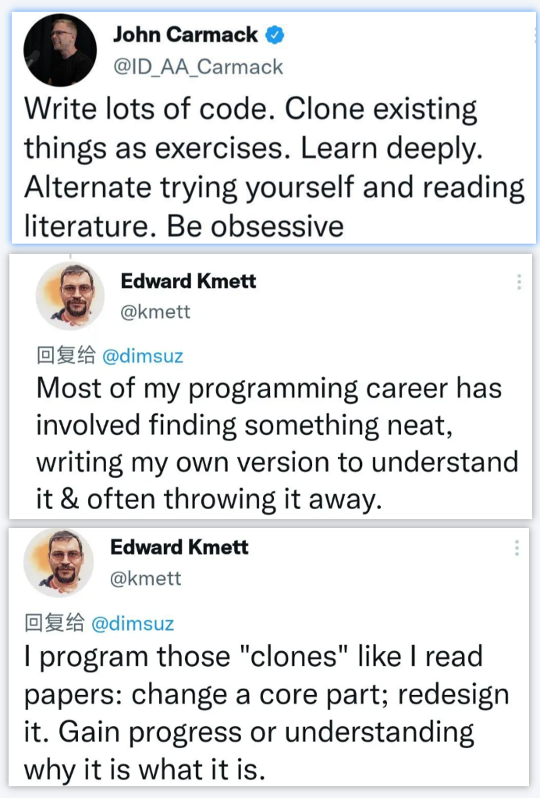

.. Michael Wu 版权所有

:Authors: Michael Wu
:Version: 1.0

如何学好编程
=================

学习、练习和总结
---------------------

我的心得体会就是：不用刻意的去努力，保持长期的兴趣，学习、练习、总结三者结合。

| 知乎的问题：`那些编程水平很高的程序员是怎么训练出来的? <https://www.zhihu.com/question/351504112/answer/2798591054>`_
| 高赞的回答列出了业界大佬们对于编程的建议：

.. tip::

    动手和思考很关键。这里有个点就是要具备一定的 **工程能力** ，利用好github，fork好的项目到自己的github仓库，进行针对性的
    改造和练习。或者一点点构建自己的笔记和项目库。现在有了AI的辅助，查资料和答疑解惑都简单很多了，练习思考可以更快的闭环，可以
    好好的通过工程手段把自己的练习思考都记录下来，不停的迭代提交，一来内化吸收，二来方便自己查询和复习。

快速收敛知识
---------------------

工作中的针对性学习： `学习不是期待未知，而是要快速发现规律。 <https://mysummary.readthedocs.io/zh/latest/%E8%8A%B1%E6%9C%B5%E7%9A%84%E6%B8%A9%E5%AE%A4/CSS%E5%B8%83%E5%B1%80.html>`_

.. hint::

    不少人把学习看作是看小说，怎么说呢？他们在期待“未知”：一个人进入一个森林，看到了高大的树木，地上的青苔，洞中闪光的眼
    睛……这些都是看小说有趣的地方。因为你接受到新的信息，随着这些信息在惊悚，好奇，恍然大悟等等。这是看小说。

    但学习，Study，研究，不是这样的，学习不是无条件接受信息，而是快速发现规律，记忆规律，指导新的创造等等。
    所以，学习必须快速找到满足目的的信息，而不是让信息随意填充你的脑力空间。大学必须快速掌握这种能力，因为未来进行研究和工作
    的时候，你一定会面对无限的知识的，如果你只能无条件用信息填充，你就相当于无法接受新的信息。作为信息科学，计算机尤其如此，因
    为所有软件的开发，基本上都是新信息的发明过程。

    所以，学习的时候不要问：C++有什么用？C语言怎么学？CSS的Layout怎么用？这种问题基本上都是前面说的“期待未知”的态度。我们
    要确定一下我们研究那个问题的目的。

关于『努力』的思考
---------------------

刻意的努力无法长久。只有习惯和兴趣，变成一种生活方式，一种生活中的乐趣，那么才能在这个领域找到真正的乐趣。越是刻意功利的去努力，
去追求，反而不会长久。任何一个生活中的工作中的变化，或者兴趣的转移，都会马上停滞不前，慢慢放下，因为你并没有感兴趣，也没有真正
的乐在其中。

.. note::

    通过个人观察，业界的高手，基本都有自己的爱好，绝不是只靠工作中的项目积累的经验。工作中给你分什么业务的活儿，你就干什么，这
    可以带来很多，但是更多的深度和广度的扩展，就要靠个人的兴趣和追求了。

上面是从战术角度，从方法论上给出了好的学习编程的方法。那么做到战略长期坚持，这个回答很好，也是道德经里的哲学：

还有就是关于努力。

| 为什么《道德经》中没有「努力」这个概念？ - 夜岚峰的回答 - 知乎
| https://www.zhihu.com/question/275029367/answer/2465570247

.. note::

  | 道德经第二十三章就说：飘风不终朝，骤雨不终日。
  | 意思是说：狂风不会整天整天地刮，暴雨不会整天整天地下。真正能够长久下去的，是梅雨季节的绵绵细雨。

  | 道德经第三十章就说：物壮则老。
  | 意思是说：一个事物如果壮大到了极点，就会走向老态的衰竭。

  | 道德经第四十一章也说：大音希声，大象无形。
  | 意思是说：越好的音乐越悠远飘渺，越好的形象越飘渺宏远。

  | 在哲学上，任何事情都是处于两极同时存在的。
  | 一个人过度地努力，当他倒下的那一刻便是过度的休息和放松。
  | 一个人想要过度地舒服，迎接他的便是无尽的折磨和痛苦。

  任何事情的产生，都会出现一股相反的力量与之进行对抗。你越是过分地努力，当你摔倒的那一天，就越是难以爬起来。

  当坚持不再刻意，而是如同心脏的跳动一般，不需要再时刻地提醒自己或是需要反复地去排练，它便随风潜入夜地变成了嵌入我们生活的一部分，
  从而不会再变成生活中的一个重要负担。

  万事万物要顺应自然的规律，日出而作，日落而息。我们要的不是一瞬间的快感，而是在绵长的生活当中感受那生命长河缓缓地流逝。
  到最后你很可能就会发现：尽管你从来不认为自己有非常艰难地努力过，但是只要你在这条路上走的足够远，你的人生便会越来越开阔越来越
  轻松，每个人都会认为你是多么地努力。

  过度努力的人只是在不断地瞎折腾自己，而真正坚持下来的人往往显得非常轻松，因为他们觉得：这就很好~
