.. Michael Wu 版权所有

:Authors: Michael Wu
:Version: 1.0

ARM体系结构
===========

本文主要介绍ARM64体系结构。

ARMv8异常等级和安全态
------------------------

ARMv8-A 有两种 security states, Secure and Non-secure. The Non-secure state 也叫做 Normal World.

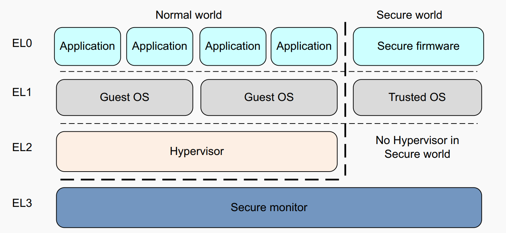

Exception Handling
^^^^^^^^^^^^^^^^^^^^

异常会中断正常执行流程，并且需要特权程序进行异常处理，从而确保系统正常运行。Exception包括：

- Interrupts.
- Memory system aborts.
- Exceptions generated by attempting to execute an instruction that is UNDEFINED.
- System calls.
- Secure monitor or Hypervisor traps.
- Debug exceptions

| ARM CPU的执行mode改变受到特权程序控制或者异常自动触发。可以参考：
| https://developer.arm.com/documentation/den0024/a/Fundamentals-of-ARMv8/Changing-Exception-levels

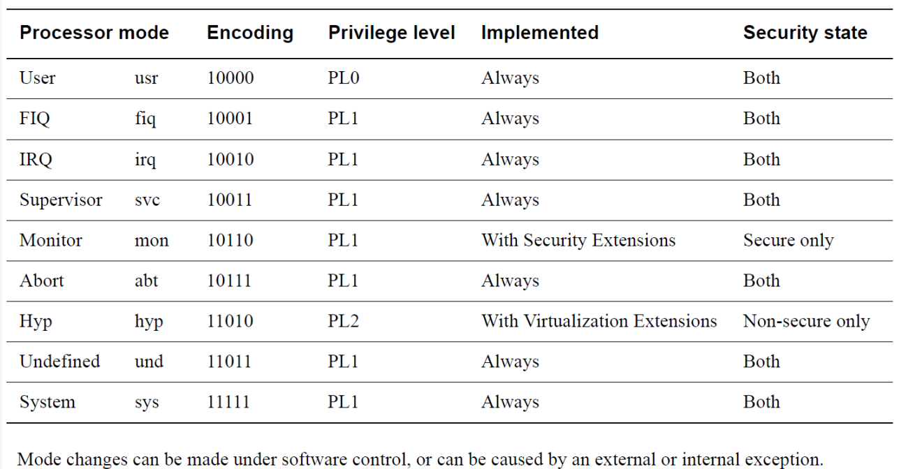

执行这些指令可能会引发异常。以请求运行在更高特权级别的软件提供的服务：

.. note::

  - The Supervisor Call (SVC) instruction enables User mode programs to request an OS service.
  - The Hypervisor Call (HVC) instruction enables the guest OS to request hypervisor services.
  - The Secure monitor Call (SMC) instruction enables the Normal world to request Secure world services.

Reset异常比较特殊，异常向量表地址可以从 ``Reset Vector Base Address`` 寄存器 ``RVBAR_ELn`` 中读取。
所有核都有一个 ``reset input`` ，reset是最高优先级的异常，无法被mask屏蔽，用于核上电初始化。

Exception and Interrupt
^^^^^^^^^^^^^^^^^^^^^^^^^

| 每种exception都有一个关联的异常handler。当异常被处理后，特权软件恢复到异常前的执行状态。
| https://developer.arm.com/documentation/100933/latest/AArch64-Exception-and-Interrupt-Handling

.. note::

  异常和中断的区别:

  - exception是一种event，这种event(除了分支和跳转指令)导致正常的指令执行流被修改。
  - interrupt是exception的一种，并不由程序执行直接触发，通常是硬件触发报给CPU核，比如一个按键中断。

  ARM把exception分为同步和异步两组:

  - The synchronous exception types can have many causes but they are handled in a similar way.
  - The asynchronous exception type is subdivided into three interrupt types, IRQ, FIQ, and SError (System Error).

.. _int_id_type:

GIC中断控制器
----------------

主要参考ARM官方文档:  https://developer.arm.com/documentation/ihi0069/h/?lang=en

GIC的各模块组成：

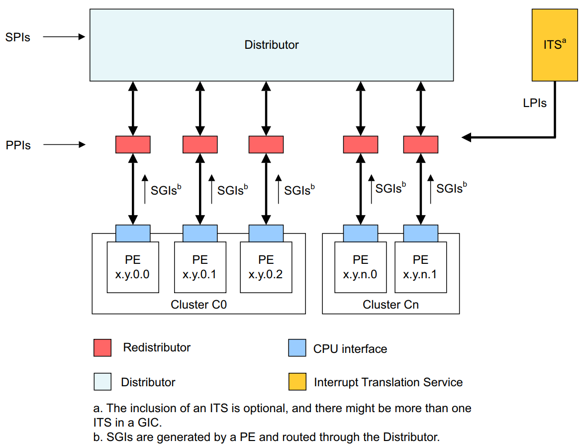

| 按照中断号分：
| https://developer.arm.com/documentation/198123/0302/Arm-GIC-fundamentals

.. list-table::
   :header-rows: 1

   * - INTID
     - Interrupt Type
     - Notes
   * - 0-15
     - SGIs
     - Banked per PE
   * - | 16-31
       | 1056-1119 (GICv3.1)
     - PPIs
     - Banked per PE
   * - | 32-1019
       | 4096-5119 (GICv3.1)
     - SPIs
     -
   * - 1020-1023
     - Special interrupt number
     - Used to signal special cases, see Settings for each PE for more information.
   * - 1024-8191
     - Reserved
     -
   * - 8192 and greater
     - LPIs
     - The upper boundary is IMPLEMENTATION DEFINED

中断的上报

参考： https://developer.arm.com/documentation/102909/0100/The-Generic-Interrupt-Controller

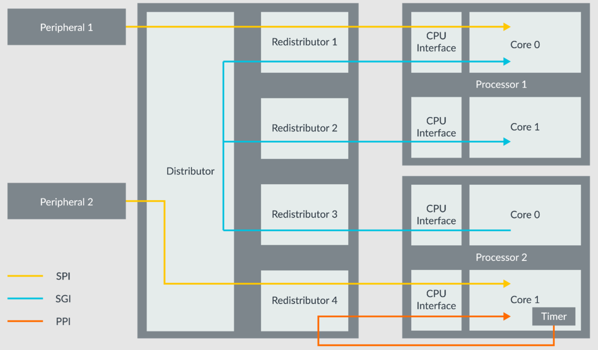

然后中断的上报流程可以看，不包括LPI（LPI都是消息中断)：

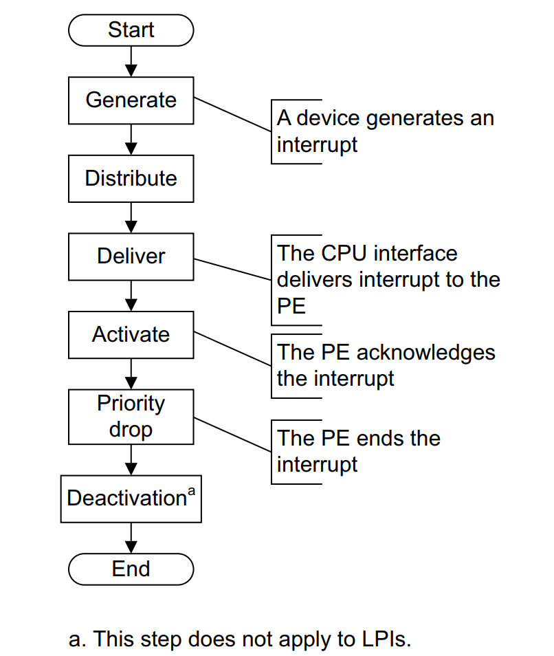

按照安全非安全进行分组如下，以及对应的使用场景：

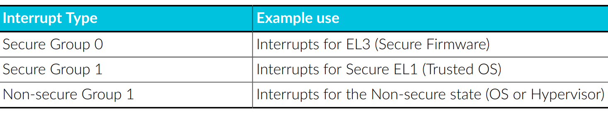

| 下面从软件使能GIC视角讲了一些原理和用法:
| https://developer.arm.com/documentation/den0024/a/AArch64-Exception-Handling/The-Generic-Interrupt-Controller

Distributor(GICD_*)
^^^^^^^^^^^^^^^^^^^

系统中所有的中断源都会连接到Distributor. Distributor决定了哪个最高优先级的pending interrupt能够上报给一个核，
并且转发那个中断到那个核的 **CPU interface**。并且，Distributor提供了寄存器来上报不同中断ID的状态。主要作用:

- Interrupt prioritization and distribution of **SPIs**.
- Enable and disable SPIs
- Set the priority level of each SPI
- Route information for each SPI
- Set each SPI to be level-sensitive or edge-triggered
- Generate message-signaled SPIs
- Control the active and pending state of SPIs
- Determine the programmer’s model that is used in each Security state: affinity routing or legacy.

中断的状态转换

  - Inactive -> Pending
      When the interrupt is asserted by the peripheral.
  - Pending -> Active
      When the handler acknowledges the interrupt.
  - Active -> Inactive
      When the handle has finished dealing with the interrupt

Redistributors(GICR_*)
^^^^^^^^^^^^^^^^^^^^^^^

- Enable and disable **SGIs and PPIs**
- Set the priority level of SGIs and PPIs
- Set each PPI to be level-sensitive or edge-triggered
- Assign each SGI and PPI to an interrupt group
- Control the state of SGIs and PPIs
- Control the base address for the data structures in memory that support
  the associated interrupt properties and pending state for LPIs
- Provide power management support for the connected PE

CPU interface(ICC_*_ELn)
^^^^^^^^^^^^^^^^^^^^^^^^^

每个核通过 **CPU interface** 来接收中断。CPU interface提供了寄存器来 mask, identify and control states of interrupts
forwarded to that core.

每个核执行exception handler作为响应. The handler must **query the interrupt ID** from a CPU interface register and
begin servicing the interrupt source. When finished, the handler must write to a CPU interface register
to **report the end of processing**.

- Provide general control and configuration to enable interrupt
- Acknowledge an interrupt
- Perform a priority drop and deactivation of interrupts
- Set an interrupt priority mask for the PE
- Define the preemption policy for the PE
- Determine the highest priority pending interrupt for the PE

Configure and initialize
^^^^^^^^^^^^^^^^^^^^^^^^^^

GIC可以作为一个memory-mapped peripheral(MMIO外设)来访问. 所有核共享同一个Distributor, 但是CPU interface is banked,
即每个核都用 **same address** 访问它自己私有的CPU interface. 每个核都不能访问其他核的CPU interface.

Distributor提供了对应的寄存器来配置每个不同中断的属性。Distributor还提供了priority masking优先级掩码，一个中断如果低于了特定的
优先级掩码配置，那么就不能上报到核. Distributor使用这个来决定一个pending interrupt是否可以报给特定的核。

CPU interfaces帮助其对应的核来fine-tuning(微调)中断的control and handling.

Distributor 和 CPU interfaces在reset时都是disabled的. The GIC在reset后必须被initialized，才能正常工作和上报中断。
In the Distributor, software must configure the priority, target, security and enable individual interrupts.

Before interrupts are expected in the core, software prepares the core to take interrupts by setting
a valid **interrupt vector** in the vector table, and clearing interrupt mask bits in PSTATE, and setting
the routing controls. For an interrupt to reach the core, the individual interrupt, Distributor and CPU interface
must all be enabled. The interrupt also needs to be of sufficient priority, that is, higher than the core's
priority mask.

下面是不同类型中断对应的相关配置寄存器:

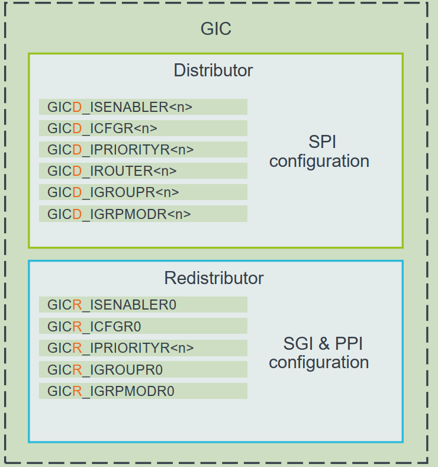

Interrupt handling
^^^^^^^^^^^^^^^^^^

When the core takes an interrupt, it jumps to the top-level interrupt vector obtained from the
vector table and begins execution.

The top-level interrupt handler reads the IAR(Interrupt Acknowledge Register) from the **CPU Interface** block to
obtain the **interrupt ID**. As well as returning the interrupt ID, the read causes the interrupt to be marked
as active in the **Distributor**.

When the device-specific handler finishes execution, the top-level handler writes the same interrupt ID to the
EoI(End of Interrupt) register in the **CPU Interface**.

It is possible for there to be more than one interrupt waiting to be serviced on the same core, but
the **CPU Interface** can signal only one interrupt at a time. The top-level interrupt handler could
repeat the above sequence until it reads the special interrupt ID value 1023, indicating that there
are no more interrupts pending at this core. This special interrupt ID is called the spurious
interrupt ID(1023).

.. note::
  **1023 - Spurious interrupt**. There are no enabled INTIDs in the pending state, or all INTIDs in that pending
  are of **insufficient priority** to be taken. When polling the IARs, this value indicates that there are
  no interrupts to available to acknowledge.

The spurious interrupt ID is a reserved value, and cannot be assigned to any device in the
system. When the top-level handler has read the spurious interrupt ID it can complete its
execution, and prepare the core to resume the task it was doing before taking the interrupt.

结合QEMU和Linux的源码实现，可以更好的理解其实现细节。

ARM arch_timer
-----------------

主要参考：

| https://developer.arm.com/documentation/102379/0104/
| https://www.kernel.org/doc/Documentation/devicetree/bindings/arm/arch_timer.txt

The Generic Timer includes a ``System Counter`` and set of **per-core timers**.

The ``System Counter`` is an always-on device, which provides a fixed frequency **incrementing**
system count. The system count value is broadcast to all the cores in the system, giving the cores
a common view of the passage of time.

.. note::
  The Generic Timer only measures the passage of time. It does not report the time or date.
  Usually, an SoC would also contain a Real-Time Clock (RTC) for time and date.

These timers provide functionality which is used for things like the operating system **scheduler tick**.

Each core has a set of timers. These timers are comparators, which compare against the broadcast system count that is
provided by the System Counter. Software can configure timers to **generate interrupts or events** in set points in the
future. Software can also use the system count to add timestamps, because the system count gives a common reference
point for all cores.

| 针对Server Base System Architecture (SBSA)的推荐中断ID配置：
| (csv转表格vscode的插件真的好用^_^)

.. table::
  :align: left

  +-------------------------------+------------------------+
  | Timer                         | SBSA recommended INTID |
  +===============================+========================+
  | EL1 Physical Timer            | 30                     |
  +-------------------------------+------------------------+
  | EL1 Virtual Timer             | 27                     |
  +-------------------------------+------------------------+
  | Non-secure EL2 Physical Timer | 26                     |
  +-------------------------------+------------------------+
  | Non-secure EL2 Virtual Timer  | 28                     |
  +-------------------------------+------------------------+
  | EL3 Physical Timer            | 29                     |
  +-------------------------------+------------------------+
  | Secure EL2 Physical Timer     | 20                     |
  +-------------------------------+------------------------+
  | Secure EL2 Virtual Timer      | 19                     |
  +-------------------------------+------------------------+

.. note::
  These INTIDs are in the Private Peripheral Interrupt (PPI) range. These INTIDs are
  private to a specific core. This means that each core sees its EL1 physical timer as
  INTID 30.

看下 QEMU virt-machine dts里的timer配置, see :ref:`virt_dts`

.. code-block:: dts

    timer {
      interrupts = <0x01 0x0d 0x304 0x01 0x0e 0x304 0x01 0x0b 0x304 0x01 0x0a 0x304>;
      always-on;
      compatible = "arm,armv8-timer\0arm,armv7-timer";
    };

都是 non-spi 中断，显然这是ppi，然后中断号: 0xd(13) 0x0e(14) 0x0b(11) 0x0a(10), 对应QEMU代码是

.. code-block:: c

  /* These are architectural INTID values */
  #define VIRTUAL_PMU_IRQ            23
  #define ARCH_GIC_MAINT_IRQ         25
  #define ARCH_TIMER_NS_EL2_IRQ      26
  #define ARCH_TIMER_VIRT_IRQ        27
  #define ARCH_TIMER_NS_EL2_VIRT_IRQ 28
  #define ARCH_TIMER_S_EL1_IRQ       29
  #define ARCH_TIMER_NS_EL1_IRQ      30

  #define INTID_TO_PPI(irq) ((irq) - 16)

减去了16，加上后就对上了，看来配置PPI的时候，硬件的编号配置到DTS里时，也是减去了16，前16个是SGI，这样又是从0开始了。

针对 Physical timers 和 Virtual timers :

- Physical timers,  compare against the count value provided by the System Counter.
- Virtual timers, compare against a virtual count. Virtual count计算方法: ``Virtual Count = Physical Count - <offset>``

还需要配合内核看下对应处理。

Boot Code
---------------

參考： https://developer.arm.com/documentation/den0013/d/Boot-Code

ARM的启动代码，包括裸机程序(bare-metal)和Bootloader.

- Code to be run immediately after the core comes out of reset, on a so-called bare-metal system.
- How a bootloader loads and runs the Linux kernel.

当core reset时，它将从异常向量表中的 ``reset vector`` 位置开始执行（位于地址 **0x00000000** 或 **0xFFFF0000** ）。
复位处理程序代码必须执行以下一些或全部操作：

- 在多核系统中，使non-primary cores进入睡眠状态。
- 初始化exception vectors.
- 初始化内存系统，包括MMU（内存管理单元）。
- 初始化core mode stacks and registers.
- 初始化关键的I/O设备。
- 执行NEON或VFP的必要初始化。
- 启用中断。
- 更改core mode or state.
- 处理Secure world所需的设置。
- 调用main() application.

首先要考虑的是异常向量表的放置。必须确保它包含一组有效的指令，跳转到正常的handler程序。

GNU Assembler中的 ``_start`` 指令告诉链接器在特定地址定位代码，将代码放置在向量表中。
初始向量表将位于非易失性(non-volatile)存储器中，并且可以包含跳转到自身的指令（除了复位向量之外, reset时没有可预期异常)
通常，复位向量包含跳转到ROM中的引导代码的指令。ROM可以别名为异常向量的地址。然后，ROM将写入一些内存重映射外设，
将RAM映射到地址0，并将真正的异常向量表复制到RAM中。这意味着处理重映射的引导代码部分必须是位置无关的，因为只能使用PC相对寻址。

典型的 exception table ::

  start
    B Reset_Handler
    B Undefined_Handler
    B SWI_Handler
    B Prefetch_Handler
    B Data_Handler
    NOP @ Reserved vector
    B IRQ_Handler
  @ FIQ_Handler will follow directly after this table

启动Linux
^^^^^^^^^^^

通常，当启动系统时，hardware specific boot code 会从闪存或ROM中运行。该代码初始化系统，包括任何必要的硬件外围设备代码，
然后启动引导加载程序（例如U-Boot）。这会初始化主存储器，并将压缩的Linux内核映像复制到
主存储器中（从闪存设备、板上存储器、MMC、主机PC或其他位置）。bootloader 将某些初始化参数传递给内核。
然后，Linux内核会 **解压自身** 并初始化其数据结构和正在运行的用户进程，然后启动命令行环境。

Bootloader
^^^^^^^^^^^

Bootloader主要会做下面的任务:

- Initializing the memory system and peripherals.
- Loading the **kernel image** to an appropriate location in memory (and possibly also an initial RAM disk).
- Generate the **boot parameters** to be passed to the kernel (including machine type).
- Set up a console (video or serial) for the kernel.
- Enter the kernel.

Kernel image
^^^^^^^^^^^^^^

The kernel image 通常编译成 **zImage format** . 其head code包含了一个magic number, 来验证解压缩的完整性，包括起始地址。
The kernel code is position independent and can be located anywhere in memory. Conventionally, it is placed at
a 0x8000 offset from the base of physical RAM. This gives space for the parameter block placed
at a 0x100 offset (used for translation tables etc).

Many systems require an initial RAM disk (initrd), as this lets you have a **root filesystem**
available without other drivers being setup. The bootloader can place an initial ramdisk image
into memory and pass the location of this to the kernel using ATAG_INITRD2 (a tag that describes
the physical location of the compressed RAM disk image) and ATAG_RAMDISK.

The bootloader will typically setup a **serial port** in the target, enabling the kernel serial driver to
detect the port and use it for a console.

内核的执行必须从core处于固定状态开始。 The bootloader calls the kernel image by branching directly to
its first instruction, the start label in ``arch/arm/boot/compressed/head.S`` . The MMU and data cache must be disabled.
The core must be in **Supervisor mode**, with CPSR I and F Bits set (IRQ and FIQ disabled). R0 must contain 0,
R1 the MACH_TYPE value and R2 the address of the tagged list of parameters.

让内核开始工作的第一步是解压缩它。这主要是与体系结构无关的。保存从bootloader传递的参数，enable the caches and MMU.
在调用 ``arch/arm/boot/compressed/misc.c``  中的  ``decompress_kernel()`` 之前，会检查解压缩后的映像是否会覆盖压缩映像。
然后在再次禁用之前，清理和无效化缓存。接着跳转到 ``arch/arm/kernel/head.S`` 中的内核启动入口点。

然后内核启动：

- 使用local_irq_disable()禁用IRQ中断，同时使用lock_kernel()阻止FIQ中断中断内核。它初始化时钟控制、内存系统和
  特定于体系结构的子系统，并处理引导加载程序传递的命令行选项。
- 设置堆栈并初始化Linux调度程序。
- 设置各种内存区域并分配页面。
- 设置中断和异常表和处理程序，以及GIC（通用中断控制器）。
- 设置系统定时器，此时启用IRQ中断。进行附加内存系统初始化，然后使用一个称为BogoMips的值来校准核心时钟速度。
- 设置内核的内部组件，包括文件系统和初始化进程，创建内核线程的守护线程。
- 解锁内核（启用FIQ），启动调度程序。
- 调用do_basic_setup()函数来初始化驱动程序、sysctl、工作队列和网络套接字。在此时执行切换到用户模式。

QEMU启动内核
^^^^^^^^^^^^^

用 ``-S -s`` 调试, 环境版本参考 :doc:`/os/QEMU仿真虚拟化`, 大概调试了下相关流程 ::

  (gdb) target remote :1234
  Remote debugging using :1234
  0x0000000040000000 in ?? ()
  (gdb) x/10i $pc
  => 0x40000000:  ldr     x0, 0x40000018
     0x40000004:  mov     x1, xzr
     0x40000008:  mov     x2, xzr
     0x4000000c:  mov     x3, xzr
     0x40000010:  ldr     x4, 0x40000020
     0x40000014:  br      x4
     0x40000018:  eor     w0, w0, w0
     <||>
     0x4000001c:  .inst   0x00000000 ; undefined
     0x40000020:  .inst   0x40200000 ; undefined

  // 跳转执行到 arch/arm64/kernel/head.S
  /* The following fragment of code is executed with the MMU enabled. */
  SYM_FUNC_START_LOCAL(__primary_switched)
     bl      start_kernel

  // 进去C程序 int/main.c
  start_kernel
    /* Interrupts are still disabled. Do necessary setups, then * enable them. */
    boot_cpu_init();
    page_address_init();
    setup_arch(&command_line);
    setup_boot_config();
    setup_command_line(command_line);
    page_alloc_init();
    ...
    trap_init();
    mm_init();
    /* 在启动中断（如定时器中断）之前设置调度程序。完整的拓扑设置发生在smp_init()时，但同时仍然拥有一个可用的调度程序。*/
    sched_init();
    workqueue_init_early();
    rcu_init();
    init_IRQ(); // 中断使能
    tick_init();
    init_timers();
    console_init();
    fork_init();
    ...
    arch_call_rest_init(); //  /* Do the rest non-__init'ed, we're now alive */
      rest_init()
        rcu_scheduler_starting();
        /* 我们需要首先生成init，以便它获得pid 1，然而init任务最终会想要创建k线程 */
        pid = user_mode_thread(kernel_init, NULL, CLONE_FS) // 创建user mode thread, 创建了 kernel_init
        schedule_preempt_disabled();
        cpu_startup_entry(CPUHP_ONLINE);
          do_idle()

  // 在 kernel_init，这个是新内核thread了
  (gdb) bt
  #0  kernel_init (unused=0x0) at init/main.c:1510
  #1  0xffff800008015968 in ret_from_fork () at arch/arm64/kernel/entry.S:860

  // arch_timer 中断处理
  Breakpoint 2, timer_handler (evt=<optimized out>, access=<optimized out>) at drivers/clocksource/arm_arch_timer.c:651
  (gdb) bt
  #0  timer_handler (evt=<optimized out>, access=<optimized out>) at drivers/clocksource/arm_arch_timer.c:651
  <||> // 这里的timer是11，就是DTS里配置的 EL1 Virtual Timer
  #1  arch_timer_handler_virt (irq=11, dev_id=0xffff0000ff7d8900) at drivers/clocksource/arm_arch_timer.c:666
  <||>  // f 2, 切到栈帧2, 可以看到 p desc->irq_data.hwirq = 27 (对应的就是硬件手册的中断号)
  #2  0xffff8000080fa394 in handle_percpu_devid_irq (desc=0xffff0000c0013600) at arch/arm64/include/asm/percpu.h:46
  #3  0xffff8000080f31c4 in generic_handle_irq_desc (desc=<optimized out>) at include/linux/irqdesc.h:158
  #4  handle_irq_desc (desc=<optimized out>) at kernel/irq/irqdesc.c:648
  #5  generic_handle_domain_irq (domain=0xb, hwirq=4286417152) at kernel/irq/irqdesc.c:704
  #6  0xffff800008557d48 in gic_handle_irq (regs=0xb) at drivers/irqchip/irq-gic.c:372
  #7  0xffff8000080159a4 in call_on_irq_stack () at arch/arm64/kernel/entry.S:889
  Backtrace stopped: previous frame identical to this frame (corrupt stack?)

  // 串口pl011中断处理
  include/linux/irq.h
  struct irq_data {
    unsigned int        irq;    // interrupt number (内核分配)
    unsigned long       hwirq;  // hardware interrupt number, local to the interrupt domain, (硬件的)
    ...
  }

  (gdb) bt
  #0  pl011_read (uap=0xffff0000c0101480, reg=11) at drivers/tty/serial/amba-pl011.c:286
  #1  0xffff8000088077f0 in pl011_int (irq=-1072688000, dev_id=0xffff0000c0101480) at drivers/tty/serial/amba-pl011.c:1556
  #2  0xffff8000080f3e4c in __handle_irq_event_percpu (desc=0xffff0000c01c9800) at kernel/irq/handle.c:158
  #3  0xffff8000080f3f58 in handle_irq_event_percpu (desc=0xffff0000c01c9800) at kernel/irq/handle.c:193
  #4  0xffff8000080f3fe8 in handle_irq_event (desc=0xffff0000c01c9800) at kernel/irq/handle.c:210
  #5  0xffff8000080f9904 in handle_fasteoi_irq (desc=0xffff0000c01c9800) at kernel/irq/chip.c:714
  #6  0xffff8000080f31c4 in generic_handle_irq_desc (desc=<optimized out>) at include/linux/irqdesc.h:158
  #7  handle_irq_desc (desc=<optimized out>) at kernel/irq/irqdesc.c:648
  #8  generic_handle_domain_irq (domain=0xffff0000c0101480, hwirq=11) at kernel/irq/irqdesc.c:704
  #9  0xffff800008557d48 in gic_handle_irq (regs=0xffff0000c0101480) at drivers/irqchip/irq-gic.c:372
  #10 0xffff8000080159a4 in call_on_irq_stack () at arch/arm64/kernel/entry.S:889
  Backtrace stopped: previous frame identical to this frame (corrupt stack?)
  (gdb) f 2
  #2  0xffff8000080f3e4c in __handle_irq_event_percpu (desc=0xffff0000c01c9800) at ../kernel/irq/handle.c:158
  158                     res = action->handler(irq, action->dev_id);
  (gdb) p desc->irq_data.hwirq
  $18 = 33  // 这个就是和DTS中的对应起来了，SPI中断1，加上前面的32(SGI+PPI)就是33

发现看内核代码，可以参考  :ref:`linux_lsp` 配置，精确跳转可以。

AMR MMU
-----------

参考： `Armv8-A Address Translation <https://developer.arm.com/documentation/100940/latest/>`_

大概得地址布局

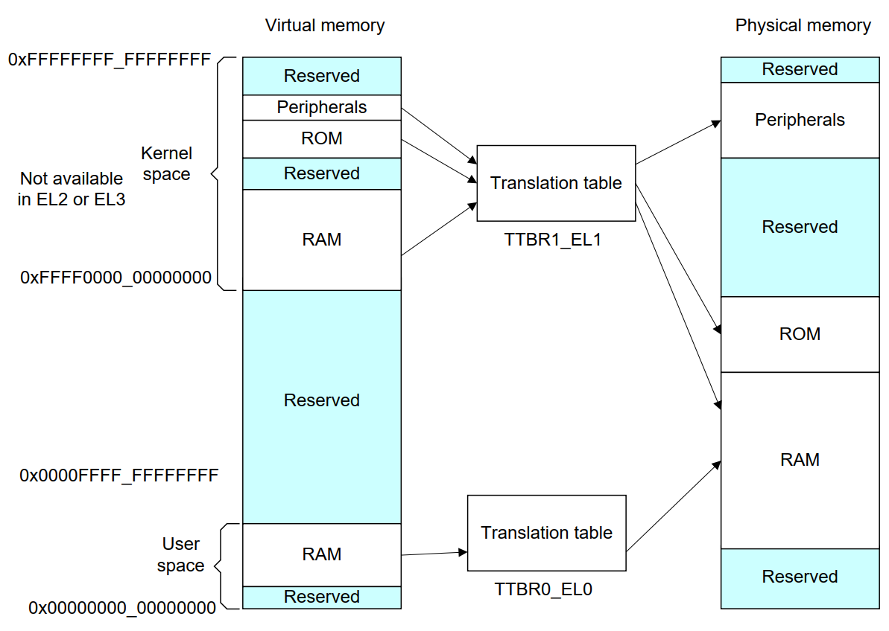

可以看出，外设通常在高地址，ram在低地址。内核在高地质，用户程序在低地址。

.. note::

  The table base addresses are specified in the Translation Table Base Registers (TTBR0_EL1) and (TTBR1_EL1):

  - 用户空间：TTBR0 is selected when the upper bits of the virtual address (VA) are all set to 0.
  - 内核空间：TTBR1 is selected when the upper bits of the VA are all set to 1.

  根据上图，就是高16bit，2个Byte来判断的。手册是写：You can enable VA tagging to exclude the top 8 bits from the check.

对于 Hypervisor 和 Firmware, 有独立的虚拟地址空间

At any one time, only one virtual address space is being used (that for the current security state
Exception level). However, conceptually, because there are three different TTBRs, there are three
parallel virtual address spaces (EL0/1, EL2, and EL3)

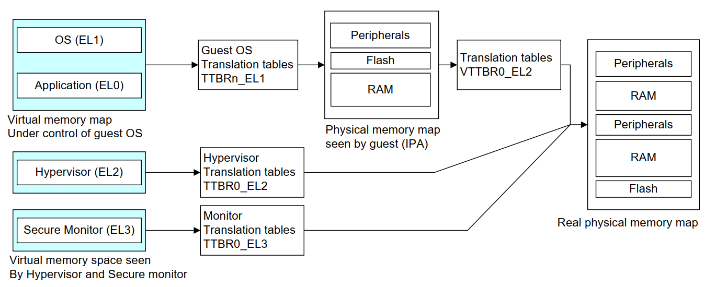

.. note::
  EL2 and EL3 have a TTBR0, but no TTBR1. This means that is either EL2 or EL3 is using AArch64,
  they can only use virtual addresses in the range 0x0 to 0x0000FFFF_FFFFFFFF.

ARM SMMU
----------

参考：

  - https://developer.arm.com/documentation/109242/0100/Overview
  - https://developer.arm.com/documentation/ihi0070/latest

ARM SMMU 主要给外设DMA(Direct Memory Access)提供 **IO-VA** 功能支持。

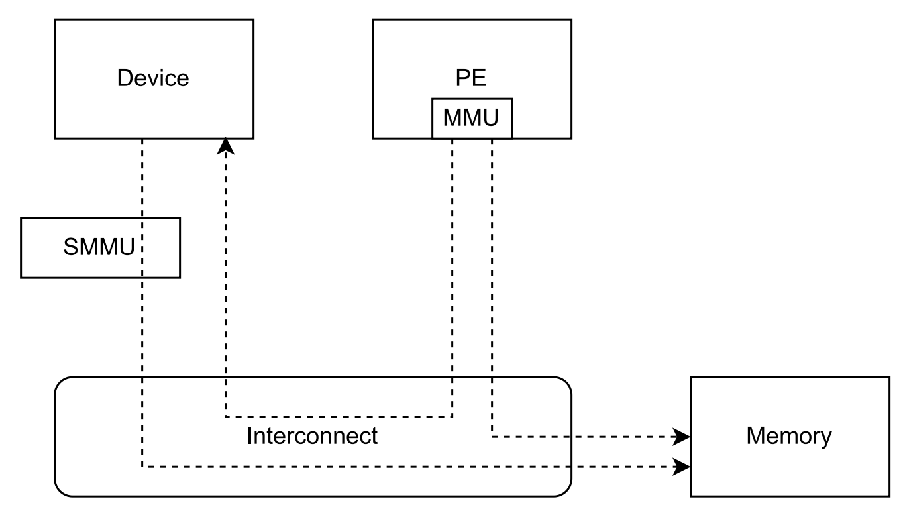

SMMU可以提供 地址翻译、地址保护、隔离的作用。多个device可以共享一个SMMU。

StreamID

  SMMU使用StreamID来区分不同device，一般一个device只有1个StreamID，但是也可以有多个。比如一个设备的DMA引擎支持多个channel，那么
  每个channel都会有一个StreamID。

  .. note::
    How the StreamID is formed is IMPLEMENTATION DEFINED

SubstreamID

  Substreams 可以让device有不同的stage 1 translations翻译时，有相同的stage 2翻译。比如，一个VM跑了多个app，每个app都有自己的
  DMA channel，所以每个有不同的stage 1 翻译流程。因为这些app在同一个VM，所以共享同样的stage 2翻译。

SMMU在内存中保存翻译流程的数据结构。 ``SMMU_(*_)STRTAB_BASE`` 存了 Stream table 的基地址。Stream table支持两种格式：

- Linear Stream table.

    ``STE_addr = STRTAB_BASE.ADDR + StreamID * sizeof(STE)``

- 2-level Stream table

    | ``L1STD_addr = STRTAB_BASE.ADDR + StreamID[n:x] * sizeof(L1STD)``
    | ``STE_addr = L1STD.L2Ptr + StreamID[(x - 1):0] * sizeof(STE)``

系统寄存器
------------

MRS和MSR指令
^^^^^^^^^^^^^^

参考： https://developer.arm.com/documentation/ddi0487/latest/

- MRS: Move to general-purpose Register from system register.
- MSR: Move to System-register from general-purpose register.

MRS/MSR的操作顺序逻辑通常是 move to dst from src. (R-通用寄存器，S-系统寄存器)

| MRS <Xt>, (<systemreg>|S<op0>_<op1>_<Cn>_<Cm>_<op2>)
| X[t] = AArch64.SysRegRead(sys_op0, sys_op1, sys_crn, sys_crm, sys_op2);

常见的aarch64 system reg
^^^^^^^^^^^^^^^^^^^^^^^^^^^^

ARM手册好多，很多想了解的总是分布在各个地方，必须看了很多后，才能有整体性的理解。

从 A1 Introduction to the ARMv8 Architecture - A1.3 ARMv8 architectural concepts 章节描述：

System registers provide **control and status information** of **architected features**.

In AArch64 state, most register names include the lowest Exception level that can access the register as
a suffix to the register name ::

  <register_name>_ELx, where x is 0, 1, 2, or 3.

这个手册包括了

- General system control registers.
- Debug registers.
- Generic Timer registers.
- Optionally, Performance Monitor registers.

还有其他的sysreg在其他手册，比如

- Trace System registers -- Embedded Trace Macrocell Architecture Specification
- Scalable Vector Extension System registers -- The Scalable Vector Extension (SVE) for ARMv8-A
- Statistical Profiling Extension System registers -- The Statistical Profiling Extension for ARMv8-A.
- Reliability, Availability, and Serviceability System registers -- ARM® Reliability, Availability, and Serviceability (RAS) Specification

让ChatGPT-4o给总结了下常见的一些 aarch64 system-reg, 大致看了没问题，ChatGPT最这种标准知识总结的一般还是不错的。
而且还可以让gpt按照指定的格式总结给出来，挺方便的还.

.. csv-table::

  寄存器名称,描述,功能
  "Current Program Status Register (CPSR)","当前程序状态寄存器","保存当前处理器状态，包括条件码、异常屏蔽位、当前处理模式"
  "Saved Program Status Register (SPSR)","保存的程序状态寄存器","当异常发生时，保存被打断的任务的 CPSR 值，以便恢复。"
  "Exception Link Register (ELR_ELn)","异常链接寄存器","保存异常返回地址。ELn 表示不同的异常级别 (n = 1, 2, 3)。"
  "Stack Pointer (SP_ELn)","栈指针","用于当前异常级别的栈指针。"
  "Vector Base Address Register (VBAR_ELn)","向量基地址寄存器","存储异常向量表的基地址。"
  "CurrentEL","当前异常级别寄存器","指示当前的异常级别。"
  "DAIF","中断屏蔽寄存器","控制异常屏蔽位 (Debug, SError, IRQ, FIQ)。"
  "MPIDR_EL1","多处理器 ID 寄存器","标识多核系统中处理器的 ID。"
  "TPIDR_EL0/TPIDR_EL1","线程 ID 寄存器","用于存储用户态/内核态线程 ID。"
  "CNTVCT_EL0","虚拟计数器寄存器","提供当前的虚拟计数器值。"
  "CNTFRQ_EL0","计数器频率寄存器","提供计数器的频率。"
  "CNTKCTL_EL1","计数器控制寄存器","控制访问计数器寄存器的权限。"
  "MAIR_EL1","内存属性归属寄存器","定义内存区域的属性。"
  "TTBR0_EL1/TTBR1_EL1","转换表基地址寄存器","提供第一级转换表的基地址。"
  "TCR_EL1","转换控制寄存器","控制地址转换表的行为和格式。"
  "SCTLR_EL1","系统控制寄存器","控制系统的基本运行模式和特性。"
  "ID_AA64PFR0_EL1","AArch64 特性寄存器 0","描述 AArch64 处理器的特性。"
  "ID_AA64DFR0_EL1","AArch64 调试特性寄存器 0","描述 AArch64 调试特性。"
  "ID_AA64MMFR0_EL1","AArch64 内存模型特性寄存器 0","描述 AArch64 内存模型特性。"
  "ID_AA64ISAR0_EL1","AArch64 指令集属性寄存器 0","描述 AArch64 指令集属性。"
  "CPACR_EL1","协处理器访问控制寄存器","控制对协处理器的访问权限。"
  "TTBR0_EL1","变换表基地址寄存器 0","提供第一级转换表的基地址。"
  "TTBR1_EL1","变换表基地址寄存器 1","提供第一级转换表的基地址。"
  "TCR_EL1","变换控制寄存器","控制地址变换表的行为和格式。"
  "ESR_EL1","异常综合寄存器","保存异常类型及其细节。"
  "FAR_EL1","错误地址寄存器","保存发生错误时的虚拟地址。"
  "AFSR0_EL1","异常故障状态寄存器 0","保存异常相关的错误状态信息。"
  "AFSR1_EL1","异常故障状态寄存器 1","保存异常相关的错误状态信息。"
  "AMAIR_EL1","内存属性归属寄存器","定义内存区域的属性。"
  "CNTVOFF_EL2","虚拟计数器偏移寄存器","用于虚拟化中的时间管理。"
  "CNTKCTL_EL1","计数器控制寄存器","控制计时器的行为。"
  "VTTBR_EL2","虚拟化翻译表基址寄存器","存储虚拟机的页表基地址。"
  "VMPIDR_EL2","虚拟化多处理器 ID 寄存器","标识虚拟机中的处理器 ID。"
  "HCR_EL2","Hypervisor 配置寄存器","配置虚拟化特性。"
  "MDCR_EL2","监控调试控制寄存器","控制调试特性。"
  "SPSR_EL2","保存的程序状态寄存器","保存当前程序状态。"
  "SP_EL2","栈指针寄存器","用于 EL2 的栈指针。"
  "ELR_EL2","异常链接寄存器","保存异常返回地址。"
  "VBAR_EL2","向量基地址寄存器","存储异常向量表的基地址。"

MPIDR寄存器
^^^^^^^^^^^^^^

https://developer.arm.com/documentation/ddi0601/2024-03/AArch64-Registers/MPIDR-EL1--Multiprocessor-Affinity-Register?lang=en

MPIDR_EL1(Multiprocessor Affinity Register)的作用：

.. note::

    | In a multiprocessor system, provides an additional PE identification mechanism. 一般为了调度使用。
    | 叫亲和性就是因为可能经常和绑定任务thread有关，所以这么叫。

    | Aff0, bits [7:0]
    | Affinity level 0. The value of the MPIDR.{Aff2, Aff1, Aff0} or
    |   MPIDR_EL1.{Aff3, Aff2, Aff1, Aff0} set of fields of each PE must be unique within the system as a whole.
    | This field has an IMPLEMENTATION DEFINED value.

一个ARM soc示意图
-----------------------

https://en.m.wikipedia.org/wiki/File:ARMSoCBlockDiagram.svg#file

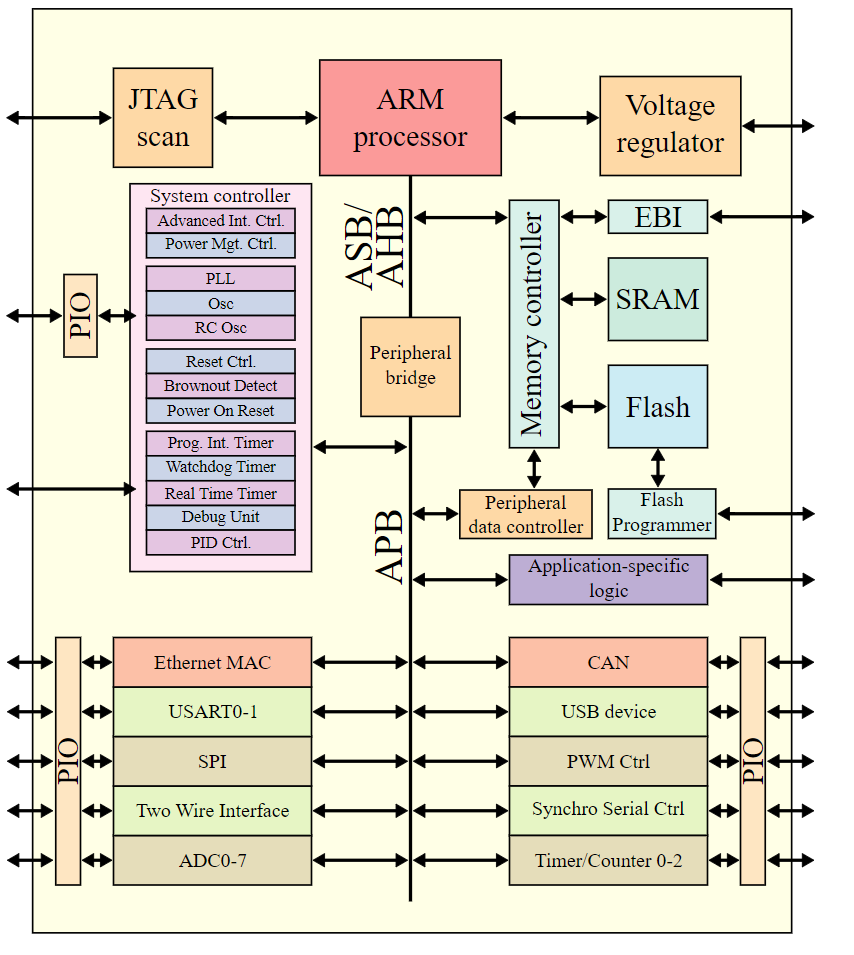

图是SVG格式的，有源码，可以被浏览器渲染。
