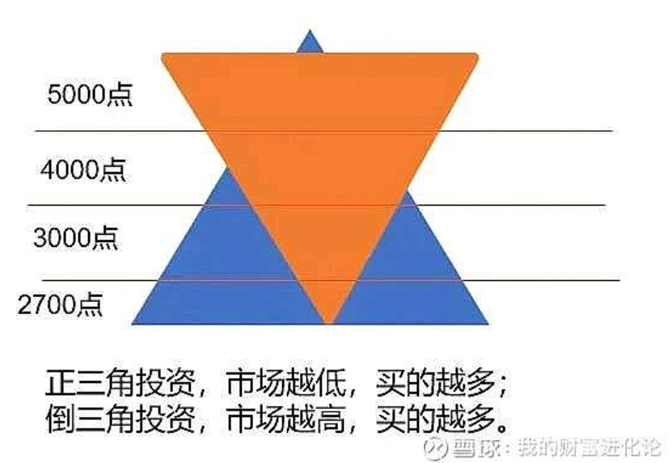

.. Michael Wu 版权所有

:Authors: Michael Wu
:Version: 1.0

理财投资
=========

2024-09-24的A股起飞
----------------------

最近一周A股这的是涨疯了，mark一下。后续对于理财还需要一个系统性的学习。

https://www.zhihu.com/question/694696726

.. image:: pic/A-shares.png
    :width: 50%

记录几个我认为不错的知乎回答:

| 时隔四年 A 股再登《新闻联播》，报道时长接近 40 秒，2.6 万亿天量成交引瞩目，透露出哪些信号？ - 现实主义理想者的回答 - 知乎
| https://www.zhihu.com/question/705357112/answer/3954908877

    | 我能比较肯定的是，如果是闲钱投资，如果能承受一定程度的浮亏，
    | 目前部分较为稳健和优质的大企业（比如从沪深300成分股中选）,
    | 我认为仍然可以买。

| 时隔四年 A 股再登《新闻联播》，报道时长接近 40 秒，2.6 万亿天量成交引瞩目，透露出哪些信号？ - 奥特之父的回答 - 知乎
| https://www.zhihu.com/question/705357112/answer/3949663291

    | 今天随便写点，大家看得懂的多些思考。
    | 缅A总市值是12万亿美元，大家可以理解为每个人都有一万美元扔在股市里。
    | 房地产总值是90万亿，每个人平均有七万美金投入了房子。
    | 储蓄总量则是20万亿美元，其中每个人平均1.7万美刀左右。（以上都是约数）
    | 而美股总量是60万亿美元，是房地产总市值的两倍。
    | 平均每个美国家庭持有美股达到二十万美刀。
    | 换句话说，美国通过股票，形成了另一种意义的“全民公有制”。
    | 另外美国的人均存款有五万美元。住房类项目的投资属性是很弱的，我可以很明确地告诉大家，只要住宅类租金小于年化6%，
    | 商铺类小于5%的一定是亏损的（除非后续高通胀，也正因为如此一定要高通胀）。新的锚点可能是黄金，可能是股票，
    | 可能是大家不知道的什么东西，但通胀本身是不可逆的。另外就是风险，从人均存款和房地产和股票的市值对比，
    | 我们甚至是很健康的。美国的好公司很多，但好公司和好股票不能简单画等号，还得看市盈率和隐患。

| 9月30日A股全天成交超 2.6 万亿元，创历史新高，本轮行情是做多中国股市的最佳机遇吗？ - 银河证券周建华的回答 - 知乎
| https://www.zhihu.com/question/697059573/answer/3871713269

    1. 9.18，创本轮行情低点2689点
    2. 9.19，美联储降息50bp
    3. 9.24，金融三巨头新闻发布会，降准降息降首付，8000亿贷款驰援A股，股市暴涨。
    4. 9.25，试射全程洲际导弹
    5. 9月26日，更高层会议，表态打通市场堵点，引导长期资本入市，市场再次暴涨
    6. 9月27日，三个阳线改三观，周五成交激增，卡死上交所
    7. 周末，中东加剧动乱
    8. 9月30日，市场更疯美联储降息后全力发动行情，背后还是对世界资金的争夺，房地产带不动以后，
       资本市场是唯一容纳这么多资金的蓄水池，对内发动行情能解决很多现实问题，价量齐升，这种速度的行情不轻易看空

| A 股连续多日暴涨，这一轮大涨还有多大空间？普通人应该出手抓住这一波机会还是冷静旁观？ - YULI宏观财经的回答 - 知乎
| https://www.zhihu.com/question/696473828/answer/3865153295

    未来，A股的核心资产——沪深300指数，将承担剩余资金的流向。这也是央企市值管理的大背景。如果沪深300指数成为高收益资产，
    它的夏普比率将成为重要的衡量指标。财政政策和货币政策都会围绕这个中轴展开。

| 如何看待9月30日的A 股突破 3300 点，国庆节假日后的一周内有望突破3500点吗？ - 鹰眼看风的回答 - 知乎
| https://www.zhihu.com/question/694856157/answer/3920739694

    我多次提到上涨衰竭这个概念，这个主要就是通过技术面分析观测的。这也是《缠论》的核心思想。衰竭的意思是，上涨力量出现背离。

    A股目前没有衰竭迹象。涨幅、成交量都在刷新高，越来越强。涨幅最大的科创50，都还在加速。将来，就算衰竭，也应该是科创50最先，
    然后创业板，然后才是主板。所以，现在继续买入主板ETF，其实风险是不高的。

亏损后的回本公式
----------------

| 亏损后的回本公式！
| https://xueqiu.com/5483912435/120031317

    | 昨天在公众号末尾出了道数学题：“一只股票，昨天跌80%，今天涨80%，请问盈亏的百分比是多少？”。
    | 我知道很多人觉得太小儿科了，但你们是没看到我后台的留言。有很多人的结果，计算的并不准确，还有一些人居然认为盈亏是持平的……
    | 我用10元来举例，跌80%=2元。2元涨80%=3.6元。
    | 正确答案是亏损64%。
    | …………
    | 亏10%，涨11%回本；
    | 亏20%，涨25%回本；
    | 亏30%，涨42.86%回本；
    | 亏40%，涨66.67%回本；
    | 亏50%，涨100%回本；
    | 亏60%，涨150%回本；
    | 亏70%，涨233.33%回本；
    | 亏80%，涨400%回本；
    | 亏90%，涨900%回本。
    | …………
    | 亏损后的回本公式：
    | 比如亏损54%
    | 1/（1-54%）-1=117.4%，也就是要涨117.4%才回本。
    | …………
    | 有亏损的朋友，自己对照下吧。看看自己还要多少才能回本。
    | 投资人并不需要做对很多事情，重要的是不犯重大的过错。---沃伦.巴菲特。
    | 投资最重要的三件事：第一，保住本金；第二，保住本金；第三，时刻牢记前两条。---沃伦.巴菲特。
    | 这个时候再看看巴菲特老爷子的名言，可能大家的感触会更深一些吧！

.. note::

    跟北大一搞AI的哥们交流，如果是在忍不了亏，那就快点跑，20%就跑吧。根据的就是上面的逻辑。
    不过其实还是一个系统性的，毕竟理财还是要系统性的学习一下的，否则上来很多观点直接就给你带跑了。

    每次的大牛市，大政策，都有历史大势。难道未来国家目的把资金的蓄水池往股市赶一赶。以及自己没时间买自选股，就可以选一些指数，
    最起码跟着大势赚一些时代的红利。

沪深300指数
--------------

沪深300定义
^^^^^^^^^^^

`沪深300的维基百科 <https://zh.wikipedia.org/wiki/%E6%B2%AA%E6%B7%B1300k>`_

    沪深300指数（英语：CSI 300，上海证券交易所代码：000300，深圳证券交易所代码：399300），在上海和深圳证券市场中选取300支市值大，
    流通性好的A股以自由流通股本市值加权的方式，由中证指数公司编制并发布的成份股指数。沪深300指数以2004年12月31日为基日，
    基点为1000点，2005年4月8日正式发布。

`沪深300指数 (000300)的官网链接 <https://www.csindex.com.cn/zh-CN/indices/index-detail/H30077#/indices/family/detail?indexCode=000300>`_

.. figure:: pic/csi-300-2024.png
    :alt: 沪深300官网截图20240930

    沪深300-20240930

指数基金定义
^^^^^^^^^^^^^^
https://www.zhihu.com/question/378778601/answer/2541674011

    指数型基金不专门投资 **债券** 和 **个股** ，属于跟踪指数变化的基金。

https://xueqiu.com/edu/invest-edu/education/begin/1894299685/83785337

    交易所开放式指数基金(ETF Exchange-traded fund)又被称为交易所交易基金，是在交易所上市交易的、基金份 额可变的一种开放式基金。
    ETF 一般采用被动式投资策略跟踪某一标的市场指数，因此具有 指数基金的特点。ETF 结合了封闭式基金与开放式基金的运作特点;
    投资者既可以像封闭式2基金那样在交易所二级市场买卖，又可以像开放式基金那样申购、赎回。不同的是，它的申购是用一篮子股票
    换取 ETF 份额，赎回时则是换回一篮子股票而不是现金。这种交易制度使 该类基金存在一级和二级市场之间的套利机制，
    可有效防止类似封闭式基金的大幅折价。此 外，ETF 还具有交易费用低廉、投资组合透明、实时交易的特点。

https://en.wikipedia.org/wiki/Exchange-traded_fund

    An exchange-traded fund (ETF) is a type of investment fund that is also an exchange-traded product, i.e.,
    it is traded on stock exchanges.ETFs own financial assets such as stocks, bonds, currencies, debts,
    futures contracts, and/or commodities such as gold bars. Many ETFs provide some level of diversification
    compared to owning an individual stock.

沪深300计算方法
^^^^^^^^^^^^^^^^^

`沪深 300 指数编制方案 - 2023 年 9 月 <https://csi-web-dev.oss-cn-shanghai-finance-1-pub.aliyuncs.com/static/html/csindex/public/uploads/indices/detail/files/zh_CN/000300_Index_Methodology_cn.pdf>`_

沪深 300 指数以“点”为单位， 精确到小数点后 3 位。沪深 300 指数以 2004 年 12 月 31 日为基日， 基点为 1000 点。

.. math::

  \text{沪深300指数} = \frac{\sum (\text{证券价格} \times \text{调整股本数})}{\text{基期市值}} \times 1000

20240930的沪深300涨幅
^^^^^^^^^^^^^^^^^^^^^

这一波大涨，记录一下指数的涨幅, 直接Google搜索，会跳出谷歌财经的。或者使用雪球也行。

.. image:: pic/hushen_300_1005.png

.. todo::

    感觉，这一轮的刺激理论是超过2015,2021的，那么从这个角度，现在这个指数基金短期看，还有很大涨幅空间。
    但是我的理财知识还过于匮乏，后面学习后，回头重新看下这个结论。

上证指数
----------------

一般说的大盘就是上证指数： `上海证券交易所综合股价指数 <https://zh.wikipedia.org/zh-cn/%E4%B8%8A%E6%B5%B7%E8%AF%81%E5%88%B8%E4%BA%A4%E6%98%93%E6%89%80%E7%BB%BC%E5%90%88%E8%82%A1%E4%BB%B7%E6%8C%87%E6%95%B0>`_

上海证券交易所综合股价指数（简称 **上证指数** 、上证综指、上证综合、沪综指或 **沪指** ，英语：SSE Composite Index），
上海证券交易所主要的综合股价指数，为一种市值加权指数，是反应挂牌股票总体走势的统计指标。

SSE: Shanghai Stock Exchange

Google搜： 上证指数计算公式 PDF 可以直接搜到官方的手册

https://www.sse.com.cn/market/sseindex/indexlist/indexdetails/indexmethods/c1/000001_000001_CN.pdf

| 沪指以 1990 年 12 月 19 日为基日，以 100 点为基点。
| 沪指的样本空间由在上海证券交易所上市的股票和红筹企业发行的存托凭证组成。ST、\*ST 证券除外。

.. math::

   \text{上证综合指数} = \frac{\sum (\text{成分股的市值})}{\text{基期市值}} \times 100

| 成分股的市值：这是指上证指数成分股（包括A股和B股）的总市值，即每个成分股的股票价格乘以其流通股本。
| 基期市值：基期市值是指指数基准日当天所有成分股的总市值。上证指数的基准日是1990年12月19日，当时基期点位设为100点。

历史的走势，还是用谷歌的财经

    上证指数-20240930

A股与美股
-----------

看了几个知乎A股和美股的态度

| 本轮牛市会如何收场？ - 老姜的回答 - 知乎
| https://www.zhihu.com/question/726049590/answer/4271520313

    认识一位信奉长期价值投资的哥们，把他支付宝里百万的标普500指数基金清空了，我说你不是价值投资吗？他说不耽误回家赚一波快钱，
    要求不高，翻倍了就回美股继续价值投资，因为美股任何时候买都是一样的，而A股的机会十年才一次。

美股是长期价值投资，尤其是指数。

1. 美股指数认识

纳斯达克综合指数：NASDAQ Composite，在1971年2月5日创立，基数点为100点，其成分股包括绝大部分于纳斯达克上市的股份，
总数超过3,000支。

纳斯达克100指数: NASDAQ 100 Index, 是美国纳斯达克100支 **最大型** 本地及国际 **非金融类** 上市公司组成的股市指数，以市值作基础，
并以一些规则平衡较大市值股份造成的影响。苹果、谷歌、微软等都在这里面。

标准普尔500指数： Standard & Poor's 500 (简称S&P 500, 标普500), 自1957年起记录美国股市表现，涵盖500只普通股，
是最受关注的股票指数之一。该指数覆盖了美国约80%的公开上市公司总市值，截至2024年1月，其总市值超过43兆美元。

2、标普和纳指的区别：

https://www.zhihu.com/question/449379527/answer/3542593391

| 标普500包含500只市值较大的上市公司股票，这些公司覆盖了多个行业，是对美国大型股市场的一个广泛衡量。--- 对标中国的沪深300指数。
| 纳斯达克100则包含100只在纳斯达克交易所上市的最大和非金融类公司股票，偏重科技股。--- 对标中国的创业板指数

| 纳斯达克：由于其上市公司多为成长型企业，因此具有较高的风险和潜在回报。
|   在经济繁荣时期，纳斯达克指数往往能取得显著的涨幅；
|   但在经济衰退时期，其波动性也可能较大。
| 标普500：由于其成分股涵盖了多个行业，因此风险相对分散。
|   这使得标普500指数在市场波动时具有相对的稳定性，适合长期投资者关注。

| 近70年以来，美国标普500回撤超过20%的熊市只有15年，而且平均标普500回撤时间10个月，修复用20个月，
|   呈现单次“回撤比较急，修复比较快”，整体呈现出“牛长熊短”的特点。
|   剧烈的调整往往由“史无前例”的黑天鹅引起，难以预知。所以想要参与长牛，势必要承担遭遇黑天鹅的风险。

1. 美股三大指数近5年涨幅(2024.10.7)

.. image:: pic/NASDAQ100-5-YEAR.png
    :scale: 57%

.. image:: pic/sp-500-5year.png
    :scale: 60%

对比了5年美股，还有长期看，确实是价值投资，而且背后的公司都是顶级公司，涵盖了科技、医药各个层面。

从深层次看，国内顶级的科技公司还是相对较少。很多A股上市的都想着套现离场，而不是把公司做起来，对比来看，国内感觉没有类似纳指100的
那种顶级科技股指数，沪深300从历史看长期投资收益也不行。后面观测一下。

关于加仓的方法
-----------------

不要倒金字塔加仓,对于高点和地点要有预判。

比如下面的反例, 来自雪球网友的讨论帖：

    | 牛市的一项友善警示：千万不要倒三角加仓！
    | 什么是倒三角加仓？举个例子：
    | 比如3000点买入10万，涨到3300点时盈利10%即1万利润；
    | 这时你认为市场不错，于是加仓20万，然后又涨到3600点，又涨10%，此时总共盈利1+3.1=4.1万。
    | 这时你感觉非常良好，于是又加仓50万，股市涨到4000点，你又盈利10%，此时总共盈利4.1+8.4=12.5万。
    | 这时你觉得自己是被工作耽误了的炒股天才，于是到处借钱100万干进去，股市很快涨到4200后你还在继续持股待涨，
    |   因为大家都说会涨到6000点，但不幸的是股市迅速拐头向下跌回3300点，从4000点算跌幅17.5%。
    |   此时你的总收益=12.5 -（80+12.5+100）*（-17.5%）= -21.2万
    | 这样的话，一场牛市走完倒亏21.2万！
    | 很多散户基本上都是这样亏钱的！

.. note::
    这个有点反直觉，之前有过买基金的经历，但是从来没研究过。所以，完全不清楚，基金别后到底是什么，没有个宏观的粗略认识是低还是高，
    并且习惯性的追涨杀跌，看见涨，心里开心然后捂着期待更高，没有个预期到底涨多少卖，然后看见下跌就忍不住赶紧卖。这就是纯粹的基础
    认识都没有的操作。

    对于美股，纳指100、标普500等这种具有长周期投资价值的，有个心里预期点，或者调研，然后低买高卖，那么绝对是可以跑赢余额宝的。而且
    也不会亏太多，只要是低买的，并且这些背后是微软、谷歌等顶级科技公司，要有一个合理的宏观认识，科学理财。

什么是股票ETF
----------------

https://etf.sse.com.cn/fund/learning/knowledge/c/5704297.shtml

  股票ETF的投资标的是在证券交易所上市交易的股票，投资目标是紧密跟踪相应的股票指数，并将跟踪误差和跟踪偏离度控制在一定范围内。
  股票ETF兼具基金和股票的优点，为投资者提供了一个方便快捷、灵活及费用低廉的投资渠道。投资者以一笔交易就可直接投资一揽子股票，
  比投资单一股票风险要小，也不会发生“赚了指数赔了钱”的情况。

  由于股票ETF走势与股市同步，投资者不需研究个股，只要判断涨跌趋势即可，因此，股票ETF是一种较轻松的投资工具。
  以跟踪沪深300指数的ETF为例，由于该ETF的价格走势与沪深300指数基本一致，所以买卖一只ETF，就等于同时交易300只绩优的股票。

  股票ETF按不同类型可分为 **宽基ETF** 、 **行业ETF** 和 **主题ETF**。

  宽基ETF是我们通常意义上所说的跟踪宽基指数即规模指数的ETF产品，其所代表的不同类型的规模指数反映了A股市场中不同规模特征股票的
  整体表现。比如我们常见的 上证50、 **沪深300**、中证500 等ETF，都属于宽基ETF。

  行业ETF可以跟踪某一行业股票的整体涨跌。如果投资者看好某一个行业，可以选择投资跟踪该行业的ETF，降低选股压力，从而获取该行业的
  整体平均收益。与投资宽基ETF相比，行业ETF能高效准确地追踪行业的整体表现，实现宽基ETF不能实现的一些投资目标。比如，
  通过行业ETF方便地投资于自己看好的特定行业板块、捕捉阶段性交易机会、运用行业轮动策略紧跟热点等等。与投资个股相比，行业ETF可便捷实现
  对某一选定行业的全面布局，分散个股投资风险，更为有效地分享该行业的整体收益。

  还有一类跟踪某特定投资主题的主题ETF。常见投资主题如环保、医疗、传媒等，此类ETF跟踪的指数往往覆盖了该主题对应的上下游上市公司。
  作为宽基ETF和行业ETF的有力补充，主题ETF为投资者提供了一个高效便捷且交易成本低廉的、可以捕捉热点投资主题的交易工具。

https://caifuhao.eastmoney.com/news/20230517100311044028380

  - 上证50：上证50指数由沪市A股中规模大、流动性好的最具代表性的50只股票组成，是大盘股的代表指数。
  - 沪深300：包含A股规模最大的第1-300只股票，同样是大盘股的代表指数。
  - 中证500：包含A股规模最大的第301-800只股票，是中小盘股的代表指数。
  - 中证1000：包含A股规模最大的第801-1800只股票，是小盘股的代表指数。

  从2013年至今四大指数相对走势可以看到，四大指数在过去十年中，阶段性的最高收益和累计收益（2013/1/4--2023/5/5）均为中证1000指数
  最高，这与指数成长性和弹性等属性密不可分。

  .. image:: pic/kuanzhi-10-y.png
    :scale: 70%

对比一下最近牛市5天(2024年）的起飞情况:

确实是，涨幅是中证500略高一点。

评估收益风险的夏普比率
-----------------------

夏普比率是基金绩效评价标准指标，其计算公式为：夏普比率= (年化收益率 - 无风险利率) / 组合年化波动率

夏普比率数值越大代表承受单位风险能够获得的回报越高。夏普比率越大越好，当夏普比率为负时，没有参考意义。

根据 https://caifuhao.eastmoney.com/news/20230517100311044028380 ，从近十年(2013/1/4--2023/5/5，)，四大指数的夏普比率来看:

- 上证50的夏普比率为 0.18
- 沪深300的夏普比率为 0.22
- 中证500和中证1000的夏普比率都是0.27, 高于上证50和沪深300。

在大家的印象中，可能觉得上证50和沪深300指数所含的上市公司多为大公司，业绩更稳健，风险或相对更小。但实际上，
过去十年（2013/1/4--2023/5/5）中证500和中证1000指数夏普比率更高，即承受单位风险获得回报相对更高。

不过看前面的那个线图，趋势都差不多，沪深300和中证500都是A股最好的公司了，对应的指数ETF可以在牛市中配置一下资产，结合点位。

2024-10-9的大幅回调
---------------------

今天沪深300收盘跌了300.11个点(7.05%), 来到了 3,955.98 。我差不多在4000点左右买入了一波。所以在今天收盘，大概亏 2% 。
当然，到底是牛市回调，还是牛转熊的持续跌，个人分析倾向于回调。分析依据是国家政策，美国降息，国家拉动股市，还有经济刺激一揽子政策，
按道理，国家是想稳健的慢牛的，最具代表的沪深300，分析应该要到 4500，然后冲到这儿差不多，然后是一个合适的点位逐渐出。

这样大概会有 500/4000 （12%） 左右的收益，如果国家的慢牛或者一不小心后面回调后又上去了，就出在这个点位附近。这个知乎的答主也是
类似的分析，宽指基金就分析下政策趋势就可以。

| 10 月 9 日，A股低开，沪指跌幅 1.79% ，如何看待今日行情？ - 阳光下的沈同学的回答 - 知乎
| https://www.zhihu.com/question/788949812/answer/4592990326

  不同的投资者看法不一样很正常
  不调整反而就不买了，一直大涨，那我底仓都可能慢慢的都获利了结掉
  能中场休息，调整下来，才是我敢买入的理由
  新手投资者反正不要借钱，你还敢玩的话，可以越跌越买沪深300指数基金
  其他的估计也看不明白，也玩不转，就都忽略

国家既然在9.24出了这么一揽子政策，也绝对不会只想着把上证指数拉到 3,258.86 就结束，这也太低，基本就没拉起来，而且持续的实际也
这么短。经济下行有通缩趋势，这个很严重，正好美国降息，是个刺激A股的好机会。Twitter有个分析不防参考下：

https://x.com/xzzzjpl/status/1844037110363492855

  这是“三个和尚没水喝”的故事。本来人民银行出了一手好牌，结果金融监管总局首先想到自己部门的监管风险和管理责任，
  先把自己的问题撇清。发改委的发布会其实没有多少新内容，完全可以等财政部之后再开，为了表示自己的衷心，偏偏要抢先开，
  把所有的压力都给到了财政部。这两天如果持续大跌，会吓怕刚刚开好户正要入市的新韭菜们，让后面的局面更加复杂。

这个也某种程度说明了，中央是想营造一个慢牛的，等等看吧。

指数估值表的参考
---------------------------

参考雪球每日分析的： https://danjuanfunds.com/djmodule/value-center

宽指ETF的投资建议
------------------

https://xueqiu.com/9391624441/306948573

  | 新手上路，以宽基ETF起步。
  | 对于大部分投资者而言，在能力不足时盲目介入个股，尤其在群情激昂的当下，从长远看其结果往往并不理想。

  | 什么是核心宽基？是指代表一个国家、一个地区、一个市场的最核心指数。
  |   如：A股的中证A500、沪深300等；如H股的恒生指数、H股指数等；
  |   如：美股的标普500、纳斯达克100等。
  | 这些指数基本代表市场的整体表现，具有足够分散、相对均衡、质量中上、优胜劣汰、新老更替等特性。
  | 尤其对于风云诡谲的A股市场而言，历来波动较大，我们常常高估自己的耐心，低估市场的惨烈。
  | 那么，选择核心宽基，便是给了自己留了更大的容错空间。

  如何选择ETF产品？

  指数基金或ETF在选择产品，请注意产品规模，请选择整体规模1亿或以上的产品，场外产品计算规模时，可以合并A、C类；
  如果是场内ETF产品，有两种选择，一种是1.5亿-5亿的产品，有一定的打新超额；另外一种则是选择规模靠前的产品，能提供更好的流动性；

    A、C类份额的区别在于费率结构，A类适合长期持有，C类适合短期持有。
    打新超额是通过打新股获得的额外收益，通常中小规模的ETF更容易获得这种超额收益。

    “打新”指的是打新股，即通过新股申购的方式参与一级市场新股发行。在某些市场，尤其是A股市场，
    新股中签后股价往往大幅上涨，因此新股申购成为一种较为热门的投资方式。

设定符合实际的收益预期

.. note::
    站在指数基金的角度，设定 **8%-12%** 年化收益预期，是一个相对合理的目标。如果希望获得更高的收益率，
    一看天分，二看性格，三看积累。

不过，这是一波牛市的初期，尤其如果是短期的快牛，那可能宽指能够收获更多一点。

沪指和沪深300的函数关系
------------------------

沪指（大盘）经常在各种报道和帖子中被作为一个锚点来进行讨论比较，沪深300是头部300，用最小二乘法来计算一下两者的关系，记住一下
chatGPT。首先使用谷歌财经看两者的增长关系图，这一个月(2024.10.15~2024.9.12)的数据，如下图：

然后，谷歌搜索，在网址 https://cn.investing.com/indices/shanghai-composite-historical-data 搜到历史数据。感觉两者看起来基本
就是线性关系，可以用最小二乘法计算出对应函数，曾经自己使用 matlab 非常数量，参加多次数学建模，好久不写忘记了，然后尝试使用了一下
chatGPT，果然给出了很方便的 matlab 代码，我本地PC装了开源的matlab替代品 Octave ，给chatGPT的prompt如下 ::

    我有两组数据，第一组，记作向量 y

    ... // 这里是近1个月的沪深300的值，每行一个，直接复制过来的

    第二组：记作向量 x

    ... // 这里是近1个月的沪指的值，每行一个，直接复制过来的

    使用最小二乘法，给出 y 和 x 之间的函数关系，y = ax + b, 求出来 a, b;
    给出来 matlab 的计算代码 .m 文件代码，画出来图吗，让我知道这个直线和实际点的误差。

直接给出了可运行的 matlab 的代码：

.. code-block:: matlab

    % 数据向量
    y = [3961.34, 3887.17, 3997.79, 3955.98, 4256.10, 4017.85, 3703.68, ...
        3545.32, 3401.53, 3351.91, 3212.76, 3201.05, 3196.04, 3171.01, 3159.25, 3172.47];

    x = [3284.32, 3217.74, 3301.93, 3258.86, 3489.78, 3336.50, 3087.53, ...
        3000.95, 2896.31, 2863.13, 2748.92, 2736.81, 2736.02, 2717.28, 2704.09, 2717.12];

    % 最小二乘法计算
    p = polyfit(x, y, 1); % 1表示线性拟合，返回斜率和截距

    % 结果输出
    a = p(1); % 斜率
    b = p(2); % 截距
    fprintf('y = %.2fx + %.2f\n', a, b);

    % 计算拟合值
    y_fit = polyval(p, x);

    % 绘图
    figure;
    plot(x, y, 'bo', 'MarkerSize', 8, 'DisplayName', '实际数据'); % 绘制实际数据点
    hold on;
    plot(x, y_fit, 'r-', 'LineWidth', 2, 'DisplayName', '拟合直线'); % 绘制拟合直线
    legend('show');
    xlabel('x');
    ylabel('y');
    title('最小二乘法拟合结果');
    grid on;

    % 显示误差
    for i = 1:length(x)
        fprintf('x = %.2f, 实际 y = %.2f, 拟合 y = %.2f, 误差 = %.2f\n', x(i), y(i), y_fit(i), y(i) - y_fit(i));
    end

计算的结果如下，x 表示沪指，y 表示 沪深300，

.. math::

    y = 1.41x - 663.93

画出来的误差图是：

我想，后面如果买沪深300ETF，就可以直接根据自己的买的价格，对应的大概是ETF指数的什么点位，大盘的多少点位，方便快速直观分析大概得
高点和地点。

同样，看一个最近买了点儿的基金，数据：  https://cn.investing.com/etfs/huataipinebridge-csi-300-historical-data

看一下这个跟踪沪深300指数的最小二乘法拟合的现行函数和和对应的误差。

计算结果如下: x 表示沪深300值， y 表示基金的每份额价格*1000，拟合结果如下：

.. math::

    y = 1.0682x - 149.44

误差图如下：

然后，在根据上面的两个步骤，算出来，每份额价格和大盘的关系大概如下：

.. math::

    y &= 1.0682(1.41x - 663.93) - 149.44 \\
      &= 1.5062x - 858.65

**跟踪几天价格验证:**

2024-10-14

    今天沪指收盘价格是：3284.32, 那么用上面公式计算这个ETF价格就是 4088, 实际价格是 4040，误差有 1.076%

2024-10-15

    今天沪指收盘价格是：3201.29, 那么用上面公式计算这个ETF价格就是 3963, 实际价格是 3931，误差有 0.814%

    推测后续A股国家护盘3200，在3200~3300波动，直到下一波大的政策。

2024-10-16

    还是安装下matlab，用着更丝滑： https://www.yutu.cn/softhtml/showsoft_8855.html

    今天沪指收盘价格：3202.95，那么用上面公式计算这个ETF价格就是 3965.6, 实际价格是 3906，误差有 1.503%

    感觉是一直下行，国家托底，护盘3200. 跟之前知乎一个答主分析一致。

    我买沪深300 ETF一个指数基金成本价当前是： 4054, 那么对应的沪指就是 3261.61, 考虑到误差约1%，假设自己买在更高，
    那就是 3261.61 / 0.99 = 3294.5, 那么自己当前的持仓价格，就是对应沪指的 3300 这个点。

    今天大盘最低是： 3167.74，最高是 3236.85，基本3200震荡，那么可以低于3200，在低个30个点时补仓；整体上来稀释成本价。
    那么 3170 的大盘，对应这个ETF价格是，用上面公式算出是 3916，那么可以在 3920 以及一下补仓，如果想进行补仓。不过整体
    波动也没多少，还是看后续政策了。
